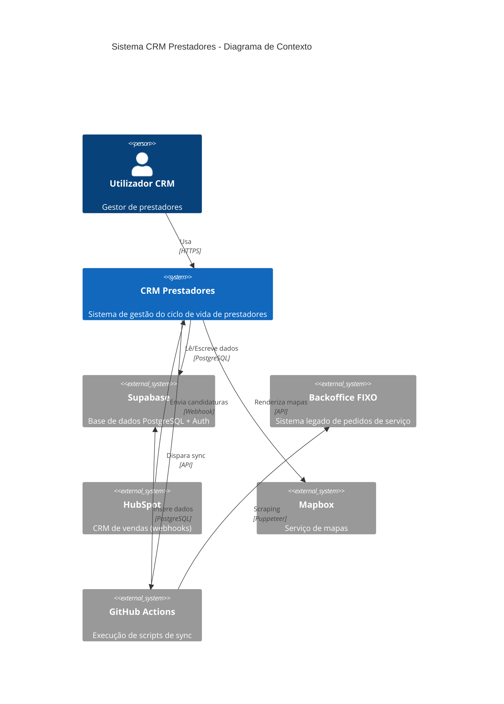

# Arquitectura do Sistema

Este documento descreve a arquitectura técnica do CRM Prestadores, as decisões tomadas e os padrões utilizados.

## Índice

- [Visão Geral](#visão-geral)
- [Decisões Arquitecturais](#decisões-arquitecturais)
- [Padrões de Código](#padrões-de-código)
- [Fluxo de Dados](#fluxo-de-dados)
- [Performance](#performance)
- [Documentos Relacionados](#documentos-relacionados)

---

## Visão Geral

### Diagrama de Contexto (C4 Level 1)



### Arquitectura de Alto Nível

```
┌────────────────────────────────────────────────────────────────────────┐
│                              BROWSER                                   │
│  ┌─────────────┐  ┌─────────────┐  ┌─────────────┐  ┌─────────────┐    │
│  │ Candidaturas│  │  Onboarding │  │ Prestadores │  │    Rede     │    │
│  │   (list)    │  │   (kanban)  │  │  (detail)   │  │   (mapa)    │    │
│  └─────────────┘  └─────────────┘  └─────────────┘  └─────────────┘    │
└────────────────────────────┬───────────────────────────────────────────┘
                             │ HTTPS
                             ▼
┌────────────────────────────────────────────────────────────────────────┐
│                         VERCEL (Next.js 16)                            │
│  ┌─────────────────────────────────────────────────────────────────┐   │
│  │                      App Router                                 │   │
│  │  ┌──────────────┐  ┌──────────────┐  ┌──────────────┐           │   │
│  │  │    Pages     │  │   Layouts    │  │  API Routes  │           │   │
│  │  │   (server)   │  │   (server)   │  │  (webhooks)  │           │   │
│  │  └──────┬───────┘  └──────────────┘  └──────────────┘           │   │
│  │         │                                                       │   │
│  │         ▼                                                       │   │
│  │  ┌──────────────────────────────────────────────────────────┐   │   │
│  │  │                   Server Actions                         │   │   │
│  │  │  candidaturas/ onboarding/ prestadores/ pricing/ ...     │   │   │
│  │  └──────────────────────────┬───────────────────────────────┘   │   │
│  └─────────────────────────────┼───────────────────────────────────┘   │
└────────────────────────────────┼───────────────────────────────────────┘
                                 │ PostgreSQL wire protocol
                                 ▼
┌─────────────────────────────────────────────────────────────────────────┐
│                           SUPABASE                                      │
│  ┌─────────────┐  ┌─────────────┐  ┌─────────────┐  ┌─────────────┐     │
│  │  PostgreSQL │  │    Auth     │  │   Storage   │  │     RLS     │     │
│  │   (dados)   │  │  (sessões)  │  │   (docs)    │  │ (políticas) │     │
│  └─────────────┘  └─────────────┘  └─────────────┘  └─────────────┘     │
└─────────────────────────────────────────────────────────────────────────┘

┌──────────────────────────────────────────────────┐
│              INTEGRAÇÕES EXTERNAS                │
│  ┌─────────────────┐ ┌─────────────────┐         │
│  │  GitHub Actions │ │     Mapbox      │         │
│  │  (sync scripts) │ │    (mapas)      │         │
│  └────────┬────────┘ └─────────────────┘         │
│           │                                      │
│           ▼                                      │
│  ┌─────────────────┐                             │
│  │ Backoffice FIXO │                             │
│  │   (scraping)    │                             │
│  └─────────────────┘                             │
└──────────────────────────────────────────────────┘
```

---

## Decisões Arquitecturais

### 1. Framework: Next.js com App Router

| Aspecto | Decisão | Alternativas Consideradas |
|---------|---------|---------------------------|
| **Escolha** | Next.js 16 (App Router) | Pages Router, Remix, SvelteKit |
| **Motivo** | Server Components nativos, melhor performance, layouts aninhados |

**Benefícios obtidos:**
- Server Components por defeito (menos JS no cliente)
- Streaming e Suspense para loading states
- Layouts partilhados sem re-render
- Server Actions para mutações (sem API routes)

**Trade-offs:**
- Curva de aprendizagem (mental model diferente)
- Ecossistema ainda em maturação
- Debugging mais complexo (server vs client)

---

### 2. Base de Dados: Supabase

| Aspecto | Decisão | Alternativas Consideradas |
|---------|---------|---------------------------|
| **Escolha** | Supabase (PostgreSQL) | PlanetScale, Neon, Firebase |
| **Motivo** | PostgreSQL completo, Auth incluído, RLS, SDK TypeScript |

**Benefícios obtidos:**
- Auth pronto a usar (email, magic link)
- Row Level Security para controlo de acesso
- Tipos TypeScript gerados automaticamente
- Dashboard para gestão visual

**Trade-offs:**
- Vendor lock-in (mitigado por ser PostgreSQL standard)
- Limites do plano gratuito
- Latência adicional vs base de dados self-hosted

---

### 3. Autenticação e Autorização: Supabase Auth + Sistema de Permissões

| Aspecto | Decisão | Alternativas Consideradas |
|---------|---------|---------------------------|
| **Escolha** | Supabase Auth + Permissões dinâmicas em BD | NextAuth, Clerk, Auth0 |
| **Motivo** | Já usamos Supabase, integração nativa, permissões flexíveis geridas em BD |

**Fluxo de autenticação e autorização:**

```
┌──────────┐     ┌───────────┐     ┌───────────┐     ┌───────────┐     ┌──────────┐
│  Login   │────>│ Supabase  │────>│ Middleware│────>│   Guard   │────>│ Dashboard│
│  Form    │     │   Auth    │     │  (sessão) │     │(permissão)│     │  Layout  │
└──────────┘     └───────────┘     └───────────┘     └───────────┘     └──────────┘
                       │                                   │
                       ▼                                   ▼
                 ┌───────────┐                    ┌─────────────────┐
                 │  Cookies  │                    │ role_permissions│
                 │ (session) │                    │    (BD)         │
                 └───────────┘                    └─────────────────┘
```

**Camadas de autorização:**

| Camada | Ficheiro | Responsabilidade |
|--------|----------|------------------|
| Middleware | `middleware.ts` | Verifica sessão activa (JWT) |
| Guard | `guard.ts` | Verifica permissão por página |
| RLS | PostgreSQL | Última linha de defesa nos dados |

**Sistema de Permissões Dinâmico:**

```
┌─────────┐         ┌─────────────────┐         ┌─────────┐
│  roles  │────────▶│ role_permissions│◀────────│  pages  │
└─────────┘         └─────────────────┘         └─────────┘
                           │
                           ▼
                  ┌─────────────────┐
                  │   can_access    │
                  └─────────────────┘
```

- **roles**: admin, manager, user, relationship_manager
- **pages**: candidaturas, onboarding, prioridades, etc.
- **role_permissions**: matriz que define que role acede a que página

Ver detalhes em [07-SEGURANCA.md](./07-SEGURANCA.md#sistema-de-permissões-dinâmico).

**Implementação:**

```typescript
// 1. Middleware - verifica sessão
// src/lib/supabase/middleware.ts
const publicRoutes = ['/login', '/registar', '/api/webhooks', '/forms']

if (!user && !isPublicRoute) {
  return NextResponse.redirect('/login')
}

// 2. Guard - verifica permissões por página
// src/lib/permissions/guard.ts
export async function requirePageAccess(pageKey: string) {
  const canAccess = await canCurrentUserAccessPage(pageKey)
  if (!canAccess) redirect('/sem-permissao')
}

// 3. Uso em Server Components
export default async function PrioridadesPage() {
  await requirePageAccess('prioridades')
  // ...
}
```

---

### 4. Sincronização com Backoffice: GitHub Actions

| Aspecto | Decisão | Alternativas Consideradas |
|---------|---------|---------------------------|
| **Escolha** | GitHub Actions + Puppeteer | AWS Lambda, Vercel Functions, servidor dedicado |
| **Motivo** | Vercel não suporta Puppeteer, GitHub Actions é gratuito e já usamos GitHub |

**Problema:**
O backoffice FIXO não tem API. Precisamos de fazer scraping com browser automation (Puppeteer).

**Opções avaliadas:**

1. **Vercel Functions** ❌
   - Não suporta Puppeteer (sandbox limitada, sem Chrome)

2. **AWS Lambda** ❌
   - Overhead de configuração
   - Custos adicionais
   - Mais uma plataforma para gerir

3. **GitHub Actions** ✅
   - Gratuito (2000 min/mês)
   - Cron nativo para scheduling
   - `repository_dispatch` para trigger manual
   - Ambiente completo (pode instalar Chrome)

**Arquitectura da solução:**

```
┌─────────────┐     repository_dispatch     ┌──────────────┐
│  CRM UI     │ ──────────────────────────> │   GitHub     │
│  (Vercel)   │                             │   Actions    │
└─────────────┘                             └──────┬───────┘
      │                                            │
      │ polling (5s)                               │ Puppeteer
      │                                            ▼
      │                                     ┌──────────────┐
      │                                     │  Backoffice  │
      │                                     │    FIXO      │
      │                                     └──────┬───────┘
      │                                            │
      │                                            │ Excel download
      │                                            ▼
      │                                     ┌──────────────┐
      └─────────────────────────────────────│   Supabase   │
                    sync_logs               │  (insert)    │
                                            └──────────────┘
```

**Trade-offs:**
- (+) Zero custo adicional
- (+) Fácil manutenção (código no mesmo repo)
- (-) Latência ~30s para iniciar workflow
- (-) Logs em local separado (GitHub UI)
- (-) Limite de 2000 min/mês no plano gratuito

---

### 5. Mapas: Mapbox GL

| Aspecto | Decisão | Alternativas Consideradas |
|---------|---------|---------------------------|
| **Escolha** | Mapbox GL + react-map-gl | Google Maps, Leaflet, OpenLayers |
| **Motivo** | Melhor performance para choropleth, styling flexível, bom free tier |

**Uso no projecto:**
- Mapa choropleth de Portugal (308 concelhos)
- Possibilidade de importação GeoJSON simplificado (3.2MB)
- Cores por nível de cobertura de prestadores
- Flexibilidade de integração
- UI moderno

## Padrões de Código

### Server Components vs Client Components

```
┌─────────────────────────────────────────────────────────────────┐
│                    DECISÃO: Server ou Client?                   │
└─────────────────────────────────────────────────────────────────┘
                              │
                              ▼
                    ┌─────────────────┐
                    │ Precisa de:     │
                    │ - useState      │
                    │ - useEffect     │
                    │ - onClick       │
                    │ - browser APIs  │
                    └────────┬────────┘
                             │
              ┌──────────────┴──────────────┐
              │                             │
              ▼                             ▼
        ┌─────────┐                   ┌─────────┐
        │   SIM   │                   │   NÃO   │
        └────┬────┘                   └────┬────┘
             │                             │
             ▼                             ▼
      ┌─────────────┐               ┌─────────────┐
      │   'use      │               │   Server    │
      │   client'   │               │  Component  │
      └─────────────┘               │  (default)  │
                                    └─────────────┘
```

**Regra geral:** Começar sempre com Server Component. Só adicionar `'use client'` quando necessário.

**Exemplos:**

```typescript
// ✅ Server Component (default) - Página que busca dados
// src/app/(dashboard)/candidaturas/page.tsx
export default async function CandidaturasPage() {
  const data = await getCandidaturas()  // Corre no servidor
  return <CandidaturasTable data={data} />
}

// ✅ Client Component - Tabela com sorting/filtering interactivo
// src/components/candidaturas/candidaturas-table.tsx
'use client'
export function CandidaturasTable({ data }) {
  const [sortBy, setSortBy] = useState('created_at')
  // ...
}
```

---

### Server Actions vs API Routes

```
┌─────────────────────────────────────────────────────────────────┐
│                    DECISÃO: Action ou API Route?                 │
└─────────────────────────────────────────────────────────────────┘
                              │
                              ▼
                    ┌─────────────────┐
                    │ É chamado por:  │
                    │ - Webhook       │
                    │ - Sistema       │
                    │   externo       │
                    │ - Cron job      │
                    └────────┬────────┘
                             │
              ┌──────────────┴──────────────┐
              │                             │
              ▼                             ▼
        ┌─────────┐                   ┌─────────┐
        │   SIM   │                   │   NÃO   │
        └────┬────┘                   └────┬────┘
             │                             │
             ▼                             ▼
      ┌─────────────┐               ┌─────────────┐
      │  API Route  │               │   Server    │
      │ src/app/api │               │   Action    │
      └─────────────┘               │ 'use server'│
                                    └─────────────┘
```

**Server Actions (mutações internas):**

```typescript
// src/lib/candidaturas/actions.ts
'use server'

export async function createCandidatura(formData: FormData) {
  const supabase = await createClient()

  // Verificar autenticação
  const { data: { user } } = await supabase.auth.getUser()
  if (!user) return { error: 'Não autenticado' }

  // Inserir dados
  const { error } = await createAdminClient()
    .from('providers')
    .insert({ ... })

  // Revalidar cache
  revalidatePath('/candidaturas')
  return { success: true }
}
```

**API Routes (webhooks externos):**

```typescript
// src/app/api/webhooks/hubspot/route.ts
export async function POST(request: Request) {
  const payload = await request.json()

  // Validar signature do webhook
  // Processar dados
  // Inserir no Supabase

  return Response.json({ received: true })
}
```

---

### Clientes Supabase

O projecto usa três clientes Supabase diferentes, cada um para um contexto específico:

```
┌─────────────────────────────────────────────────────────────────┐
│                     CLIENTES SUPABASE                           │
└─────────────────────────────────────────────────────────────────┘

┌─────────────────┐     ┌─────────────────┐     ┌─────────────────┐
│  Server Client  │     │  Admin Client   │     │ Browser Client  │
│                 │     │                 │     │                 │
│  createClient() │     │createAdminClient│     │  createClient() │
│  from server.ts │     │  from admin.ts  │     │  from client.ts │
└────────┬────────┘     └────────┬────────┘     └────────┬────────┘
         │                       │                       │
         ▼                       ▼                       ▼
┌─────────────────┐     ┌─────────────────┐     ┌─────────────────┐
│ - Server        │     │ - Server apenas │     │ - Browser       │
│   Components    │     │ - Bypass RLS    │     │ - Client        │
│ - Server        │     │ - Service Role  │     │   Components    │
│   Actions       │     │   Key           │     │ - Anon Key      │
│ - Respeita RLS  │     │                 │     │ - Respeita RLS  │
│ - Usa cookies   │     │                 │     │                 │
└─────────────────┘     └─────────────────┘     └─────────────────┘
```

**Quando usar cada um:**

| Cliente | Usar quando... | Exemplo |
|---------|----------------|---------|
| Server | Ler dados respeitando permissões do user | Listar candidaturas do user |
| Admin | Operações que precisam bypass RLS | Criar user, contar pendentes |
| Browser | Interactividade no cliente | Real-time subscriptions |

---

### Estrutura de Pastas

```
src/
├── app/                          # Rotas (Next.js App Router)
│   ├── (auth)/                   # Grupo de rotas públicas
│   │   ├── login/
│   │   └── registar/
│   ├── (dashboard)/              # Grupo de rotas protegidas
│   │   ├── layout.tsx            # Layout com sidebar
│   │   ├── candidaturas/
│   │   │   ├── page.tsx          # Lista
│   │   │   └── [id]/page.tsx     # Detalhe
│   │   └── ...
│   └── api/                      # API Routes (webhooks)
│
│
├── lib/
│   ├── permissions/              # Sistema de permissões dinâmico
│   │   ├── actions.ts            # CRUD de roles e permissões
│   │   └── guard.ts              # requirePageAccess()
│
├── components/
│   ├── ui/                       # shadcn/ui (não editar)
│   ├── layout/                   # Header, Sidebar, etc.
│   └── [domínio]/                # Componentes por feature
│       ├── candidaturas/
│       ├── onboarding/
│       └── ...
│
├── lib/
│   ├── supabase/                 # Clientes DB
│   │   ├── server.ts
│   │   ├── client.ts
│   │   ├── admin.ts
│   │   └── middleware.ts
│   ├── utils.ts                  # cn(), formatters
│   └── [domínio]/                # Server Actions
│       └── actions.ts
│
└── types/
    └── database.ts               # Tipos gerados do Supabase
```

**Convenções:**

1. **Um ficheiro `actions.ts` por domínio** - Todas as server actions de candidaturas em `lib/candidaturas/actions.ts`
2. **Componentes junto ao domínio** - `components/candidaturas/` contém todos os componentes de candidaturas
3. **Tipos centralizados** - Importar sempre de `@/types/database` ou do `actions.ts` do domínio

---

## Fluxo de Dados

### Leitura (Server Component)

```
┌──────────┐     ┌──────────┐     ┌──────────┐     ┌──────────┐
│  Browser │────>│   Page   │────>│  Action  │────>│ Supabase │
│ (request)│     │ (server) │     │  (read)  │     │  (query) │
└──────────┘     └──────────┘     └──────────┘     └──────────┘
                       │                                 │
                       │<────────────────────────────────┘
                       │              dados
                       ▼
                 ┌──────────┐
                 │   HTML   │
                 │(streamed)│
                 └──────────┘
```

### Escrita (Server Action)

```
┌──────────┐     ┌──────────┐     ┌──────────┐     ┌──────────┐
│  Browser │────>│   Form   │────>│  Action  │────>│ Supabase │
│ (submit) │     │ (client) │     │ (mutate) │     │ (insert) │
└──────────┘     └──────────┘     └──────────┘     └──────────┘
                       │                                 │
                       │<────────────────────────────────┘
                       │           revalidatePath
                       ▼
                 ┌──────────┐
                 │  Re-fetch│
                 │   page   │
                 └──────────┘
```

---
## Performance

### Estratégias Utilizadas

1. **Server Components por defeito**
   - Menos JavaScript enviado para o cliente
   - Dados fetched no servidor (mais perto da DB)

2. **Streaming com Suspense**
   - Páginas carregam progressivamente
   - Loading states por secção

3. **Revalidação selectiva**
   - `revalidatePath()` apenas nas rotas afectadas
   - Evita refetch desnecessário

4. **GeoJSON optimizado**
   - Mapa de Portugal: 29MB → 3.2MB
   - Simplificação de geometrias

5. **Paginação server-side**
   - Queries limitadas (10, 25, 50, 100 items)
   - Contagem total para UI

---

## Documentos Relacionados

- [02-FLUXOS-NEGOCIO.md](./02-FLUXOS-NEGOCIO.md) - Estados e transições
- [03-BASE-DADOS.md](./03-BASE-DADOS.md) - Schema detalhado
- [04-INTEGRACOES.md](./04-INTEGRACOES.md) - Backoffice, HubSpot, Mapbox
- [05-COMPONENTES.md](./05-COMPONENTES.md) - Padrões UI e componentes
- [06-DEPLOY.md](./06-DEPLOY.md) - Deploy e configuração
- [07-SEGURANCA.md](./07-SEGURANCA.md) - Segurança e protecção de dados

---

*Última actualização: Janeiro 2026*
