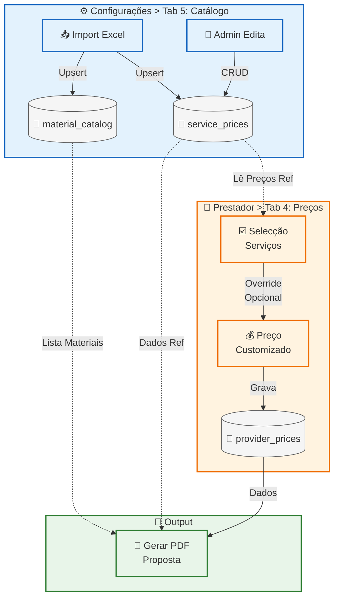

# Fluxos de Negócio

Este documento descreve os fluxos de dados, estados e regras de negócio do CRM Prestadores.

## Índice

### 0. Gestão de Utilizadores
- [Fluxo de Utilizadores e Autenticação](#fluxo-de-utilizadores-e-autenticação)

### 1. Ciclo de Vida do Prestador

#### 1.1 Jornada do Prestador
- [Estados do Prestador](#estados-do-prestador)
- [Página de Detalhe do Prestador](#página-de-detalhe-do-prestador-providersid)
- [Fluxo de Candidaturas](#fluxo-de-candidaturas)
- [Sistema de Duplicados e Merge](#sistema-de-duplicados-e-merge)
- [Fluxo de Onboarding](#fluxo-de-onboarding)
- [Fluxo de Formulários de Serviços](#fluxo-de-formulários-de-serviços)
- [Fluxo de Preços e Catálogo de Serviços](#fluxo-de-preços-e-catálogo-de-serviços)

#### 1.2 Dados
- **1.2.1 Importação**
  - [Import CSV](#import-csv)
  - [Gestão de Documentos](#gestão-de-documentos)
- **1.2.2 Sincronização**
  - [Visão Geral](#sincronização-de-dados)
  - [Scrappers Activos](#scrappers-activos)
  - [Monitorização](#monitorização-de-sincronização)

#### 1.3 Operações (Páginas do CRM)
- [Pedidos de Serviço](#pedidos-de-serviço-pedidos)
- [Alocações](#alocações-alocacoes)
- [Facturação](#facturação-faturacao)
- [Rede (Cobertura Geográfica)](#rede---cobertura-geográfica-rede)
- [Agenda](#agenda-agenda)
- [KPIs](#kpis-kpis)
- [Configurações](#configurações-configuracoes)
  - [Tarefas](#tab-1-tarefas)
  - [Alertas](#tab-2-alertas-configurações-globais)
  - [Cobertura](#tab-3-cobertura)
  - [Mapeamento de Serviços](#tab-4-mapeamento-de-serviços)
  - [Catálogo de Serviços](#tab-5-catálogo-de-serviços)
  - [Histórico](#tab-6-histórico)

### 2. Sistema
- [Sistema de Prioridades](#sistema-de-prioridades)
- [Sistema de Alertas](#sistema-de-alertas)
- [Histórico de Alterações](#histórico-de-alterações)

### 3. Referência
- [Regras de Negócio Importantes](#regras-de-negócio-importantes)
- [Próximos Documentos](#próximos-documentos)

---

## Fluxo de Utilizadores e Autenticação

### Sistema de Permissões Dinâmico

O CRM implementa um sistema de **permissões dinâmico** gerido em base de dados. As permissões são definidas através de três tabelas:

```
┌─────────────────────────────────────────────────────────────────┐
│              ARQUITECTURA DE PERMISSÕES                          │
├─────────────────────────────────────────────────────────────────┤
│                                                                 │
│    ┌─────────┐         ┌─────────────────┐         ┌─────────┐  │
│    │  roles  │────────▶│ role_permissions│◀────────│  pages  │  │
│    └─────────┘         └─────────────────┘         └─────────┘  │
│                               │                                 │
│                    Matriz: role × página                        │
│                    can_access = true/false                      │
│                                                                 │
└─────────────────────────────────────────────────────────────────┘
```

### Roles do Sistema

O sistema tem 4 níveis de acesso, geridos dinamicamente:

| Role | Descrição | Páginas Bloqueadas |
|------|-----------|-------------------|
| `admin` | Gestão completa do sistema | Nenhuma |
| `manager` | Gestor com acesso a prioridades | `admin_gestao_sistema` |
| `relationship_manager` | RM - responsável por prestadores | `admin_gestao_sistema`, `prioridades` |
| `user` | Acesso básico de consulta | `admin_gestao_sistema`, `prioridades` |

### Gestão de Roles e Permissões

Os administradores podem gerir permissões através da página `/admin/gestao-sistema`:

```
┌─────────────────────────────────────────────────────────────────┐
│                    PAINEL ADMIN (/admin/utilizadores)           │
├─────────────────────────────────────────────────────────────────┤
│  [Utilizadores]  [Roles]  [Acessos]                             │
└─────────────────────────────────────────────────────────────────┘
```

**Tab Utilizadores:** Aprovar/rejeitar utilizadores, atribuir roles
**Tab Roles:** Criar, editar e apagar roles (excepto roles de sistema)
**Tab Acessos:** Matriz visual para toggle de permissões por página/role

```
┌─────────────────────────────────────────────────────────────────┐
│  MATRIZ DE PERMISSÕES                                            │
├─────────────────────────────────────────────────────────────────┤
│  Página              │ admin │ manager │ rm    │ user  │         │
│  ────────────────────┼───────┼─────────┼───────┼───────┤         │
│  Candidaturas        │  ✅   │   ✅    │  ✅   │  ✅   │         │
│  Onboarding          │  ✅   │   ✅    │  ✅   │  ✅   │         │
│  Prioridades         │  ✅   │   ✅    │  ❌   │  ❌   │         │
│  Gestão de Sistema   │  ✅   │   ❌    │  ❌   │  ❌   │         │
└─────────────────────────────────────────────────────────────────┘
```

### Fluxo de Registo e Aprovação

```
┌─────────────────┐    ┌─────────────────┐    ┌─────────────────┐
│    Registo      │───>│    Pendente     │───>│    Aprovado     │
│   (/registar)   │    │  (aguarda admin)│    │  (acesso total) │
└─────────────────┘    └─────────────────┘    └─────────────────┘
                               │
                               │ Admin rejeita
                               ▼
                       ┌─────────────────┐
                       │    Rejeitado    │
                       │  (sem acesso)   │
                       └─────────────────┘
```

### Estados do Utilizador

```typescript
type ApprovalStatus = 'pending' | 'approved' | 'rejected'
```

| Estado | Acesso | Acções Disponíveis |
|--------|--------|-------------------|
| `pending` | Nenhum | Aguarda aprovação |
| `approved` | Conforme role | Acesso às páginas permitidas pelo role |
| `rejected` | Nenhum | Conta bloqueada |

### Fluxo de Autorização (Por Página)

```
┌─────────────────┐    ┌─────────────────┐    ┌─────────────────┐
│     Login       │───>│   Middleware    │───>│     Guard       │
│   (/login)      │    │ (verifica JWT)  │    │ (verifica role) │
└─────────────────┘    └─────────────────┘    └────────┬────────┘
                                                       │
                               ┌───────────────────────┴───────────────────────┐
                               │                                               │
                               ▼                                               ▼
                       ┌─────────────────┐                           ┌─────────────────┐
                       │  Tem permissão  │                           │  Sem permissão  │
                       │  ✅ Acede       │                           │  ❌ Redireciona │
                       └─────────────────┘                           └─────────────────┘
```

### Verificação de Permissões

```typescript
// Guard usado em cada página protegida
// src/lib/permissions/guard.ts

export async function requirePageAccess(pageKey: string) {
  const supabase = await createClient()
  const { data: { user } } = await supabase.auth.getUser()

  if (!user) {
    redirect('/login')
  }

  const canAccess = await canCurrentUserAccessPage(pageKey)
  if (!canAccess) {
    redirect('/sem-permissao')
  }
}

// Uso em páginas:
export default async function PrioridadesPage() {
  await requirePageAccess('prioridades')
  // ... resto da página
}
```

### Navegação Dinâmica (Sidebar)

A sidebar adapta-se às permissões do utilizador:

- Páginas sem acesso **não aparecem** na navegação
- Secções vazias são **automaticamente escondidas**
- Estado colapsado das secções é **persistido em localStorage**

```
┌─────────────────────────────────────────────────────────────────┐
│  SIDEBAR (User com role 'user')                                  │
├─────────────────────────────────────────────────────────────────┤
│                                                                 │
│  ▼ Onboarding                                                   │
│    - Candidaturas                                               │
│    - Onboarding                                                 │
│    - KPIs                                                       │
│    - Agenda                                                     │
│                                                                 │
│  ▼ Rede                                                         │
│    - Prestadores                                                │
│    - Mapa de Cobertura                                          │
│    - KPIs Operacionais                                          │
│    - Pedidos                                                    │
│    - ...                                                        │
│                                                                 │
│  ▼ Gestão                       ← Secção com Prioridades/Analyt.│
│    - (conteúdo varia conforme role)                             │
│                                                                 │
│  Configurações                  ← Standalone, sem secção        │
│                                                                 │
│  (Prioridades não aparece)      ← Bloqueado para role 'user'    │
│  (Gestão de Sistema não aparece)← Bloqueado para role 'user'    │
│                                                                 │
└─────────────────────────────────────────────────────────────────┘
```

---

## Estados do Prestador

O prestador passa por diferentes estados ao longo do seu relacionamento com a empresa:

```
                                    ┌─────────────────────────────────────┐
                                    │                                     │
                                    ▼                                     │
┌─────────┐    enviar para    ┌──────────────┐    concluir    ┌─────────┐ │
│  NOVO   │ ──────────────────│ EM_ONBOARDING│ ──────────────>│  ATIVO  │ │
└────┬────┘    onboarding     └──────┬───────┘   onboarding   └─────┬───┘ │
     │                               │                              │     │
     │ abandonar                     │ abandonar                    │     │
     │                               │                              │     │
     ▼                               ▼                              │     │
┌──────────────────────────────────────────┐       suspender        │     │
│              ABANDONADO                  │<───────────────────────┘     │
└────────────────────┬─────────────────────┘                              │
                     │                                                    │
                     │ recuperar                                          │
                     └────────────────────────────────────────────────────┘
```

### Estados Possíveis

| Estado | Descrição | Próximas Acções |
|--------|-----------|-----------------|
| `novo` | Candidatura recebida, aguarda análise | Enviar para onboarding, Abandonar |
| `em_onboarding` | Em processo de integração | Concluir onboarding, Abandonar, Remover do onboarding |
| `ativo` | Operacional, pode receber trabalhos | Suspender |
| `suspenso` | Temporariamente inativo | Reactivar |
| `abandonado` | Desistiu ou foi rejeitado | Recuperar |

### Transições de Estado

```typescript
// Estados permitidos (database enum)
type ProviderStatus = 'novo' | 'em_onboarding' | 'ativo' | 'suspenso' | 'abandonado'
```

| De | Para | Acção | Quem pode |
|----|------|-------|-----------|
| `novo` | `em_onboarding` | Enviar para onboarding | Qualquer user |
| `novo` | `abandonado` | Abandonar candidatura | Qualquer user |
| `em_onboarding` | `ativo` | Concluir onboarding | Qualquer user |
| `em_onboarding` | `abandonado` | Abandonar | Qualquer user |
| `em_onboarding` | `novo` | Remover do onboarding | Qualquer user |
| `ativo` | `suspenso` | Suspender | Qualquer user |
| `suspenso` | `ativo` | Reactivar | Qualquer user |
| `abandonado` | `novo` | Recuperar | Qualquer user |

---

## Página de Detalhe do Prestador (`/providers/[id]`)

A página de detalhe é o ponto central para gerir toda a informação de um prestador. Organiza-se em 3 áreas principais: Header, Banner de Estado, e 8 Tabs de conteúdo.

### Estrutura da Página

```
┌─────────────────────────────────────────────────────────────────────┐
│  HEADER                                                             │
│  ← Voltar    Nome do Prestador    [Tipo de Entidade]                │
├─────────────────────────────────────────────────────────────────────┤
│  BANNER DE ESTADO (varia conforme status)                           │
│  ┌─────────────────────────────────────────────────────────────┐    │
│  │ Dados de contacto | Status Badge | Acções contextuais       │    │
│  └─────────────────────────────────────────────────────────────┘    │
├─────────────────────────────────────────────────────────────────────┤
│  TABS                                                               │
│  [Perfil][Submissões][Onboarding][Preços][Pedidos][Perf.][Notas][H] │
├─────────────────────────────────────────────────────────────────────┤
│                                                                     │
│  CONTEÚDO DA TAB ACTIVA                                             │
│                                                                     │
└─────────────────────────────────────────────────────────────────────┘
```

### Banner de Estado (UI Condicional)

O banner adapta-se ao estado actual do prestador:

| Estado | Elementos Exibidos |
|--------|-------------------|
| `novo` / `abandonado` | Contacto + Botões: [Enviar para Onboarding] [Abandonar/Recuperar] |
| `em_onboarding` | Contacto + Progress Ring + Estatísticas tarefas + [Remover do Onboarding] |
| `ativo` / `suspenso` | Contacto + Ícone de estado + Timestamp da última alteração |

### As 8 Tabs

| # | Tab | Descrição | Disponibilidade |
|---|-----|-----------|-----------------|
| 1 | **Perfil** | Dados do prestador, documentação, recursos, cobertura | Sempre |
| 2 | **Submissões** | Histórico de formulários submetidos | Sempre |
| 3 | **Onboarding** | Tarefas por etapa com estado e owner | Se `em_onboarding` |
| 4 | **Preços** | Selecção de serviços e preços customizados | Sempre |
| 5 | **Pedidos** | Pedidos de serviço atribuídos | Se tem `backoffice_id` |
| 6 | **Performance** | KPIs, gráficos e benchmarks | Se tem `backoffice_id` |
| 7 | **Notas** | Notas internas + Documentos anexados | Sempre |
| 8 | **Histórico** | Timeline de todas as alterações | Sempre |

---

### Tab 1: Perfil

Exibe e permite editar toda a informação do prestador.

#### Secções do Perfil

**1. Informações Básicas** (editáveis inline)

| Campo | Tipo | Editável |
|-------|------|----------|
| Nome | Texto | ✅ |
| Email | Email | ✅ |
| Telefone | Tel | ✅ |
| NIF | Texto | ✅ |
| Tipo de Entidade | Select (técnico/eni/empresa) | ✅ |
| IBAN | Texto | ✅ |
| Website | URL | ✅ |
| Redes Sociais | URLs (Facebook, Instagram, LinkedIn, Twitter) | ✅ |

**2. Documentação e Certificações** (card editável, apenas se formulário submetido)

| Campo | Tipo | Descrição |
|-------|------|-----------|
| Declaração de Actividade | Boolean | Tem declaração válida |
| Seguro RC | Boolean | Tem seguro de responsabilidade civil |
| Seguro Acidentes Trabalho | Boolean | Tem seguro de acidentes |
| Certificações | Array strings | Lista de certificações |
| Plataformas | Array strings | Outras plataformas onde trabalha |

**3. Recursos** (card editável, apenas se formulário submetido)

| Campo | Tipo | Descrição |
|-------|------|-----------|
| Viatura Própria | Boolean | Tem transporte próprio |
| Computador | Boolean | Tem PC/tablet |
| Nº Técnicos | Número | Técnicos disponíveis |
| Equipamento Próprio | Array strings | Lista de equipamentos |

**4. Disponibilidade** (card editável, apenas se formulário submetido)

| Campo | Tipo | Descrição |
|-------|------|-----------|
| Hora Início | Time | Início do horário de trabalho |
| Hora Fim | Time | Fim do horário de trabalho |
| Dias Disponíveis | Array | Dias da semana (Seg-Dom) |

**5. Cobertura Geográfica** (dialog de edição)

- Lista de concelhos cobertos
- Botão editar abre dialog com `CoverageSelector`
- Mostra contagem de concelhos

**6. Serviços** (dialog de edição)

- Serviços agrupados por Cluster → Grupo → Serviço
- Acordeão expansível com detalhes
- Botão editar abre dialog com `ServicesSelector`

**7. Dados do Backoffice** (apenas leitura, se existe `backoffice_id`)

| Campo | Descrição |
|-------|-----------|
| Rating Serviço | Classificação 1-5 ⭐ |
| Rating Técnico | Classificação 1-5 ⭐ |
| Pedidos | Total, Activos, Concluídos, Cancelados |
| Metadata | Backoffice ID, Estado, Último login, Data sync |

#### Edição Inline

```
┌──────────────────────────────────────────────┐
│ Nome:  João Silva  [✎]                       │  ← Hover mostra ícone editar
├──────────────────────────────────────────────┤
│ Nome:  [João Silva        ] [✓] [✗]          │  ← Modo edição
└──────────────────────────────────────────────┘
```

- **Enter**: Guardar
- **Escape**: Cancelar
- Todas as alterações são registadas no `history_log`

---

### Tab 2: Submissões

Histórico de todas as submissões de formulários pelo prestador.

#### Tabela de Submissões

| Coluna | Descrição |
|--------|-----------|
| # | Número da submissão |
| Data Submissão | Timestamp da submissão |
| IP | Endereço IP de origem |
| Decl. Atividade | Tem declaração de actividade |
| Seguro RC | Tem seguro responsabilidade civil |
| Seguro AT | Tem seguro acidentes de trabalho |
| Certificações | Lista separada por vírgulas |
| Plataformas | Outras plataformas |
| Dias Disponíveis | Dias da semana (Seg, Ter, etc.) |
| Hora Início/Fim | Horário de trabalho |
| Nº Técnicos | Quantidade de técnicos |
| Viatura | Tem transporte próprio |
| PC/Tablet | Tem computador |
| Equipamento | Lista de equipamentos |
| **Serviços** | Contagem (clicável → dialog com lista hierárquica) |
| **Cobertura** | Contagem (clicável → dialog com lista de concelhos) |

#### Funcionalidades

- **Colunas redimensionáveis**: Arrastar bordas para ajustar largura
- **Scroll horizontal**: Botões de navegação esquerda/direita
- **Destaque**: Submissão mais recente tem fundo destacado
- **Geração de Link**: Card para gerar e copiar link do formulário

```
┌─────────────────────────────────────────────────────────────────┐
│ Formulário de Serviços                                          │
│ Gere um link para o prestador preencher os seus dados.         │
│                                          [Gerar e Copiar Link]  │
└─────────────────────────────────────────────────────────────────┘
```

---

### Tab 3: Onboarding

Gestão de tarefas do processo de onboarding (apenas visível se `status = em_onboarding`).

#### Estrutura

```
┌─────────────────────────────────────────────────────────────────┐
│ Etapa 1: Documentação                                           │
├─────────────────────────────────────────────────────────────────┤
│ ☐ Verificar seguro RC         │ Maria Silva │ Por fazer        │
│ ☑ Validar declaração          │ João Santos │ Concluída        │
│ ◐ Confirmar certificações     │ ---         │ Em curso         │
└─────────────────────────────────────────────────────────────────┘
│ Etapa 2: Formação                                               │
├─────────────────────────────────────────────────────────────────┤
│ ...                                                             │
└─────────────────────────────────────────────────────────────────┘
```

#### Dados por Tarefa

| Campo | Descrição |
|-------|-----------|
| Estado | `por_fazer`, `em_curso`, `concluida` |
| Nome da Tarefa | Definido em `task_definitions` |
| Owner | RM responsável pela tarefa |
| Deadline | Calculado a partir de `task_definitions` |

#### Acções

- Marcar tarefa como concluída/em curso
- Atribuir owner a uma tarefa
- Ver deadline e alertas

---

### Tab 4: Preços

Selecção de serviços e definição de preços para propostas.

#### Dashboard

```
┌──────────────────┬──────────────────┬──────────────────┐
│ Total Serviços   │ Selecionados     │ Preços Custom    │
│      245         │      12          │       3          │
└──────────────────┴──────────────────┴──────────────────┘
```

#### Funcionalidades

**1. Organização por Clusters**

| Cluster | Cor | Descrição |
|---------|-----|-----------|
| Casa | Azul | Serviços domésticos |
| Saúde e bem estar | Verde | Serviços de saúde |
| Empresas | Roxo | Serviços corporativos |
| Luxo | Âmbar | Serviços premium |
| Pete | Rosa | Serviços especiais |

**2. Selecção de Serviços**

- ☐ Checkbox individual por serviço
- ☐ Checkbox para seleccionar grupo inteiro
- ☐ Checkbox para seleccionar cluster inteiro
- Auto-selecção: serviços dos formulários são pré-seleccionados

**3. Preços Customizados**

| Serviço | Unidade | Preço Ref. | Preço Custom | IVA |
|---------|---------|------------|--------------|-----|
| Instalação Caldeira | Unid. | 85.00€ | [90.00€] | 23% |
| Reparação Canaliz. | Hora | 45.00€ | --- | 23% |

- Clicar no preço abre modo edição inline
- Deixar vazio reverte para preço de referência

**4. Pesquisa**

- Filtro em tempo real por nome do serviço, unidade, ou grupo

**5. Gerar PDF**

```
┌─────────────────────────────────────────────────────────────────┐
│                    PROPOSTA DE PREÇOS                           │
│                      [Logo FIXO]                                │
├─────────────────────────────────────────────────────────────────┤
│ Prestador: João Silva                                           │
│ NIF: 123456789                                                  │
│ Email: joao@email.com                                           │
├─────────────────────────────────────────────────────────────────┤
│ SERVIÇOS                                                        │
│ ─────────────────────────────────────────────────────────────── │
│ Serviço              │ Unid.  │ S/IVA  │ IVA%  │ C/IVA         │
│ Instalação Caldeira  │ Unid.  │ 90.00€ │ 23%   │ 110.70€       │
│ ...                                                             │
├─────────────────────────────────────────────────────────────────┤
│ RESUMO POR CLUSTER                                              │
│ Casa: 5 serviços - 450.00€                                      │
│ Empresas: 2 serviços - 180.00€                                  │
├─────────────────────────────────────────────────────────────────┤
│ Subtotal: 630.00€                                               │
│ IVA Total: 144.90€                                              │
│ TOTAL: 774.90€                                                  │
└─────────────────────────────────────────────────────────────────┘
```

- Botão "Gerar PDF" só activo se há serviços seleccionados
- Abre diálogo de impressão do browser

---

### Tab 5: Pedidos

Lista de pedidos de serviço atribuídos ao prestador (requer `backoffice_id`).

#### Tabela de Pedidos

| Coluna | Ordenável | Descrição |
|--------|-----------|-----------|
| Código | ✅ | Código único do pedido |
| Data | ✅ | Data de criação |
| Serviço | ✅ | Tipo de serviço |
| Estado | ✅ | Estado actual |
| Valor | ✅ | Valor do pedido |
| Cliente | - | Nome do cliente |

#### Funcionalidades

- Ordenação por qualquer coluna
- Filtros por estado, data, serviço
- Paginação (10, 25, 50, 100 por página)
- Se não tem `backoffice_id`: mostra mensagem vazia

---

### Tab 6: Performance

Analytics e KPIs do prestador (requer `backoffice_id`).

#### Presets de Data

```
[7 dias] [30 dias] [90 dias] [Este ano] [Custom]
```

#### KPI Cards

| KPI | Descrição |
|-----|-----------|
| Pedidos Totais | Quantidade no período |
| Taxa de Conclusão | % pedidos concluídos |
| Tempo Médio Resposta | Horas para responder |
| Valor Total | Soma dos pedidos |

#### Gráficos

- **Line Chart**: Evolução de pedidos ao longo do tempo
- **Bar Chart**: Distribuição por tipo de serviço
- **Pie Chart**: Distribuição por estado

#### Benchmark

Comparação com a média da rede:

| Métrica | Prestador | Rede | Diferença |
|---------|-----------|------|-----------|
| Taxa Conclusão | 92% | 85% | +7% ✅ |
| Tempo Resposta | 2.4h | 3.1h | -0.7h ✅ |

---

### Tab 7: Notas

Gestão de notas internas e documentos anexados.

#### Sub-tabs

**7.1 Notas**

| Campo | Descrição |
|-------|-----------|
| Tipo | `general`, `follow_up`, `issue`, `internal` |
| Conteúdo | Texto da nota |
| Autor | User que criou |
| Data | Timestamp de criação |

- Botão "Nova Nota" abre dialog
- Filtro por tipo de nota
- Ordenação por data (mais recentes primeiro)

**7.2 Documentos**

| Campo | Descrição |
|-------|-----------|
| Ficheiro | Nome do documento |
| Tipo | `insurance`, `certificate`, `contract`, `other` |
| Tamanho | Tamanho do ficheiro |
| Data Upload | Timestamp do upload |
| Utilizador | Quem fez upload |

- Botão "Upload" para adicionar novos documentos
- Download directo do ficheiro
- Botão de eliminar (com confirmação)
- Máximo 10MB por ficheiro
- Registo automático no histórico

---

### Tab 8: Histórico

Timeline de todas as alterações e eventos do prestador.

#### Tipos de Eventos

| Event Type | Ícone | Cor | Descrição |
|------------|-------|-----|-----------|
| `created` | ➕ | Verde | Prestador criado |
| `status_changed` | 🔄 | Azul | Alteração de estado |
| `sent_to_onboarding` | 📋 | Azul | Enviado para onboarding |
| `removed_from_onboarding` | ❌ | Vermelho | Removido do onboarding |
| `activated` | ✅ | Verde | Activado |
| `suspended` | ⏸️ | Amarelo | Suspenso |
| `abandoned` | 🚪 | Vermelho | Abandonado |
| `recovered` | ↩️ | Verde | Recuperado |
| `task_completed` | ✔️ | Verde | Tarefa concluída |
| `task_started` | ▶️ | Azul | Tarefa iniciada |
| `owner_changed` | 👤 | Roxo | Responsável alterado |
| `document_uploaded` | 📄 | Azul | Documento carregado |
| `document_deleted` | 🗑️ | Vermelho | Documento eliminado |
| `field_change` | ✏️ | Cinza | Campo editado |
| `price_change` | 💰 | Amarelo | Preço alterado |
| `note_added` | 📝 | Cinza | Nota adicionada |
| `forms_submission` | 📋 | Azul | Formulário submetido |

#### Filtros

- **Por Tipo de Evento**: Dropdown com todos os tipos encontrados
- **Por Utilizador**: Dropdown com utilizadores que fizeram alterações
- **Limpar Filtros**: Reset de todos os filtros

#### Visualização

```
Timeline Vertical
│
├─ 20/01/2026 14:30
│  [✏️ Campo Editado] Maria Silva
│  Nome: "João" → "João Carlos"
│
├─ 19/01/2026 10:15
│  [📋 Formulário Submetido] Sistema
│  Serviços: 12 | Cobertura: 45 concelhos
│  Técnicos: 2 | Certificações: 3
│
├─ 18/01/2026 09:00
│  [📋 Enviado para Onboarding] Admin
│  Iniciou processo de onboarding
│
└─ ...
```

- Últimos 100 eventos
- Mostra old_value → new_value para alterações
- Para `forms_submission`: grid com métricas detalhadas

---

### Server Actions Principais

| Acção | Ficheiro | Descrição |
|-------|----------|-----------|
| `updateProviderProfile` | [profile-actions.ts](src/lib/providers/profile-actions.ts) | Actualiza campos básicos |
| `updateProviderFormsFields` | [profile-actions.ts](src/lib/providers/profile-actions.ts) | Actualiza campos de formulário |
| `updateProviderCoverageAndServices` | [profile-actions.ts](src/lib/providers/profile-actions.ts) | Actualiza cobertura e serviços |
| `toggleServiceSelection` | [pricing-actions.ts](src/lib/providers/pricing-actions.ts) | Selecciona/deselecciona serviço |
| `updateCustomPrice` | [pricing-actions.ts](src/lib/providers/pricing-actions.ts) | Define preço customizado |
| `bulkToggleServices` | [pricing-actions.ts](src/lib/providers/pricing-actions.ts) | Selecção em massa |
| `generateProposalPDFData` | [pricing-actions.ts](src/lib/providers/pricing-actions.ts) | Dados para PDF |
| `generateFormsToken` | [services-actions.ts](src/lib/forms/services-actions.ts) | Gera link de formulário |
| `getProviderHistory` | [providers/actions.ts](src/lib/providers/actions.ts) | Histórico de eventos |

---

## Fluxo de Candidaturas

### Entrada de Candidaturas

As candidaturas podem entrar no sistema de duas formas:

```
┌─────────────────┐                    ┌─────────────────┐
│    HubSpot      │                    │   Criação       │
│   (webhook)     │                    │    Manual       │
└────────┬────────┘                    └────────┬────────┘
         │                                      │
         │ POST /api/webhooks/hubspot           │ Form UI
         │                                      │
         ▼                                      ▼
┌──────────────────────────────────────────────────────────┐
│                    VALIDAÇÃO                             │
│  - Campos obrigatórios (nome, email)                     │
│  - Formato de email válido                               │
│  - NIF válido (9 dígitos) se fornecido                   │
└─────────────────────────┬────────────────────────────────┘
                          │
                          ▼
┌──────────────────────────────────────────────────────────┐
│              DETECÇÃO DE DUPLICADOS                      │
│  1. Email exacto                                         │
│  2. NIF exacto                                           │
│  3. Nome fuzzy (≥85% similaridade)                       │
└─────────────────────────┬────────────────────────────────┘
                          │
            ┌─────────────┴─────────────┐
            │                           │
            ▼                           ▼
     ┌──────────┐               ┌──────────────┐
     │   Novo   │               │  Duplicado   │
     │ Provider │               │  Detectado   │
     └──────────┘               └──────┬───────┘
                                       │
                          ┌────────────┴────────────┐
                          │                         │
                          ▼                         ▼
                   ┌──────────────┐         ┌──────────────┐
                   │ Quick Merge  │         │ Merge Manual │
                   │ (automático) │         │ (campo a     │
                   │              │         │   campo)     │
                   └──────────────┘         └──────────────┘
```

---

## Sistema de Duplicados e Merge

### Detecção de Duplicados

O sistema detecta duplicados por ordem de prioridade:

1. **Email exacto** - Correspondência exacta de email (case-insensitive)
2. **NIF exacto** - Correspondência exacta de NIF (9 dígitos)
3. **Nome fuzzy** - Similaridade ≥85% usando distância de Levenshtein

```typescript
// Exemplo de cálculo de similaridade
function calculateSimilarity(str1: string, str2: string): number {
  // Normalizar strings (lowercase, remover acentos)
  // Calcular distância de Levenshtein
  // Retornar percentagem de similaridade
  return Math.round((1 - distance / maxLen) * 100)
}

// "João Silva" vs "Joao Silva" → 95% ✅ (duplicado)
// "João Silva" vs "Maria Silva" → 70% ❌ (não duplicado)
```

### Opções de Merge

| Tipo | Quando usar | Comportamento |
|------|-------------|---------------|
| **Quick Merge** | Duplicado óbvio, dados consistentes | Mantém registo mais antigo, actualiza campos vazios |
| **Merge Manual** | Dados conflitantes | UI para escolher campo a campo qual valor manter |

### Processo de Merge Manual

```
┌─────────────────────────────────────────────────────────────────┐
│                    ECRÃ DE MERGE MANUAL                         │
└─────────────────────────────────────────────────────────────────┘

┌────────────────────┬────────────────────┬────────────────────┐
│       Campo        │   Registo Antigo   │   Registo Novo     │
├────────────────────┼────────────────────┼────────────────────┤
│ Nome               │ ○ João Silva       │ ● João M. Silva    │
│ Email              │ ● joao@email.com   │ ○ joao2@email.com  │
│ Telefone           │ ○ (vazio)          │ ● 912345678        │
│ NIF                │ ● 123456789        │ ○ (vazio)          │
└────────────────────┴────────────────────┴────────────────────┘
                              │
                              ▼
                    [Confirmar Merge]
```

### Dados Transferidos no Merge

Quando dois registos são unidos, são transferidos:
- Notas e observações
- Histórico de alterações
- Documentos associados
- Preços acordados
- Cards de onboarding
- Contagem de candidaturas (soma)

---

## Fluxo de Onboarding

### Visão Geral

O onboarding é um pipeline Kanban com **11 etapas** e **23 tarefas**. Cada etapa tem tarefas específicas que devem ser concluídas antes de avançar automaticamente.

```
Etapas 1-4:
┌───────────┐   ┌───────────┐   ┌───────────┐   ┌───────────┐
│  Etapa 1  │──>│  Etapa 2  │──>│  Etapa 3  │──>│ Etapa 3A  │
│    POR    │   │CONTACTADOS│   │  AGUARDA  │   │  REUNIÃO  │
│ CONTACTAR │   │AGUARDA INF│   │  REUNIÃO  │   │  MARCADA  │
└───────────┘   └───────────┘   └───────────┘   └─────┬─────┘
                                                      │
Etapas 4-7:                                           ▼
┌───────────┐   ┌───────────┐   ┌───────────┐   ┌───────────┐
│  Etapa 4  │──>│  Etapa 5  │──>│  Etapa 6  │──>│  Etapa 7  │
│  COMITÉ   │   │  AGUARDA  │   │    EM     │   │  AGUARDA  │
│ GO/NO GO  │   │   DOCS    │   │ FORMAÇÃO  │   │   QUIZ    │
└───────────┘   └───────────┘   └───────────┘   └─────┬─────┘
                                                      │
Etapas 8-11:                                          ▼
┌───────────┐   ┌───────────┐   ┌───────────┐   ┌───────────┐
│  Etapa 8  │──>│  Etapa 9  │──>│ Etapa 10  │──>│ Etapa 11  │
│  ENVIAR   │   │  CRIAR    │   │ALINHAMENTO│   │ACOMPANHA- │
│ MATERIAIS │   │FICHA ERP  │   │PRE-LAUNCH │   │  MENTO    │
└───────────┘   └───────────┘   └───────────┘   └───────────┘
```

### Etapas e Tarefas Detalhadas

#### Etapa 1: POR CONTACTAR
| # | Tarefa | Deadline Normal | Deadline Urgente |
|---|--------|-----------------|------------------|
| 1 | Enviar email #2 + anexo | 48h | 24h |
| 2 | Ligar (ou enviar reminder) | 48h | 24h |

#### Etapa 2: CONTACTADOS / AGUARDA INFO
| # | Tarefa | Deadline Normal | Deadline Urgente |
|---|--------|-----------------|------------------|
| 3 | Analisar resposta | 72h | 48h |
| 4 | Enviar precário (Email #3) | Manual | Manual |
| 5 | Avaliar interesse do parceiro | Manual | Manual |

#### Etapa 3: AGUARDA REUNIÃO
| # | Tarefa | Deadline |
|---|--------|----------|
| 6 | Marcar reunião Teams (Email #4) | Manual |

#### Etapa 3A: REUNIÃO MARCADA
| # | Tarefa | Deadline |
|---|--------|----------|
| 7 | Realizar reunião (usar script) | Manual |

#### Etapa 4: APRESENTAR AO COMITÉ
| # | Tarefa | Deadline |
|---|--------|----------|
| 8 | Decisão GO / NO GO | Manual |

> **Nota:** NO GO → Prestador passa para estado `abandonado`

#### Etapa 5: AGUARDA DOCUMENTAÇÃO/APÓLICE
| # | Tarefa | Deadline |
|---|--------|----------|
| 9 | Pedir informação final (Email #5) | Manual |
| 10 | Receber informação | Manual |

#### Etapa 6: EM FORMAÇÃO
| # | Tarefa | Deadline |
|---|--------|----------|
| 11 | Criar prestador BO + colocar ficha | Manual |
| 12 | Enviar email de acesso à AP, formação e merch (Email #6) | Manual |

#### Etapa 7: AGUARDA RESPOSTA QUIZ
| # | Tarefa | Deadline |
|---|--------|----------|
| 13 | Receber resposta do Quiz | Manual |
| 14 | Receber pedido de merch | Manual |
| 15 | Receber resposta ao email #6 | Manual |

#### Etapa 8: ENVIAR MATERIAIS
| # | Tarefa | Deadline |
|---|--------|----------|
| 16 | Enviar materiais (Email 6.2) | Manual |
| 17 | Confirmar recepção dos materiais | Manual |

#### Etapa 9: CRIAR FICHA ERP
| # | Tarefa | Deadline |
|---|--------|----------|
| 18 | Criar ficha ERP | Manual |

#### Etapa 10: ALINHAMENTO PRE-LAUNCH
| # | Tarefa | Deadline |
|---|--------|----------|
| 19 | Alinhamento da data de entrada + dúvidas | Manual |
| 20 | Enviar email de launch (Email #8) | Manual |
| 21 | Atribuir serviços, quotas e custos | Manual |
| 22 | Colocar data da entrada | Manual |

#### Etapa 11: ACOMPANHAMENTO
| # | Tarefa | Deadline Normal | Deadline Urgente |
|---|--------|-----------------|------------------|
| 23 | Contacto pós-launch (7-10 dias após entrada) | 240h (10 dias) | 168h (7 dias) |

### Tipos de Onboarding

| Tipo | Prazos | Uso |
|------|--------|-----|
| `normal` | Prazos padrão | Maioria dos casos |
| `urgente` | Prazos reduzidos | Necessidade imediata de prestador na zona |

```typescript
type OnboardingType = 'normal' | 'urgente'
```

### Estrutura de Dados

```
┌──────────────────┐
│  onboarding_card │ ←── Representa o prestador no Kanban
├──────────────────┤
│ provider_id      │ ←── Ligação ao prestador
│ current_stage_id │ ←── Etapa actual (1-11)
│ onboarding_type  │ ←── normal ou urgente
│ started_at       │ ←── Data de início
│ completed_at     │ ←── null enquanto em progresso
└────────┬─────────┘
         │
         │ 1:N (uma tarefa por task_definition)
         ▼
┌──────────────────────┐
│   onboarding_task    │ ←── Tarefas do card
├──────────────────────┤
│ task_definition_id   │ ←── Definição da tarefa
│ status               │ ←── por_fazer, em_curso, concluida
│ deadline_at          │ ←── Prazo calculado
│ original_deadline_at │ ←── Prazo original (para tracking)
│ completed_at         │ ←── Quando foi concluída
│ completed_by         │ ←── Quem concluiu
└──────────────────────┘
```

### Estados das Tarefas

```typescript
type TaskStatus = 'por_fazer' | 'em_curso' | 'concluida'
```

```
┌───────────┐    iniciar    ┌───────────┐    concluir   ┌───────────┐
│ POR_FAZER │ ─────────────>│ EM_CURSO  │ ─────────────>│ CONCLUIDA │
└───────────┘               └─────┬─────┘               └─────┬─────┘
                                  │                           │
                                  │ reabrir                   │
                                  │<──────────────────────────┘
```

### Avanço Automático de Etapa

Quando todas as tarefas obrigatórias de uma etapa são concluídas, o card avança automaticamente para a próxima etapa.

### Cálculo de Deadlines

Os deadlines são calculados em cascata — cada tarefa começa quando a anterior termina:

```
Tarefa 1: 2h  ──┐
               │
Tarefa 2: 4h  ─┼─> Tarefa 1: agora + 2h
               │   Tarefa 2: agora + 2h + 4h = agora + 6h
Tarefa 3: 1h  ─┘   Tarefa 3: agora + 6h + 1h = agora + 7h
```

### Conclusão do Onboarding

```
┌─────────────────────────────────────────────────────────────────┐
│                   CONCLUIR ONBOARDING                            │
└─────────────────────────────────────────────────────────────────┘
                              │
                              ▼
┌─────────────────────────────────────────────────────────────────┐
│  1. Marcar card como concluído (completed_at = now)             │
└─────────────────────────────────────────────────────────────────┘
                              │
                              ▼
┌─────────────────────────────────────────────────────────────────┐
│  2. Actualizar provider.status = 'ativo'                        │
│     Actualizar provider.activated_at = now                      │
└─────────────────────────────────────────────────────────────────┘
                              │
                              ▼
┌─────────────────────────────────────────────────────────────────┐
│  3. Registar no history_log                                     │
└─────────────────────────────────────────────────────────────────┘
                              │
                              ▼
┌─────────────────────────────────────────────────────────────────┐
│  4. Recalcular prioridades (background)                         │
└─────────────────────────────────────────────────────────────────┘
```

---

## Fluxo de Formulários de Serviços

### Visão Geral

O sistema de formulários permite que prestadores submetam informações detalhadas sobre os seus serviços, documentação, recursos e cobertura geográfica. Cada submissão cria um **snapshot histórico** que fica imutável, enquanto os dados editáveis são mantidos na tabela `providers`.

```
┌─────────────────────────────────────────────────────────────────┐
│                    ARQUITECTURA DE DADOS                        │
└─────────────────────────────────────────────────────────────────┘

┌───────────────────────────────────────────────────────────────────┐
│ providers (dados editáveis/actuais)                               │
├───────────────────────────────────────────────────────────────────┤
│ - services[]                  │ Serviços seleccionados (UUIDs)    │
│ - counties[]                  │ Concelhos de cobertura            │
│ - has_activity_declaration    │ Documentação                      │
│ - has_liability_insurance     │                                   │
│ - has_work_accidents_insurance│                                   │
│ - certifications[]            │                                   │
│ - works_with_platforms[]      │ Plataformas parceiras             │
│ - available_weekdays[]        │ Disponibilidade                   │
│ - work_hours_start/end        │                                   │
│ - num_technicians             │ Recursos                          │
│ - has_own_transport           │                                   │
│ - has_computer                │                                   │
│ - own_equipment[]             │                                   │
│ - forms_submitted_at          │ Data da última submissão          │
└───────────────────────────────────────────────────────────────────┘
                              │
                              │ 1:N (histórico de submissões)
                              ▼
┌───────────────────────────────────────────────────────────────────┐
│ provider_forms_data (snapshots imutáveis)                         │
├───────────────────────────────────────────────────────────────────┤
│ - provider_id                 │ FK para providers                 │
│ - submission_number           │ Número sequencial (1, 2, 3...)    │
│ - submitted_at                │ Data/hora da submissão            │
│ - submitted_ip                │ IP de origem                      │
│ - selected_services[]         │ Serviços no momento da submissão  │
│ - coverage_municipalities[]   │ Concelhos no momento              │
│ - (todos os outros campos)    │ Snapshot completo                 │
└───────────────────────────────────────────────────────────────────┘
```

### Fluxo de Submissão

```
┌─────────────────┐    ┌─────────────────┐    ┌─────────────────┐
│   Gerar Token   │───>│ Prestador abre  │───>│   Submeter      │
│   (backoffice)  │    │   link único    │    │   Formulário    │
└─────────────────┘    └─────────────────┘    └─────────────────┘
        │                      │                       │
        │                      │                       │
        ▼                      ▼                       ▼
  Token guardado         /forms/services/       INSERT em
  em providers.          [token]               provider_forms_data
  forms_token                                  + UPDATE providers
```

#### 1. Geração de Token

```typescript
// O backoffice gera um token único para o prestador
const token = Buffer.from(`${providerId}:${Date.now()}`).toString('base64url')

// Token é guardado em providers.forms_token
await supabase
  .from('providers')
  .update({ forms_token: token })
  .eq('id', providerId)
```

#### 2. Acesso ao Formulário

O prestador acede via URL: `/forms/services/[token]`

- Token é validado contra `providers.forms_token`
- Se válido, carrega dados actuais do prestador para pré-preenchimento
- Formulário permite múltiplas submissões

#### 3. Submissão do Formulário

```
┌─────────────────────────────────────────────────────────────────┐
│                    PROCESSO DE SUBMISSÃO                         │
└─────────────────────────────────────────────────────────────────┘
                              │
                              ▼
┌─────────────────────────────────────────────────────────────────┐
│  1. Calcular próximo submission_number                          │
│     SELECT MAX(submission_number) + 1 FROM provider_forms_data  │
└─────────────────────────────────────────────────────────────────┘
                              │
                              ▼
┌─────────────────────────────────────────────────────────────────┐
│  2. INSERT novo registo em provider_forms_data                  │
│     (snapshot imutável com todos os dados submetidos)           │
└─────────────────────────────────────────────────────────────────┘
                              │
                              ▼
┌─────────────────────────────────────────────────────────────────┐
│  3. UPDATE providers com dados actuais                          │
│     (versão editável)                                           │
└─────────────────────────────────────────────────────────────────┘
                              │
                              ▼
┌─────────────────────────────────────────────────────────────────┐
│  4. INSERT em history_log                                       │
│     event_type: 'forms_submission'                              │
└─────────────────────────────────────────────────────────────────┘
```

### Histórico de Submissões

Cada submissão é preservada como um snapshot histórico, permitindo:

- Ver evolução dos dados ao longo do tempo
- Comparar submissões diferentes
- Auditar alterações

```
┌─────────────────────────────────────────────────────────────────┐
│                    TAB "SUBMISSÕES" NO CRM                       │
└─────────────────────────────────────────────────────────────────┘

┌────────┬────────────────────┬──────────┬───────────┬───────────┐
│   #    │  Data Submissão    │ Serviços │ Concelhos │   Ações   │
├────────┼────────────────────┼──────────┼───────────┼───────────┤
│   3    │ 20/01/2026 14:30   │    15    │    23     │  [Ver]    │
│   2    │ 15/01/2026 10:15   │    12    │    20     │  [Ver]    │
│   1    │ 10/01/2026 09:00   │    10    │    18     │  [Ver]    │
└────────┴────────────────────┴──────────┴───────────┴───────────┘
```

### Edição pelo Backoffice

O backoffice pode editar os dados actuais do prestador directamente na tabela `providers`:

```
┌─────────────────────────────────────────────────────────────────┐
│                 FLUXO DE EDIÇÃO (BACKOFFICE)                     │
└─────────────────────────────────────────────────────────────────┘

┌─────────────────┐                    ┌─────────────────┐
│  Tab "Perfil"   │                    │  history_log    │
│  (CRM)          │───── edição ──────>│  (auditoria)    │
└─────────────────┘                    └─────────────────┘
        │                                      │
        │ UPDATE providers                     │ INSERT com
        │ (campos editáveis)                   │ old_value/new_value
        ▼                                      ▼
┌─────────────────┐                    ┌─────────────────┐
│ Dados actuais   │                    │ Campos alterados│
│ do prestador    │                    │ registados      │
└─────────────────┘                    └─────────────────┘
```

Os campos editáveis incluem:
- Documentação (seguros, declarações, certificações)
- Recursos (viatura, computador, equipamento, técnicos)
- Disponibilidade (dias, horários)
- Serviços e cobertura geográfica

---

## Fluxo de Preços e Catálogo de Serviços

### Fluxo de Geração de Propostas

O objectivo final é gerar uma proposta comercial (PDF) para o prestador. Este processo depende dos dados geridos centralmente na Tab 5 "Catálogo de Serviços".



### 1. Fonte de Dados (Catálogo Global)
O catálogo é gerido em **Configurações > Tab 5: Catálogo de Serviços**.
- Define os preços de referência base.
- Permite importação em massa via Excel.
- Garante a uniformidade das descrições e unidades.

### 2. Selecção e Personalização (Por Prestador)
Na página do prestador (**Tab 4: Preços**):
1.  **Herança de Dados**: A lista de serviços disponíveis vem directamente do catálogo global activo.
2.  **Selecção**: O RM selecciona quais os serviços que este prestador vai realizar (`is_selected_for_proposal`).
3.  **Personalização**:
    - Se o prestador aceitar o preço de tabela, o campo "Preço Custom" fica vazio (usa referência).
    - Se houver negociação, define-se um valor específico em `custom_price_without_vat`.

### 3. Geração de Proposta (PDF)
A acção "Gerar PDF" compila:
- **Cabeçalho**: Dados do prestador (Nome, NIF).
- **Corpo**: Tabela com os serviços marcados como `seleccionados`.
    - Coluna Preço: Usa valor customizado se existir, senão usa referência.
    - Coluna IVA: Usa a taxa definida no serviço global.
- **Anexos**: Lista de materiais da categoria "Canalizador" (vinda directamente de `material_catalog`).

> **Nota**: O PDF é gerado em tempo real no browser (client-side) para garantir rapidez e privacidade, mas os dados base são sempre validados contra a base de dados.

### Clusters Disponíveis

| Cluster | Cor Badge | Descrição |
|---------|-----------|-----------|
| Casa | Azul | Serviços domésticos |
| Saúde e bem estar | Verde | Serviços de saúde |
| Empresas | Roxo | Serviços corporativos |
| Luxo | Âmbar | Serviços premium |
| Pete | Rosa | Serviços especiais |

---

## Import CSV de Prestadores

### Fluxo de Importação

```
┌─────────────────┐    ┌─────────────────┐    ┌─────────────────┐
│  Upload CSV     │───>│   Parse e       │───>│   Detecção      │
│  (Candidaturas) │    │   Validar       │    │   Duplicados    │
└─────────────────┘    └─────────────────┘    └─────────────────┘
        │                      │                       │
        │                      │                       │
        ▼                      ▼                       ▼
   Ficheiro CSV         Mapear colunas          Para cada linha
   com headers          para campos             verificar email
```

### Opções de Tratamento de Duplicados

| Opção | Comportamento |
|-------|---------------|
| **Skip** | Ignora registos duplicados |
| **Update** | Actualiza campos do registo existente |
| **Ask** | Pergunta ao utilizador para cada duplicado |

### Processamento em Batch

```typescript
// Importação optimizada com chunks
const CHUNK_SIZE = 100

for (const chunk of chunks(providers, CHUNK_SIZE)) {
  // 1. Detectar duplicados no batch
  const duplicates = await detectDuplicates(chunk)

  // 2. Separar novos de existentes
  const newProviders = chunk.filter(p => !duplicates.has(p.email))
  const existing = chunk.filter(p => duplicates.has(p.email))

  // 3. Inserir novos
  await supabase.from('providers').insert(newProviders)

  // 4. Actualizar existentes (se opção = update)
  if (duplicateHandling === 'update') {
    for (const p of existing) {
      await supabase.from('providers').update(p).eq('email', p.email)
    }
  }
}
```

### Campos Suportados no CSV

| Campo CSV | Campo DB | Obrigatório |
|-----------|----------|-------------|
| nome | name | Sim |
| email | email | Sim |
| telefone | phone | Não |
| nif | nif | Não |
| tipo_entidade | entity_type | Não |
| distritos | districts | Não |
| servicos | services | Não |

---

## Gestão de Documentos

### Tipos de Documentos

| Tipo | Descrição | Extensões |
|------|-----------|-----------|
| `insurance` | Seguros (RC, Acidentes) | PDF |
| `certificate` | Certificados/Declarações | PDF |
| `contract` | Contratos | PDF |
| `other` | Outros documentos | PDF, JPG, PNG |

### Fluxo de Upload

```
┌─────────────────┐    ┌────────────────────┐     ┌─────────────────┐
│   Seleccionar   │───>│    Validar         │───> │    Upload       │
│    Ficheiro     │    │  (tipo, tamanho)   │     │   (Supabase)    │
└─────────────────┘    └────────────────────┘     └─────────────────┘
                                                          │
                                                          │ Storage
                                                          │ bucket
                                                          ▼
                                                  ┌─────────────────┐
                                                  │   Registar em   │
                                                  │ provider_docs   │
                                                  └─────────────────┘
```


### Logging de Documentos

Todas as operações de documentos são registadas no `history_log`:

| Operação | Event Type | Campos Registados |
|----------|------------|-------------------|
| Upload | `document_uploaded` | `file_name`, `document_type` (em `new_value`) |
| Eliminação | `document_deleted` | `file_name` (em `old_value`) |

### Eliminação

Ao eliminar um documento:
1. Remove registo da tabela `provider_documents`
2. Remove ficheiro do storage bucket
3. Regista no `history_log` com event_type `document_deleted`

---

## Sincronização de Dados

O CRM sincroniza dados com o backoffice FIXO através de scrappers automatizados que correm via **GitHub Actions**. Esta secção fornece uma visão geral; para detalhes técnicos completos, consultar [04-INTEGRACOES.md](./04-INTEGRACOES.md).

### Scrappers Activos

| Scrapper | Frequência | Horário (PT) | Dados Sincronizados |
|----------|------------|--------------|---------------------|
| **Pedidos de Serviço** | Semanal (Segundas) | 07:00 | Últimos 90 dias de pedidos |
| **Facturação** | Semanal (Segundas) | 07:30 | Processos de facturação |
| **Prestadores** | Semanal (Segundas) | 08:00 | Dados base dos prestadores |
| **Histórico de Alocação** | Semanal (Segundas) | 08:30 | Estatísticas mensais |

### Fluxo de Sincronização

```
┌─────────────────┐     ┌──────────────────┐     ┌─────────────────┐
│  CRM (Vercel)   │────>│  GitHub Actions  │────>│    Supabase     │
│  Botão Sync     │     │  (Puppeteer)     │     │    Database     │
└─────────────────┘     └──────────────────┘     └─────────────────┘
        │                        │                        │
        │                        │                        │
repository_dispatch      Scrape backoffice           Upsert dados
                        
```

### Formas de Execução

| Forma | Descrição | Uso Típico |
|-------|-----------|------------|
| **Automático** | Cron às segundas-feiras | Sincronização regular |
| **Manual (GitHub)** | Via interface do GitHub Actions | Debug ou re-sync |
| **Via CRM** | Botão "Sincronizar" nas configurações | Sync imediato pelo utilizador |

### Monitorização de Sincronização

A página `/configuracoes/sync-logs` permite:
- Ver histórico de todas as sincronizações
- Acompanhar syncs em tempo real (polling a cada 5s)
- Ver estatísticas: registos processados, inseridos, actualizados
- Identificar erros e duração de cada sync
- Ver quem disparou a sincronização (se manual)

### Tabelas de Logs

| Scrapper | Tabela de Logs | Tabela de Dados |
|----------|----------------|-----------------|
| Pedidos de Serviço | `sync_logs` | `service_requests` |
| Facturação | `billing_sync_logs` | `billing_processes` |
| Prestadores | `provider_sync_logs` | `providers` |
| Histórico de Alocação | `allocation_sync_logs` | `allocation_history` |

> **Documentação detalhada:** Para configuração de secrets, troubleshooting e detalhes técnicos dos scrappers, consultar [04-INTEGRACOES.md](./04-INTEGRACOES.md#backoffice-fixo-scrappers).

---

## Páginas do CRM (Operações)

Esta secção descreve resumidamente cada página operacional do CRM.

### Pedidos de Serviço (`/pedidos`)

**O que permite ver/fazer:**
- Lista de todos os pedidos de serviço com filtros por estado, data, prestador, serviço
- Detalhes do pedido: número, data, cliente, morada, prestador atribuído, valor
- Ordenação e paginação

**Fonte de dados:** Sincronização semanal do backoffice. Ver [1.2.2 Sincronização](#sincronização-de-dados).

---

### Alocações (`/alocacoes`)

**O que permite ver/fazer:**
- Estatísticas de distribuição de pedidos por prestador
- Métricas: pedidos recebidos, aceites, rejeitados, expirados
- Tempo médio de resposta por prestador
- Filtros por período e prestador

**Fonte de dados:** Sincronização semanal do backoffice. Ver [1.2.2 Sincronização](#sincronização-de-dados).

---

### Facturação (`/faturacao`)

**O que permite ver/fazer:**
- Processos de facturação com estados: por_enviar → em_análise → aceite → pago
- Comparação entre valor automático e valor do prestador
- Filtros por estado, período, prestador
- Histórico de reclamações

**Fonte de dados:** Sincronização semanal do backoffice. Ver [1.2.2 Sincronização](#sincronização-de-dados).

---

### Rede - Cobertura Geográfica (`/rede`)

Dashboard avançado de análise de cobertura com **4 abas**:

#### Aba Mapa (Choropleth Interativo)

**Visualização:**
- Mapa de Portugal com 308 concelhos (GeoJSON simplificado 3.2MB)
- Cores por nível de capacidade:
  - **Verde**: Boa cobertura (capacidade ≥ 100%)
  - **Amarelo**: Baixa cobertura (50% ≤ capacidade < 100%)
  - **Vermelho**: Má cobertura (capacidade < 50%)
- Opacidade varia com número de gaps (mais gaps = mais opaco)
- Markers numéricos nos centroides mostram contagem de gaps

**Interactividade:**
- **Hover**: Popup com status, breakdown de gaps, serviços afectados
- **Click**: Abre dialog com análise detalhada do concelho
- **Filtro por serviço**: Dropdown para filtrar gaps em tempo real

#### Aba Distritos (Grid Visual)

- Cards coloridos por distrito
- Verde (cobertura completa), laranja (com lacunas), vermelho (sem cobertura)
- Contagem de prestadores e gaps por distrito

#### Aba Lacunas (Gap Analysis)

- Lista de gaps ordenados por severidade (crítico > aviso)
- **Matching inteligente**: Sugere prestadores para cobrir gaps
- Scoring baseado em:
  - +50 pts: Já oferece o serviço noutra zona
  - +30 pts: Já cobre o distrito com outros serviços
  - +10 pts: Cobre distritos adjacentes

#### Aba Pesquisa

- Buscador livre de prestadores
- Filtros por distrito, serviço, estado

---

#### Cálculo de Capacidade

```
Capacidade = (Prestadores × Pedidos_por_Prestador) / Total_Pedidos × 100%
```

**Exemplo:**
- 3 prestadores activos no concelho
- Cada um pode cobrir 20 pedidos (configurável)
- Houve 50 pedidos no período
- Capacidade = (3 × 20) / 50 = 120% → Boa cobertura

#### Configurações (via `/configuracoes`)

| Parâmetro | Default | Descrição |
|-----------|---------|-----------|
| `requests_per_provider` | 20 | Pedidos que 1 prestador consegue cobrir |
| `capacity_good_min` | 100% | Limiar para "boa cobertura" |
| `capacity_low_min` | 50% | Limiar para "baixa cobertura" |
| `analysis_period_months` | 1 | Período de análise (1-12 meses) |

#### Recomendações Automáticas

O sistema calcula quantos prestadores são necessários para atingir 100% de capacidade:

```
Necessários = ceil(Total_Pedidos / Pedidos_por_Prestador) - Actuais
```

Botão "Criar Prioridade" pré-preenche dados para criação rápida de objectivo.

**Fonte de dados:** Dados internos (providers.counties) + agregação de pedidos.

---

### Agenda (`/agenda`)

**O que permite ver/fazer:**
- Calendário de tarefas de onboarding (vista mensal/semanal/diária)
- Tarefas coloridas por estado (por fazer, em curso, concluída)
- Filtro por RM responsável
- Click para navegar ao card de onboarding

**Fonte de dados:** Dados internos do CRM (onboarding_tasks).

---

### KPIs (`/kpis`)

**O que permite ver/fazer:**
- Dashboard com métricas de performance
- Candidaturas: total, por estado, taxa de conversão
- Onboarding: cards activos, tempo médio por etapa
- Prestadores: total activos, distribuição por distrito/serviço
- Filtros por período (7/30/90 dias), distrito, serviço

**Fonte de dados:** Agregação de dados internos do CRM.

---

### Configurações (`/configuracoes`)

Página central de administração do sistema com **6 tabs** de configuração.

**Acesso:** Maioria das tabs requer role `admin`.

---

#### Tab 1: Tarefas

Configuração dos deadlines para cada tarefa do onboarding.

| Campo | Descrição |
|-------|-----------|
| **Deadline Normal** | Prazo em horas para onboarding normal |
| **Deadline Urgente** | Prazo em horas para onboarding urgente |
| **Alerta** | Horas antes do deadline para gerar alerta (default: 24h) |

As tarefas estão agrupadas por etapa (1-11). Ao editar, as alterações aplicam-se a **novos** cards de onboarding.

**Tabela:** `task_definitions`

---

#### Tab 2: Alertas (Configurações Globais)

Parâmetros globais que afectam alertas e atribuições automáticas.

| Parâmetro | Descrição | Default |
|-----------|-----------|---------|
| **RM Padrão para Novos Prestadores** | RM atribuído automaticamente ao criar prestador | Nenhum (manual) |
| **RM Padrão para Onboarding** | RM atribuído ao enviar para onboarding | Nenhum (manual) |
| **Tarefa Parada** | Dias sem alteração para marcar tarefa como parada | 3 dias |
| **Desvio de Preço** | Threshold para alertar desvio de preço (ex: 20%) | 20% |

**Tabela:** `settings` (key-value)

---

#### Tab 3: Cobertura

Parâmetros para cálculo de capacidade de cobertura na página `/rede`.

| Parâmetro | Descrição | Default | Range |
|-----------|-----------|---------|-------|
| **Pedidos por Prestador** | Quantos pedidos 1 prestador consegue cobrir | 20 | 1-100 |
| **Boa Cobertura** | Capacidade mínima para cor verde | 100% | 0-200% |
| **Baixa Cobertura** | Capacidade mínima para cor amarela | 50% | 0-200% |
| **Período de Análise** | Meses para analisar pedidos | 1 | 1-12 |

**Fórmula de capacidade:**
```
Capacidade = (Prestadores × Pedidos_por_Prestador) / Total_Pedidos × 100%
```

**Cores resultantes:**
- 🟢 Verde: Capacidade ≥ Boa Cobertura
- 🟡 Amarelo: Capacidade entre Baixa e Boa
- 🔴 Vermelho: Capacidade < Baixa Cobertura

**Tabela:** `settings` (key: `coverage_thresholds`)

---

#### Tab 4: Mapeamento de Serviços

Revisão de sugestões do algoritmo para mapear serviços de prestadores à taxonomia oficial.

**Funcionalidades:**
- Ver sugestões pendentes com score de confiança
- Aprovar uma das 3 sugestões do algoritmo
- Procurar manualmente na taxonomia completa
- Marcar que precisa de novo serviço na taxonomia
- Rejeitar sugestões incorrectas

**Métricas exibidas:**
- Total de mapeamentos
- Verificados manualmente (%)
- Pendentes de revisão
- Precisão do algoritmo

**Tabelas:** `service_mapping_suggestions`, `service_mapping`, `service_taxonomy`, `service_mapping_feedback`

---

#### Tab 5: Catálogo de Serviços

Gestão centralizada de preços de referência e materiais para angariação. Esta área permite a visualização, edição, e gestão em massa (import/export) dos dados base usados nas propostas comerciais.

**Funcionalidades Principais:**

**1. Visualização e Pesquisa**
- **Dashboard de Estatísticas**: Cards com totais (preços, materiais), contagem por cluster, e métricas de atualização.
- **Tabela de Preços**:
  - Scroll horizontal e colunas redimensionáveis para melhor visualização.
  - Paginação configurável (100, 200, 500, 1000 items) para melhor performance com grandes volumes de dados.
  - Filtros avançados: Texto livre, Cluster e Grupo de Serviço.
- **Tabela de Materiais**: Listagem de materiais da categoria "Canalizador".

**2. Gestão de Preços**
- **Edição Inline**: Clique para editar directamente na tabela.
- **Autocomplete**: Sugestões inteligentes para campos de texto (Nome, Cluster, Grupo, Unidade).
- **Adicionar Serviço**: Criação manual de novos serviços.
- **Soft Delete**: Marcação de serviços como inactivos (eliminados da vista).
- **Validação**: Garantia de unicidade composta por `serviço + unidade + tipologia`.

**3. Importação e Exportação (Excel)**
- **Export**: Download de `.xlsx` com filtros actuais aplicados.
- **Import**: Upload de `.xlsx` (substituição total dos dados).
  - Formato esperado: Sheets "DB" (preços) e "Materiais_Canalizador".
  - **Atenção**: Requer confirmação explicita pois remove todos os dados existentes antes de inserir os novos.

**Estrutura de Dados:**

**Clusters:**
- Casa (Azul)
- Saúde e bem estar (Verde)
- Empresas (Roxo)
- Luxo (Âmbar)
- Pete (Rosa)

**Tipos de Preços (9 variantes):**
- Base, Nova Visita, Extra Noite
- Hora (c/ e s/ materiais)
- Limpeza (Simples, Tratamentos, Imper., Imper.+Trat.)

**Tabelas BD:** `service_prices`, `material_catalog`

---

#### Tab 6: Histórico

Registo de auditoria de todas as alterações de configurações.

**Informação por entrada:**
- Nome da configuração alterada
- Utilizador que alterou (ou "Sistema")
- Valor anterior ~~riscado~~
- Novo valor **em negrito**
- Data/hora relativa

**Limitado a:** últimas 50 entradas

**Tabela:** `settings_log`

---

**Fluxo de Actualização:**

```
┌─────────────────┐    ┌─────────────────┐    ┌─────────────────┐
│   Utilizador    │───>│  Server Action  │───>│    Database     │
│   edita campo   │    │  (validação)    │    │    (update)     │
└─────────────────┘    └─────────────────┘    └─────────────────┘
                               │                       │
                               │                       │
                               ▼                       ▼
                       ┌─────────────────┐    ┌─────────────────┐
                       │  Criar entrada  │    │   Revalidate    │
                       │  settings_log   │    │     página      │
                       └─────────────────┘    └─────────────────┘
```

---

## Sistema de Prioridades

### Visão Geral

Prioridades permitem definir objectivos de activação/onboarding para períodos específicos.

### Criação de Prioridade

```
┌─────────────────────────────────────────────────────────────────┐
│                    CRIAR PRIORIDADE                              │
└─────────────────────────────────────────────────────────────────┘
                              │
                              ▼
┌─────────────────────────────────────────────────────────────────┐
│  1. Definir critérios:                                          │
│     - Serviços alvo (ex: Canalizador, Electricista)             │
│     - Distritos alvo (ex: Lisboa, Porto)                        │
│     - Tipos de entidade (técnico, ENI, empresa)                 │
└─────────────────────────────────────────────────────────────────┘
                              │
                              ▼
┌─────────────────────────────────────────────────────────────────┐
│  2. Definir meta:                                               │
│     - Target numérico (ex: 10 prestadores)                      │
│     - Prazo (deadline)                                          │
│     - Tipo: activação ou onboarding                             │
└─────────────────────────────────────────────────────────────────┘
                              │
                              ▼
┌─────────────────────────────────────────────────────────────────┐
│  3. Guardar snapshot baseline:                                  │
│     - Contagem actual de prestadores que cumprem critérios      │
│     - Usado para calcular progresso                             │
└─────────────────────────────────────────────────────────────────┘
```

### Cálculo de Progresso

```typescript
// Progresso = (Actual - Baseline) / Target * 100

// Exemplo:
// Baseline (ao criar): 5 prestadores activos em Lisboa
// Target: 10 novos prestadores
// Actual: 12 prestadores activos em Lisboa
// Progresso: (12 - 5) / 10 * 100 = 70%
```

### Estados da Prioridade

| Estado | Descrição |
|--------|-----------|
| `active` | Em progresso |
| `completed` | Meta atingida |
| `cancelled` | Cancelada |
| `expired` | Prazo ultrapassado |

### Tipos de Prioridade

| Tipo | Descrição | Métrica |
|------|-----------|---------|
| `activation` | Activar prestadores | providers.status = 'ativo' |
| `onboarding` | Concluir onboarding | onboarding_card.completed_at != null |

---

## Sistema de Alertas

### Tipos de Alertas

| Tipo | Trigger | Destinatário |
|------|---------|--------------|
| `deadline_approaching` | Tarefa a X horas do deadline | RM do provider |
| `task_stalled` | Tarefa parada há X dias | RM do provider |
| `priority_deadline` | Prioridade próxima do prazo | Responsáveis da prioridade |

### Configuração de Alertas

| Parâmetro | Default | Descrição |
|-----------|---------|-----------|
| `deadline_alert_hours` | 24 | Horas antes do deadline para alertar |
| `stalled_task_days` | 3 | Dias sem alteração para considerar parada |

### Fluxo de Geração

```
┌─────────────────────────────────────────────────────────────────┐
│                    CRON JOB (diário)                             │
│                    /api/alerts/generate                          │
└─────────────────────────────────────────────────────────────────┘
                              │
                              ▼
┌─────────────────────────────────────────────────────────────────┐
│  1. Buscar tarefas com deadline próximo                         │
│     WHERE deadline_at < NOW() + interval 'X hours'              │
│     AND status != 'concluida'                                   │
└─────────────────────────────────────────────────────────────────┘
                              │
                              ▼
┌─────────────────────────────────────────────────────────────────┐
│  2. Buscar tarefas paradas                                      │
│     WHERE updated_at < NOW() - interval 'X days'                │
│     AND status = 'em_curso'                                     │
└─────────────────────────────────────────────────────────────────┘
                              │
                              ▼
┌─────────────────────────────────────────────────────────────────┐
│  3. Para cada tarefa, obter o RM do provider associado          │
└─────────────────────────────────────────────────────────────────┘
                              │
                              ▼
┌─────────────────────────────────────────────────────────────────┐
│  4. Verificar se já existe alerta (evitar duplicados)           │
└─────────────────────────────────────────────────────────────────┘
                              │
                              ▼
┌─────────────────────────────────────────────────────────────────┐
│  5. Criar alerta se não existir                                 │
│     - user_id = provider.relationship_owner_id                  │
│     - task_id = task.id                                         │
└─────────────────────────────────────────────────────────────────┘
                              │
                              ▼
┌─────────────────────────────────────────────────────────────────┐
│  6. UI mostra badge no header (AlertsBell component)            │
└─────────────────────────────────────────────────────────────────┘
```

### Estados do Alerta

| Estado | Descrição |
|--------|-----------|
| `unread` | Não lido |
| `read` | Lido pelo utilizador |
| `dismissed` | Ignorado/fechado |

---

## Configurações do Sistema

### Estrutura

```
┌─────────────────────────────────────────────────────────────────┐
│                    CONFIGURAÇÕES (/configuracoes)                │
└─────────────────────────────────────────────────────────────────┘

┌─────────────────────────────────────────────────────────────────┐
│  TABS DISPONÍVEIS:                                               │
│                                                                  │
│  [Catálogo] [Etapas] [Tarefas] [Cobertura] [Alertas] [Sync]     │
└─────────────────────────────────────────────────────────────────┘
```

### Categorias de Configuração

| Tab | Descrição | Quem pode editar |
|-----|-----------|------------------|
| Catálogo | Upload/gestão do catálogo de serviços | Admin |
| Etapas | Definições das etapas de onboarding | Admin |
| Tarefas | Deadlines e responsáveis das tarefas | Admin |
| Cobertura | Distritos e concelhos disponíveis | Admin |
| Alertas | Thresholds de alertas | Admin |
| Sync Logs | Histórico de sincronizações | Todos (leitura) |

### Parâmetros Configuráveis

| Parâmetro | Localização | Descrição |
|-----------|-------------|-----------|
| `default_deadline_hours_normal` | task_definitions | Deadline padrão normal |
| `default_deadline_hours_urgent` | task_definitions | Deadline padrão urgente |
| `deadline_alert_hours` | settings | Antecedência para alertas |
| `stalled_task_days` | settings | Dias para considerar tarefa parada |
| `price_deviation_threshold` | settings | % máximo de desvio de preço |

### Auditoria de Configurações

Todas as alterações são registadas:

```typescript
interface SettingsAuditLog {
  setting_key: string
  old_value: any
  new_value: any
  changed_by: string
  changed_at: string
}
```

---

## Histórico de Alterações

Todas as acções significativas são registadas na tabela `history_log`:

### Eventos Registados

| event_type | Descrição |
|------------|-----------|
| `sent_to_onboarding` | Candidatura enviada para onboarding |
| `stage_change` | Card movido para nova etapa |
| `task_completed` | Tarefa concluída |
| `task_reopened` | Tarefa reaberta |
| `deadline_change` | Prazo alterado |
| `owner_change` | Responsável alterado |
| `task_owner_change` | Responsável de tarefa alterado |
| `status_change` | Estado do prestador alterado |
| `note_added` | Nota adicionada |
| `price_change` | Preço alterado |
| `field_change` | Campo editado (documentação, recursos, disponibilidade) |
| `forms_submission` | Formulário de serviços submetido pelo prestador |
| `document_upload` | Documento carregado |
| `document_delete` | Documento eliminado |
| `merge` | Prestadores unidos |
| `abandoned` | Candidatura abandonada |
| `recovered` | Candidatura recuperada |
| `removed_from_onboarding` | Removido do onboarding |

### Estrutura do Log

```typescript
interface HistoryLogEntry {
  id: string
  provider_id: string
  card_id?: string        // Se relacionado com onboarding
  task_id?: string        // Se relacionado com tarefa
  event_type: string
  description: string
  old_value?: object      // Estado anterior
  new_value?: object      // Novo estado
  reason?: string         // Motivo (quando aplicável)
  created_by: string      // User que fez a acção
  created_at: string
}
```

---

## Regras de Negócio Importantes

### 1. Utilizadores

- Novos registos ficam pendentes até aprovação de admin
- Apenas admins podem aprovar/rejeitar utilizadores
- Role `relationship_manager` tem acesso a gestão de prestadores
- Role `user` tem acesso apenas de leitura

### 2. Onboarding

- Um prestador só pode ter um card de onboarding activo
- Tarefas de etapas futuras não têm deadline até o card chegar a essa etapa
- Ao avançar de etapa, os deadlines são calculados a partir desse momento

### 3. Duplicados

- Email e NIF devem ser únicos (excepto valores mascarados `***`)
- Duplicados são detectados no momento da criação/importação
- Merge manual preserva o ID do registo mais antigo
- Similaridade de nome ≥85% é considerada duplicado

### 4. Catálogo de Serviços e Preços

- Preços de referência estão em `service_prices` (importados via Excel)
- Preços personalizados por prestador em `provider_prices`
- Um prestador pode ter preço diferente da referência (`custom_price_without_vat`)
- IVA é definido ao nível do serviço (coluna `vat_rate` em `service_prices`)
- Serviços são agrupados por `cluster` (Casa, Saúde, Empresas, etc.)
- Apenas serviços marcados com `is_selected_for_proposal` aparecem no PDF de proposta

### 5. Cobertura

- Um prestador pode cobrir múltiplos concelhos
- A cobertura é usada para matching de pedidos
- Concelhos sem cobertura aparecem a vermelho no mapa

### 6. Formulários de Serviços

- Cada submissão cria um snapshot imutável em `provider_forms_data`
- Os dados editáveis ficam na tabela `providers` (podem ser alterados pelo backoffice)
- O número de submissão (`submission_number`) é sequencial por prestador
- Alterações pelo backoffice são registadas com `event_type: 'field_change'`
- Submissões pelo prestador são registadas com `event_type: 'forms_submission'`

### 7. Documentos

- Tamanho máximo: 10MB por ficheiro
- Tipos permitidos: PDF, JPG, PNG
- Documentos são associados ao prestador e ao utilizador que fez upload
- Eliminação remove ficheiro do storage

### 8. Prioridades

- Progresso é calculado com base no snapshot baseline
- Prioridades expiradas são automaticamente marcadas
- Múltiplos utilizadores podem ser responsáveis por uma prioridade

### 9. Facturação

- Estados seguem ciclo: por_enviar → em_análise → aceite → pago
- Reclamações podem ser registadas em qualquer estado
- Valores automáticos vs prestador são comparados para validação

### 10. Alertas

- Alertas são criados automaticamente pelo cron job diário
- Não são criados alertas duplicados para a mesma tarefa
- Alertas são direccionados ao RM do prestador

---

## Próximos Documentos

- [03-BASE-DADOS.md](./03-BASE-DADOS.md) - Schema detalhado
- [04-INTEGRACOES.md](./04-INTEGRACOES.md) - Backoffice, HubSpot, Mapbox

---

*Última actualização: Janeiro 2026*
