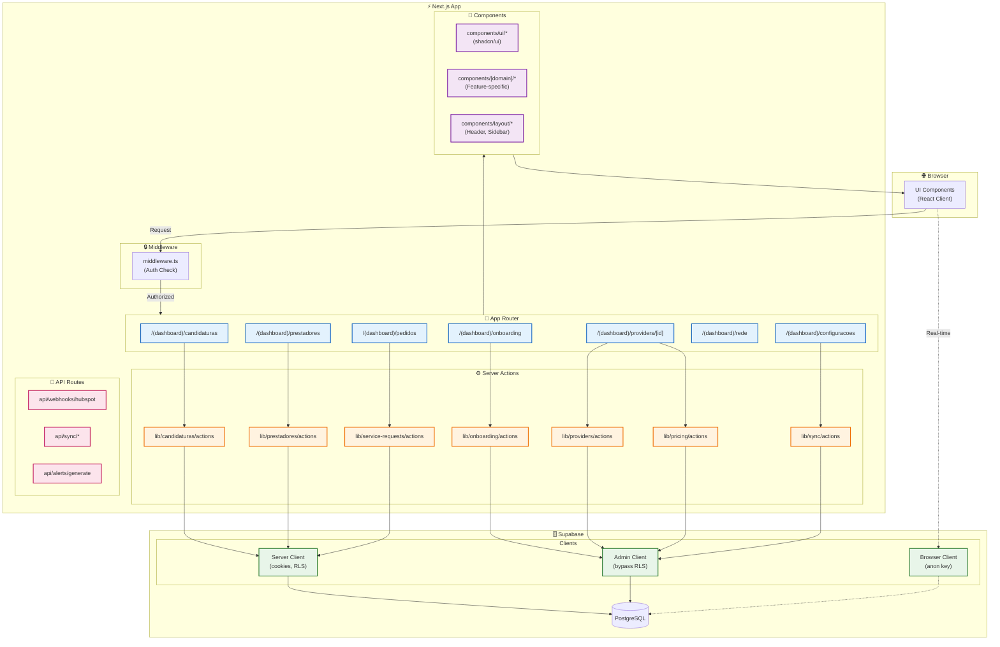
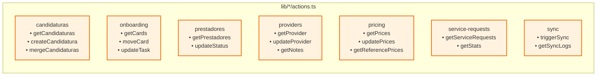
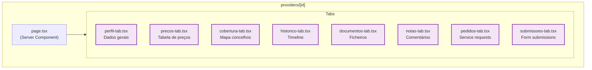
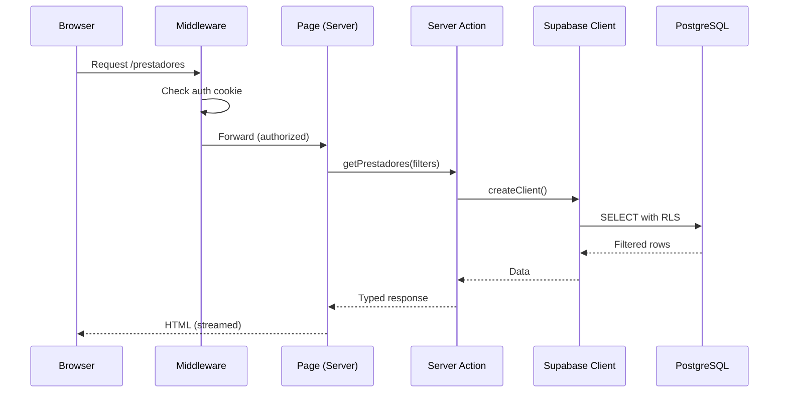
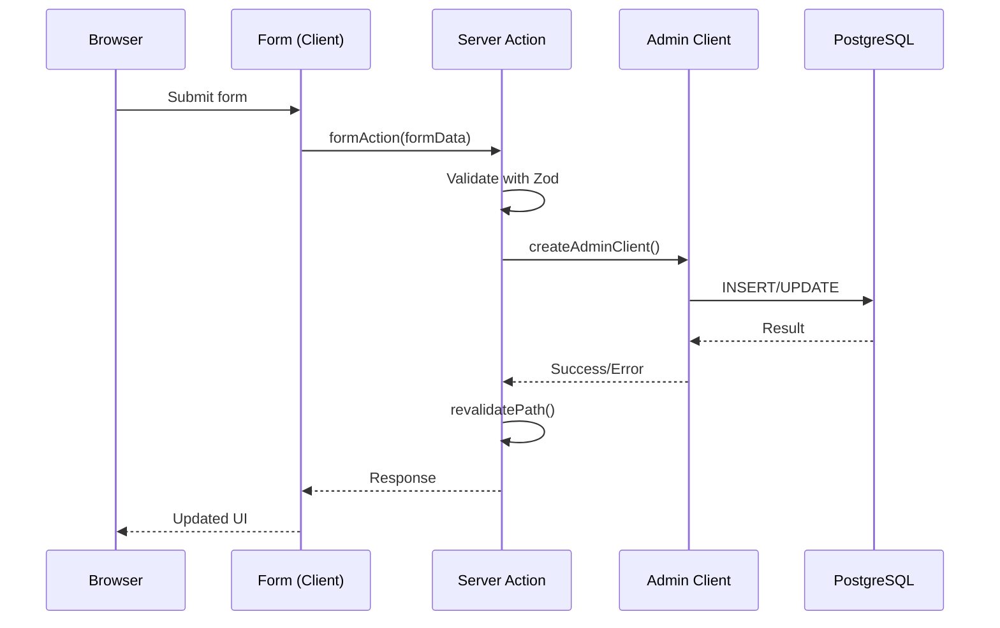
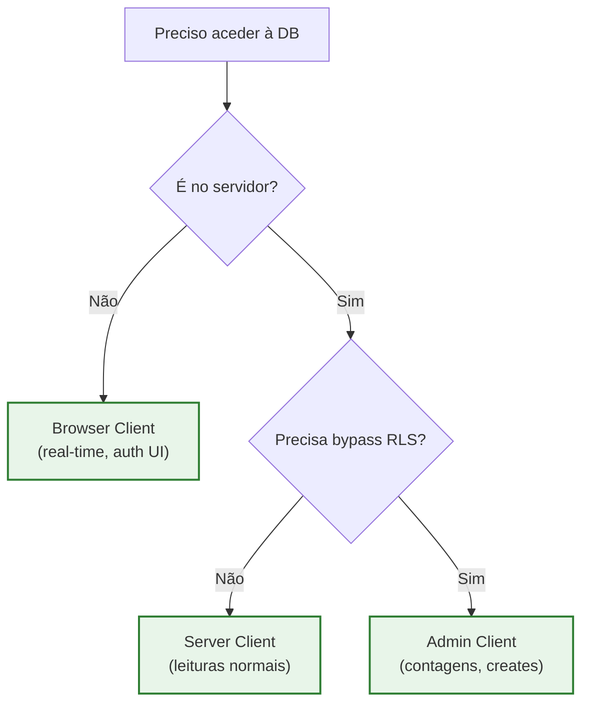

# Diagrama de Componentes (C4 Level 3)

Visão dos componentes internos da aplicação Next.js e suas interacções.

---

## Diagrama Geral

---

## Componentes por Domínio

### Pages (App Router)

```mermaid
flowchart LR
    subgraph dashboard ["/(dashboard)"]
        candidaturas["candidaturas/page.tsx<br/>Lista de candidaturas"]
        onboarding["onboarding/page.tsx<br/>Kanban board"]
        prestadores["prestadores/page.tsx<br/>Lista de prestadores"]
        provider["providers/[id]/page.tsx<br/>Detalhe prestador"]
        pedidos["pedidos/page.tsx<br/>Pedidos de serviço"]
        rede["rede/page.tsx<br/>Mapa de cobertura"]
        kpis["kpis/page.tsx<br/>Dashboard métricas"]
        agenda["agenda/page.tsx<br/>Calendário tarefas"]
        config["configuracoes/page.tsx<br/>Definições"]
    end

    classDef pageStyle fill:#e3f2fd,stroke:#1565c0,stroke-width:2px
    class candidaturas,onboarding,prestadores,provider,pedidos,rede,kpis,agenda,config pageStyle
```

### Server Actions

### Provider Detail Tabs

---

## Fluxo de Dados Detalhado

### Leitura (GET)

### Escrita (POST/PUT)

---

## Clientes Supabase

| Cliente | Ficheiro | Uso | RLS |
|---------|----------|-----|-----|
| **Server** | `lib/supabase/server.ts` | Server Components, Actions | ✅ Respeitado |
| **Admin** | `lib/supabase/admin.ts` | Operações privilegiadas | ❌ Bypass |
| **Browser** | `lib/supabase/client.ts` | Client Components | ✅ Respeitado |

### Quando usar cada um

---

## Documentos Relacionados

- [containers.md](./containers.md) - Diagrama de Containers (C4 Level 2)
- [context.md](./context.md) - Diagrama de Contexto (C4 Level 1)
- [01-ARQUITETURA.md](../../01-ARQUITETURA.md) - Arquitectura detalhada
- [05-COMPONENTES.md](../../05-COMPONENTES.md) - Padrões UI

---

*Última actualização: Janeiro 2026*
