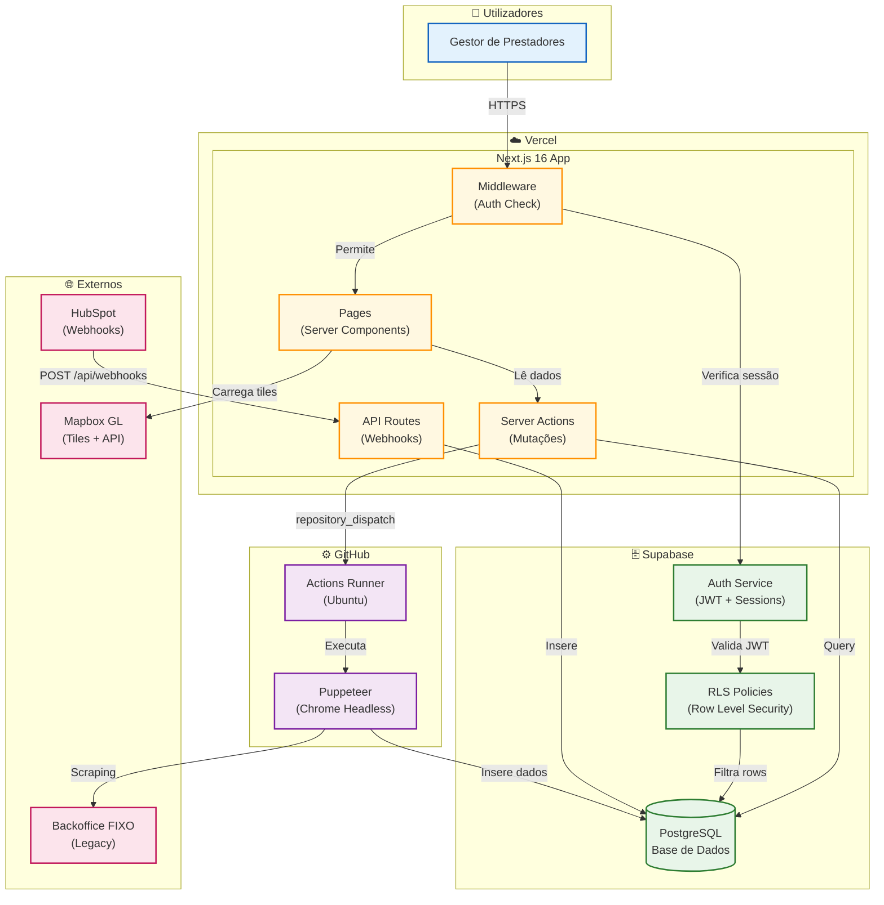

# Diagrama de Containers (C4 Level 2)

Visão dos containers (aplicações, bases de dados, serviços) que compõem o sistema.

---

## Diagrama



---

## Containers do Sistema

### Vercel (Frontend + Backend)

| Container | Tecnologia | Responsabilidade |
|-----------|------------|------------------|
| **Pages** | React Server Components | Renderização de UI, fetch de dados |
| **Server Actions** | Next.js Actions | Mutações (create, update, delete) |
| **API Routes** | Next.js Route Handlers | Webhooks externos (HubSpot) |
| **Middleware** | Next.js Middleware | Verificação de autenticação em todas as rotas |

### Supabase (Dados + Auth)

| Container | Tecnologia | Responsabilidade |
|-----------|------------|------------------|
| **PostgreSQL** | PostgreSQL 15 | Armazenamento de dados |
| **Auth Service** | Supabase Auth | Gestão de sessões, JWT |
| **RLS Policies** | PostgreSQL RLS | Controlo de acesso por row |

### GitHub (Sincronização)

| Container | Tecnologia | Responsabilidade |
|-----------|------------|------------------|
| **Actions Runner** | Ubuntu Latest | Ambiente de execução |
| **Puppeteer** | Chrome Headless | Scraping do backoffice |

---

## Fluxos Principais

### 1. Acesso Normal
```
User → Middleware → Auth → Pages → Actions → DB
```

### 2. Webhook HubSpot
```
HubSpot → API Route → DB
```

### 3. Sincronização
```
Actions → GitHub → Puppeteer → Backoffice → DB
```

---

## Comunicação Entre Containers

| De | Para | Protocolo | Porta |
|----|------|-----------|-------|
| Browser | Vercel | HTTPS | 443 |
| Next.js | Supabase | PostgreSQL | 5432 |
| Next.js | Mapbox | HTTPS | 443 |
| GitHub Actions | Supabase | PostgreSQL | 5432 |
| HubSpot | Next.js | HTTPS | 443 |

---

## Documentos Relacionados

- [context.md](./context.md) - Diagrama de Contexto (C4 Level 1)
- [01-ARQUITETURA.md](../../01-ARQUITETURA.md) - Arquitectura detalhada
- [04-INTEGRACOES.md](../../04-INTEGRACOES.md) - Detalhes das integrações

---

*Última actualização: Janeiro 2026*
