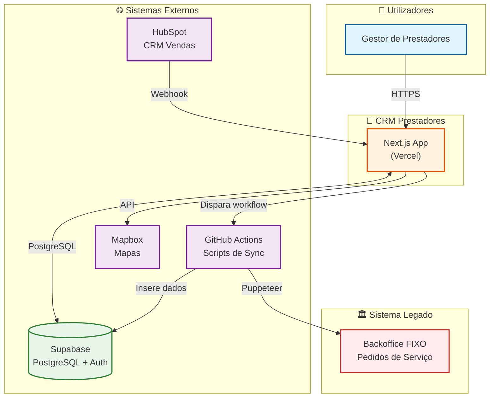

# Diagrama de Contexto (C4 Level 1)

Visão de alto nível do sistema CRM Prestadores e suas integrações externas.

---

## Diagrama



---

## Legenda

| Elemento | Descrição |
|----------|-----------|
| **Gestor de Prestadores** | Utilizador interno que gere candidaturas, onboarding e prestadores activos |
| **Next.js App** | Aplicação web hospedada na Vercel (frontend + server actions) |
| **Supabase** | Base de dados PostgreSQL + sistema de autenticação |
| **GitHub Actions** | Executa scripts de sincronização com Puppeteer |
| **Mapbox** | Serviço de mapas para visualização de cobertura |
| **HubSpot** | CRM de vendas que envia candidaturas via webhook |
| **Backoffice FIXO** | Sistema legado sem API (scraping necessário) |

---

## Fluxos Principais

### 1. Utilização Normal
```
Utilizador → CRM → Supabase
```

### 2. Nova Candidatura (HubSpot)
```
HubSpot → Webhook → CRM → Supabase
```

### 3. Sincronização de Pedidos
```
CRM → GitHub Actions → Backoffice FIXO → Supabase
```

### 4. Visualização de Mapa
```
CRM → Mapbox API → Renderiza mapa
```

---

## Documentos Relacionados

- [01-ARQUITETURA.md](../../01-ARQUITETURA.md) - Arquitectura detalhada
- [04-INTEGRACOES.md](../../04-INTEGRACOES.md) - Detalhes das integrações

---

*Última actualização: Janeiro 2026*
