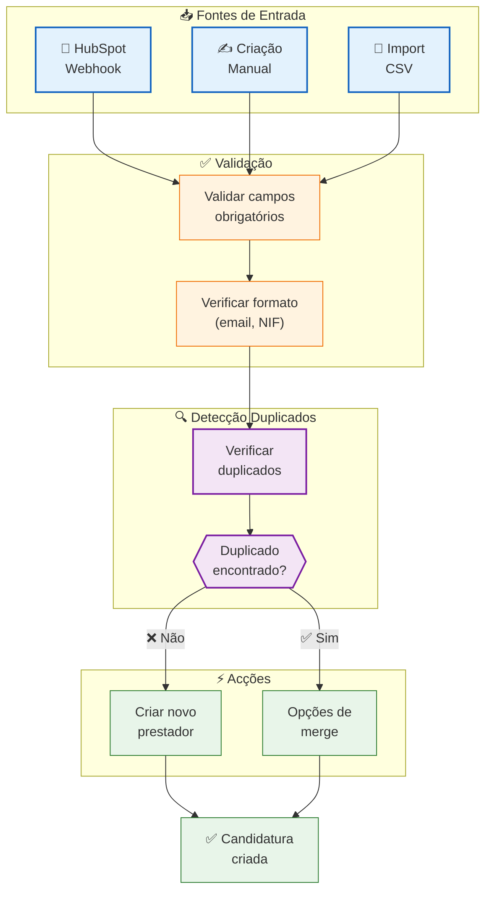
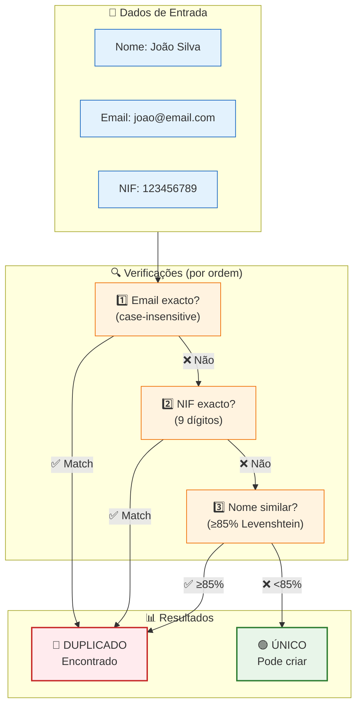
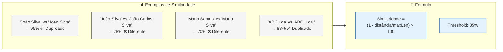
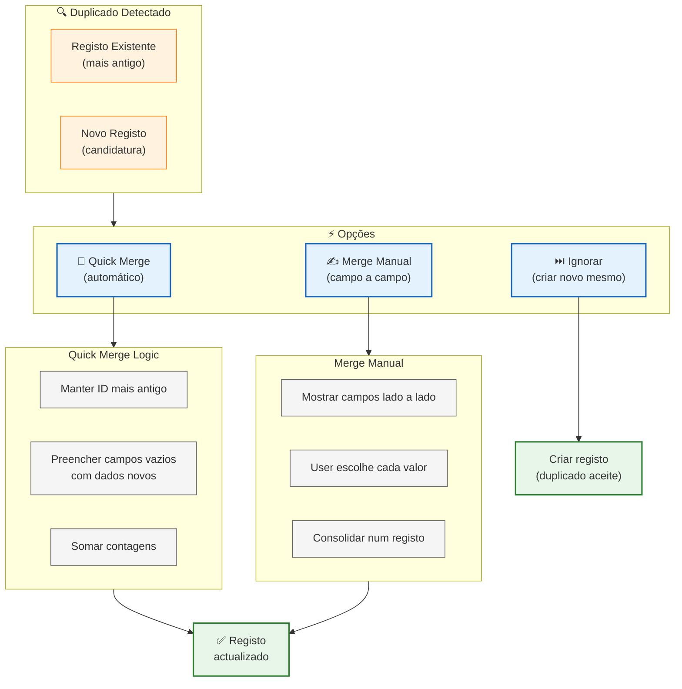
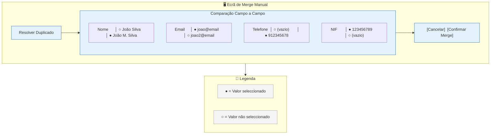
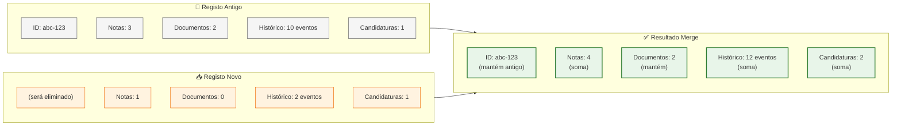
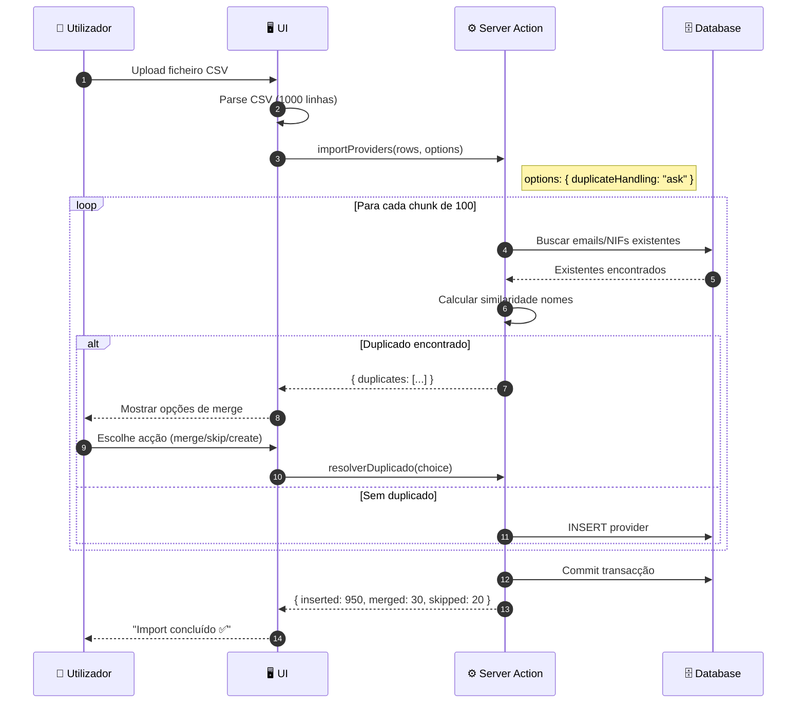
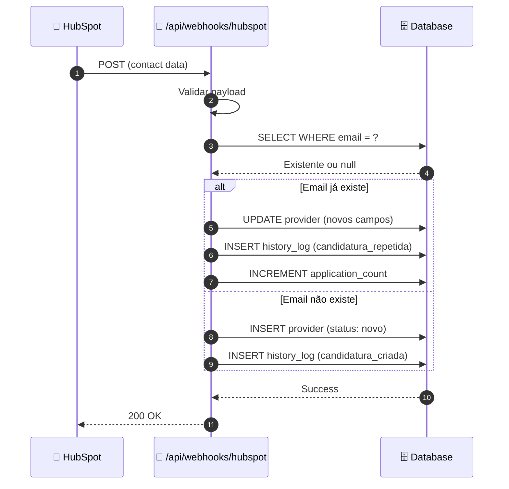

# Fluxo de Candidaturas e Duplicados

Este diagrama detalha o processo de entrada de candidaturas e o sistema de detecção e merge de duplicados.

> **Documentação completa:** [02-FLUXOS-NEGOCIO.md](../../02-FLUXOS-NEGOCIO.md#fluxo-de-candidaturas)

---

## Visão Geral: Entrada de Candidaturas

---

## Algoritmo de Detecção de Duplicados

---

## Cálculo de Similaridade (Levenshtein)

---

## Opções de Merge

---

## Interface de Merge Manual

---

## Dados Transferidos no Merge

---

## Sequence: Import CSV com Duplicados

---

## Sequence: Webhook HubSpot

---

## Tratamento por Fonte

| Fonte | Duplicados | Comportamento Default |
|-------|------------|----------------------|
| **HubSpot** | Auto-detectados | Update se existe, create se não |
| **Manual** | Aviso antes de criar | User decide (merge/skip/create) |
| **CSV** | Configurável | skip / update / ask |

---

## Regras de Negócio

1. **Email e NIF devem ser únicos** - excepto valores mascarados (`***`)
2. **Merge preserva ID antigo** - para manter histórico e relações
3. **Similaridade ≥85%** - threshold para considerar nome duplicado
4. **Quick Merge não apaga dados** - apenas preenche vazios
5. **Histórico é sempre preservado** - merge adiciona evento especial

---

## Código Relacionado

| Ficheiro | Função |
|----------|--------|
| `lib/candidaturas/actions.ts` | `createCandidatura()`, `checkDuplicates()` |
| `lib/candidaturas/merge-actions.ts` | `quickMerge()`, `manualMerge()` |
| `lib/utils/similarity.ts` | `calculateSimilarity()` (Levenshtein) |
| `components/candidaturas/duplicate-dialog.tsx` | UI de resolução |
| `app/api/webhooks/hubspot/route.ts` | Webhook handler |

---

## Documentos Relacionados

- [02-FLUXOS-NEGOCIO.md](../../02-FLUXOS-NEGOCIO.md#sistema-de-duplicados-e-merge) - **Regras de merge detalhadas**
- [provider-lifecycle.md](./provider-lifecycle.md) - Ciclo de vida após criação
- [03-BASE-DADOS.md](../../03-BASE-DADOS.md) - Schema da tabela providers

---

*Última actualização: Janeiro 2026*
