# Fluxo de Candidaturas e Duplicados

Este diagrama detalha o processo de entrada de candidaturas e o sistema de detecção e merge de duplicados.

> **Documentação completa:** [02-FLUXOS-NEGOCIO.md](../../02-FLUXOS-NEGOCIO.md#fluxo-de-candidaturas)

---

## Visão Geral: Entrada de Candidaturas

```mermaid
flowchart TB
    subgraph sources ["📥 Fontes de Entrada"]
        hubspot["🔗 HubSpot<br/>Webhook"]
        manual["✍️ Criação<br/>Manual"]
        csv["📄 Import<br/>CSV"]
    end

    subgraph validation ["✅ Validação"]
        validate["Validar campos<br/>obrigatórios"]
        format["Verificar formato<br/>(email, NIF)"]
    end

    subgraph duplicate ["🔍 Detecção Duplicados"]
        check["Verificar<br/>duplicados"]
        decision{{"Duplicado<br/>encontrado?"}}
    end

    subgraph actions ["⚡ Acções"]
        create["Criar novo<br/>prestador"]
        merge_opts["Opções de<br/>merge"]
    end

    hubspot --> validate
    manual --> validate
    csv --> validate

    validate --> format
    format --> check
    check --> decision

    decision -->|"❌ Não"| create
    decision -->|"✅ Sim"| merge_opts

    create --> done["✅ Candidatura<br/>criada"]
    merge_opts --> done

    classDef sourceStyle fill:#e3f2fd,stroke:#1565c0,stroke-width:2px
    classDef validateStyle fill:#fff3e0,stroke:#ef6c00,stroke-width:1px
    classDef duplicateStyle fill:#f3e5f5,stroke:#7b1fa2,stroke-width:2px
    classDef actionStyle fill:#e8f5e9,stroke:#2e7d32,stroke-width:1px

    class hubspot,manual,csv sourceStyle
    class validate,format validateStyle
    class check,decision duplicateStyle
    class create,merge_opts,done actionStyle
```

---

## Algoritmo de Detecção de Duplicados

```mermaid
flowchart TB
    subgraph input ["📝 Dados de Entrada"]
        name["Nome: João Silva"]
        email["Email: joao@email.com"]
        nif["NIF: 123456789"]
    end

    subgraph checks ["🔍 Verificações (por ordem)"]
        c1["1️⃣ Email exacto?<br/>(case-insensitive)"]
        c2["2️⃣ NIF exacto?<br/>(9 dígitos)"]
        c3["3️⃣ Nome similar?<br/>(≥85% Levenshtein)"]
    end

    subgraph results ["📊 Resultados"]
        match["🔴 DUPLICADO<br/>Encontrado"]
        no_match["🟢 ÚNICO<br/>Pode criar"]
    end

    input --> c1
    c1 -->|"✅ Match"| match
    c1 -->|"❌ Não"| c2
    c2 -->|"✅ Match"| match
    c2 -->|"❌ Não"| c3
    c3 -->|"✅ ≥85%"| match
    c3 -->|"❌ <85%"| no_match

    classDef inputStyle fill:#e3f2fd,stroke:#1565c0,stroke-width:1px
    classDef checkStyle fill:#fff3e0,stroke:#ef6c00,stroke-width:1px
    classDef matchStyle fill:#ffebee,stroke:#c62828,stroke-width:2px
    classDef uniqueStyle fill:#e8f5e9,stroke:#2e7d32,stroke-width:2px

    class name,email,nif inputStyle
    class c1,c2,c3 checkStyle
    class match matchStyle
    class no_match uniqueStyle
```

---

## Cálculo de Similaridade (Levenshtein)

```mermaid
flowchart LR
    subgraph example ["📊 Exemplos de Similaridade"]
        e1["'João Silva' vs 'Joao Silva'<br/>→ 95% ✅ Duplicado"]
        e2["'João Silva' vs 'João Carlos Silva'<br/>→ 78% ❌ Diferente"]
        e3["'Maria Santos' vs 'Maria Silva'<br/>→ 70% ❌ Diferente"]
        e4["'ABC Lda' vs 'ABC, Lda.'<br/>→ 88% ✅ Duplicado"]
    end

    subgraph formula ["📐 Fórmula"]
        f1["Similaridade =<br/>(1 - distância/maxLen) × 100"]
        threshold["Threshold: 85%"]
    end

    example --> formula

    classDef exampleStyle fill:#f5f5f5,stroke:#616161,stroke-width:1px
    classDef formulaStyle fill:#e3f2fd,stroke:#1565c0,stroke-width:1px

    class e1,e2,e3,e4 exampleStyle
    class f1,threshold formulaStyle
```

---

## Opções de Merge

```mermaid
flowchart TB
    subgraph duplicate_found ["🔍 Duplicado Detectado"]
        existing["Registo Existente<br/>(mais antigo)"]
        new["Novo Registo<br/>(candidatura)"]
    end

    subgraph options ["⚡ Opções"]
        quick["🚀 Quick Merge<br/>(automático)"]
        manual["✍️ Merge Manual<br/>(campo a campo)"]
        skip["⏭️ Ignorar<br/>(criar novo mesmo)"]
    end

    subgraph quick_logic ["Quick Merge Logic"]
        q1["Manter ID mais antigo"]
        q2["Preencher campos vazios<br/>com dados novos"]
        q3["Somar contagens"]
    end

    subgraph manual_logic ["Merge Manual"]
        m1["Mostrar campos lado a lado"]
        m2["User escolhe cada valor"]
        m3["Consolidar num registo"]
    end

    duplicate_found --> options

    quick --> quick_logic
    manual --> manual_logic
    skip --> create["Criar registo<br/>(duplicado aceite)"]

    quick_logic --> done["✅ Registo<br/>actualizado"]
    manual_logic --> done

    classDef foundStyle fill:#fff3e0,stroke:#ef6c00,stroke-width:1px
    classDef optionStyle fill:#e3f2fd,stroke:#1565c0,stroke-width:2px
    classDef logicStyle fill:#f5f5f5,stroke:#616161,stroke-width:1px
    classDef doneStyle fill:#e8f5e9,stroke:#2e7d32,stroke-width:2px

    class existing,new foundStyle
    class quick,manual,skip optionStyle
    class q1,q2,q3,m1,m2,m3 logicStyle
    class done,create doneStyle
```

---

## Interface de Merge Manual

```mermaid
flowchart TB
    subgraph ui ["🖥️ Ecrã de Merge Manual"]
        header["Resolver Duplicado"]

        subgraph table ["Comparação Campo a Campo"]
            row1["Nome      │ ○ João Silva    │ ● João M. Silva"]
            row2["Email     │ ● joao@email    │ ○ joao2@email"]
            row3["Telefone  │ ○ (vazio)       │ ● 912345678"]
            row4["NIF       │ ● 123456789     │ ○ (vazio)"]
        end

        actions["[Cancelar]  [Confirmar Merge]"]
    end

    subgraph legend ["📖 Legenda"]
        l1["● = Valor seleccionado"]
        l2["○ = Valor não seleccionado"]
    end

    header --> table
    table --> actions
    ui --> legend

    classDef uiStyle fill:#e3f2fd,stroke:#1565c0,stroke-width:1px
    classDef legendStyle fill:#f5f5f5,stroke:#9e9e9e,stroke-width:1px

    class header,table,actions uiStyle
    class l1,l2 legendStyle
```

---

## Dados Transferidos no Merge

```mermaid
flowchart LR
    subgraph old ["📁 Registo Antigo"]
        o1["ID: abc-123"]
        o2["Notas: 3"]
        o3["Documentos: 2"]
        o4["Histórico: 10 eventos"]
        o5["Candidaturas: 1"]
    end

    subgraph new ["📥 Registo Novo"]
        n1["(será eliminado)"]
        n2["Notas: 1"]
        n3["Documentos: 0"]
        n4["Histórico: 2 eventos"]
        n5["Candidaturas: 1"]
    end

    subgraph merged ["✅ Resultado Merge"]
        m1["ID: abc-123<br/>(mantém antigo)"]
        m2["Notas: 4<br/>(soma)"]
        m3["Documentos: 2<br/>(mantém)"]
        m4["Histórico: 12 eventos<br/>(soma)"]
        m5["Candidaturas: 2<br/>(soma)"]
    end

    old --> merged
    new --> merged

    classDef oldStyle fill:#f5f5f5,stroke:#616161,stroke-width:1px
    classDef newStyle fill:#fff3e0,stroke:#ef6c00,stroke-width:1px
    classDef mergedStyle fill:#e8f5e9,stroke:#2e7d32,stroke-width:2px

    class o1,o2,o3,o4,o5 oldStyle
    class n1,n2,n3,n4,n5 newStyle
    class m1,m2,m3,m4,m5 mergedStyle
```

---

## Sequence: Import CSV com Duplicados

```mermaid
sequenceDiagram
    autonumber
    participant U as 👤 Utilizador
    participant UI as 🖥️ UI
    participant API as ⚙️ Server Action
    participant DB as 🗄️ Database

    U->>UI: Upload ficheiro CSV
    UI->>UI: Parse CSV (1000 linhas)

    UI->>API: importProviders(rows, options)
    Note right of API: options: { duplicateHandling: "ask" }

    loop Para cada chunk de 100
        API->>DB: Buscar emails/NIFs existentes
        DB-->>API: Existentes encontrados

        API->>API: Calcular similaridade nomes

        alt Duplicado encontrado
            API-->>UI: { duplicates: [...] }
            UI-->>U: Mostrar opções de merge
            U->>UI: Escolhe acção (merge/skip/create)
            UI->>API: resolverDuplicado(choice)
        else Sem duplicado
            API->>DB: INSERT provider
        end
    end

    API->>DB: Commit transacção
    API-->>UI: { inserted: 950, merged: 30, skipped: 20 }
    UI-->>U: "Import concluído ✅"
```

---

## Sequence: Webhook HubSpot

```mermaid
sequenceDiagram
    autonumber
    participant HS as 🔗 HubSpot
    participant API as 📡 /api/webhooks/hubspot
    participant DB as 🗄️ Database

    HS->>API: POST (contact data)
    API->>API: Validar payload

    API->>DB: SELECT WHERE email = ?
    DB-->>API: Existente ou null

    alt Email já existe
        API->>DB: UPDATE provider (novos campos)
        API->>DB: INSERT history_log (candidatura_repetida)
        API->>DB: INCREMENT application_count
    else Email não existe
        API->>DB: INSERT provider (status: novo)
        API->>DB: INSERT history_log (candidatura_criada)
    end

    DB-->>API: Success
    API-->>HS: 200 OK
```

---

## Tratamento por Fonte

| Fonte | Duplicados | Comportamento Default |
|-------|------------|----------------------|
| **HubSpot** | Auto-detectados | Update se existe, create se não |
| **Manual** | Aviso antes de criar | User decide (merge/skip/create) |
| **CSV** | Configurável | skip / update / ask |

---

## Regras de Negócio

1. **Email e NIF devem ser únicos** - excepto valores mascarados (`***`)
2. **Merge preserva ID antigo** - para manter histórico e relações
3. **Similaridade ≥85%** - threshold para considerar nome duplicado
4. **Quick Merge não apaga dados** - apenas preenche vazios
5. **Histórico é sempre preservado** - merge adiciona evento especial

---

## Código Relacionado

| Ficheiro | Função |
|----------|--------|
| `lib/candidaturas/actions.ts` | `createCandidatura()`, `checkDuplicates()` |
| `lib/candidaturas/merge-actions.ts` | `quickMerge()`, `manualMerge()` |
| `lib/utils/similarity.ts` | `calculateSimilarity()` (Levenshtein) |
| `components/candidaturas/duplicate-dialog.tsx` | UI de resolução |
| `app/api/webhooks/hubspot/route.ts` | Webhook handler |

---

## Documentos Relacionados

- [02-FLUXOS-NEGOCIO.md](../../02-FLUXOS-NEGOCIO.md#sistema-de-duplicados-e-merge) - **Regras de merge detalhadas**
- [provider-lifecycle.md](./provider-lifecycle.md) - Ciclo de vida após criação
- [03-BASE-DADOS.md](../../03-BASE-DADOS.md) - Schema da tabela providers

---

*Última actualização: Janeiro 2026*
