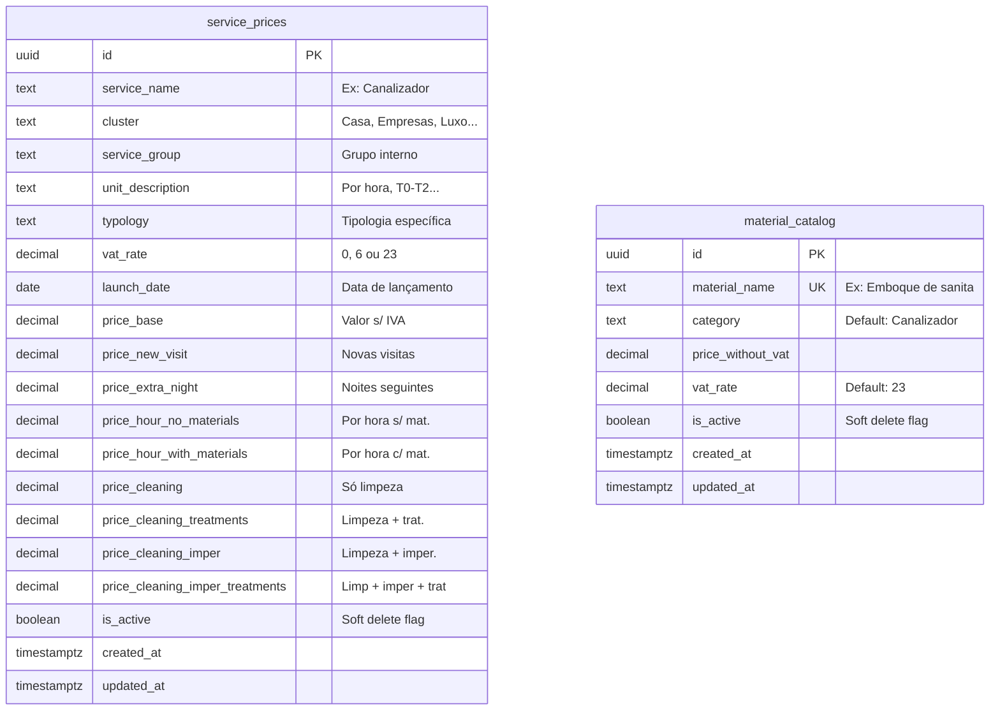
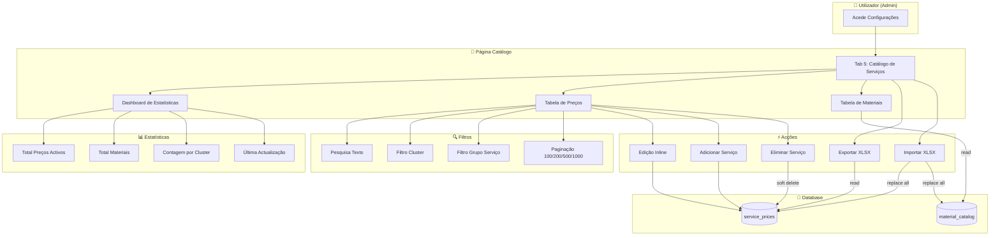
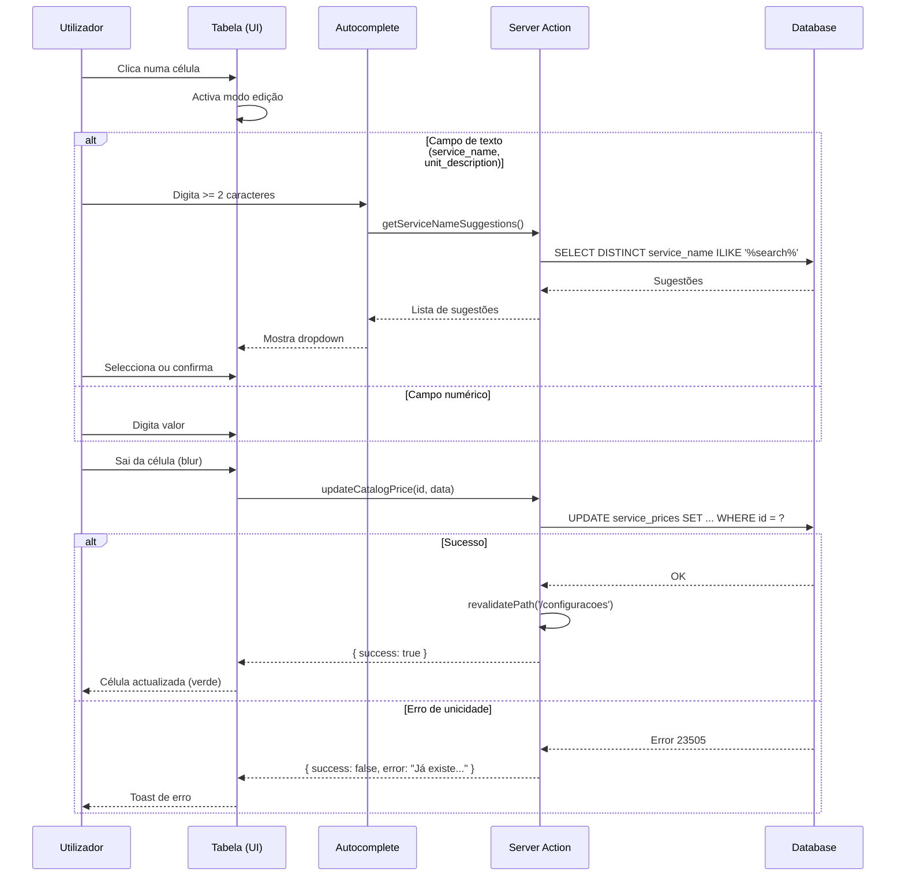
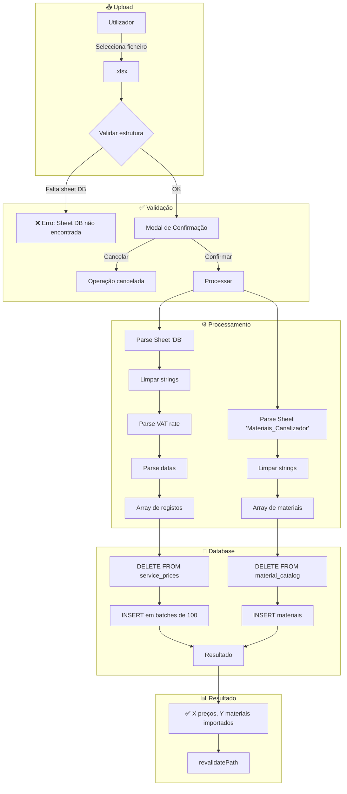
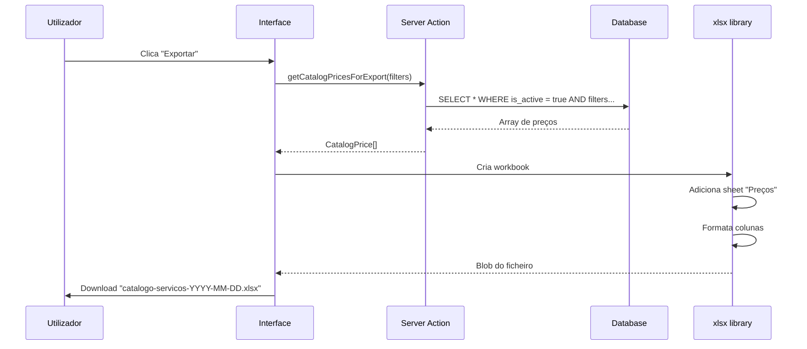
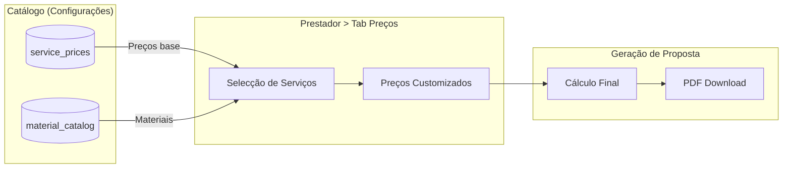

# Fluxo do Catálogo de Serviços

## Visão Geral

O Catálogo de Serviços é a fonte central de preços de referência para angariação de prestadores. Os dados são originalmente importados do Excel "PreçosAngariação_Tabela Resumo.xlsx" e podem ser geridos manualmente ou via import/export.

**Localização:** Configurações > Tab 5: Catálogo de Serviços

**Ficheiros principais:**
- `src/components/service-catalog/prices-table.tsx`
- `src/components/service-catalog/materials-table.tsx`
- `src/components/service-catalog/catalog-stats.tsx`
- `src/lib/service-catalog/actions.ts`
- `src/app/api/service-catalog/import/route.ts`

---

## 1. Arquitectura de Dados



### Clusters Disponíveis

| Cluster | Cor (UI) | Descrição |
|---------|----------|-----------|
| Casa | Azul | Serviços domésticos gerais |
| Saúde e bem estar | Verde | Serviços de saúde/bem-estar |
| Empresas | Roxo | Serviços B2B |
| Luxo | Âmbar | Serviços premium |
| Pete | Rosa | Serviços para animais |

### Constraint de Unicidade

```sql
-- Índice único funcional (permite NULL em typology)
CREATE UNIQUE INDEX angariacao_reference_prices_unique_idx
  ON angariacao_reference_prices(
    service_name,
    unit_description,
    COALESCE(typology, '')
  );
```

---

## 2. Fluxo de Gestão Principal



---

## 3. Fluxo de Edição Inline



---

## 4. Fluxo de Importação Excel



### Formato do Excel Esperado

**Sheet "DB" (Preços):**

| Coluna | Tipo | Obrigatório | Notas |
|--------|------|-------------|-------|
| Serviços | texto | ✅ | Nome do serviço |
| Cluster | texto | ✅ | Casa, Empresas, etc. |
| Qtd./Unid. | texto | ✅ | Por hora, T0-T2, etc. |
| Grupo (Sheet onde está) | texto | ❌ | Grupo interno |
| Tipologia | texto | ❌ | Especificidade |
| Taxa de IVA | número | ❌ | Default: 23 |
| Data de lançamento do serviço | data | ❌ | |
| Valor s/ IVA | número | ❌ | Preço base |
| Valor s/ IVA - Novas visitas | número | ❌ | |
| Valor s/ IVA - Noites seguintes | número | ❌ | |
| Valor s/IVA - por hora sem materiais | número | ❌ | |
| Valor s/IVA - por hora com materiais | número | ❌ | |
| Valor s/IVA - Limpeza | número | ❌ | |
| Valor s/IVA - Limpeza + Tratamentos | número | ❌ | |
| Valor s/IVA - Limpeza + Imper. | número | ❌ | |
| Valor s/IVA - Limpeza + imper. + Tratamentos | número | ❌ | |

**Sheet "Materiais_Canalizador" (Materiais):**

| Coluna | Tipo | Obrigatório |
|--------|------|-------------|
| Material | texto | ✅ |
| Valores s/ IVA | número | ✅ |
| Taxa de IVA | número | ❌ (default: 23) |

---

## 5. Fluxo de Exportação



---

## 6. Server Actions

| Action | Descrição | Retorno |
|--------|-----------|---------|
| `getCatalogStats()` | Estatísticas gerais | `CatalogStats` |
| `getCatalogPrices(params)` | Preços com paginação/filtros | `{ data, total }` |
| `getCatalogMaterials()` | Lista de materiais activos | `CatalogMaterial[]` |
| `getCatalogClusters()` | Clusters únicos | `string[]` |
| `getCatalogServiceGroups(cluster?)` | Grupos de serviço | `string[]` |
| `createCatalogPrice(data)` | Criar novo preço | `{ success, id?, error? }` |
| `updateCatalogPrice(id, data)` | Actualizar preço | `{ success, error? }` |
| `deleteCatalogPrice(id)` | Soft delete | `{ success, error? }` |
| `getServiceNameSuggestions(search)` | Autocomplete | `string[]` |
| `getUnitDescriptionSuggestions(search)` | Autocomplete | `string[]` |
| `getCatalogPricesForExport(filters)` | Todos os preços para export | `CatalogPrice[]` |

---

## 7. Componentes UI

```
src/components/service-catalog/
├── catalog-stats.tsx      # Cards de estatísticas
├── prices-table.tsx       # Tabela principal de preços
├── materials-table.tsx    # Tabela de materiais
├── price-row.tsx          # Linha editável da tabela
├── add-price-dialog.tsx   # Modal para adicionar preço
└── import-dialog.tsx      # Modal de import com confirmação
```

### Características da Tabela

- **Scroll horizontal**: Para acomodar as 9 colunas de preços
- **Colunas redimensionáveis**: Drag nas bordas das colunas
- **Edição inline**: Click para editar, blur para guardar
- **Autocomplete**: Para campos de texto com dados existentes
- **Paginação**: 100, 200, 500 ou 1000 items por página
- **Filtros persistentes**: Mantidos durante navegação na página

---

## 8. RLS (Row Level Security)

```sql
-- Leitura: todos os utilizadores autenticados
CREATE POLICY "Allow read for authenticated"
  ON service_prices FOR SELECT
  TO authenticated USING (true);

-- Escrita: apenas service_role (admin operations)
CREATE POLICY "Allow all for service_role"
  ON service_prices FOR ALL
  TO service_role
  USING (true) WITH CHECK (true);
```

**Nota:** As operações de escrita usam `createAdminClient()` que bypassa RLS com a service role key.

---

## 9. Relacionamento com Propostas

O catálogo alimenta o sistema de propostas comerciais para prestadores:



Ver também: [Fluxo de Preços e Catálogo de Serviços](../../02-FLUXOS-NEGOCIO.md#fluxo-de-preços-e-catálogo-de-serviços)
