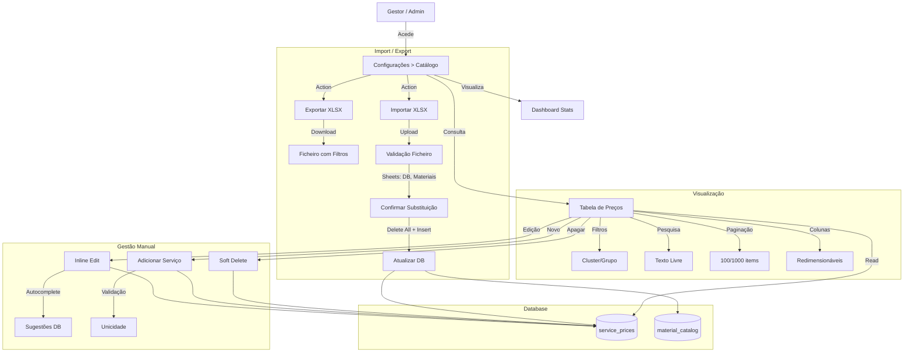

# Fluxo do Catálogo de Serviços

## Gestão de Preços e Materiais

Este diagrama ilustra as interacções principais na gestão do catálogo de serviços, incluindo visualização, edição, e processos de importação/exportação.

