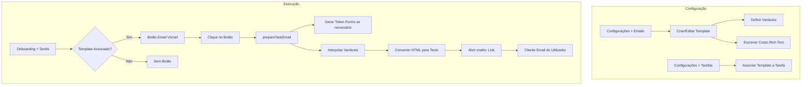

# Email Templates - Fluxo de Funcionamento

## Visão Geral

O sistema de Email Templates permite criar, gerir e enviar emails personalizados aos prestadores durante o processo de onboarding. Os templates suportam variáveis dinâmicas que são substituídas automaticamente com os dados do prestador.

## Arquitectura



## Componentes

### 1. Gestão de Templates (`/configuracoes` > Tab Emails)

**Ficheiros:**
- `src/components/settings/email-templates-settings.tsx` - UI CRUD
- `src/lib/email-templates/actions.ts` - Server actions
- `src/components/ui/rich-text-editor.tsx` - Editor Tiptap

**Funcionalidades:**
- Criar, editar, eliminar templates
- Editor rich text (bold, italic, listas, links)
- Gestão de variáveis
- Preview do template
- Toggle activo/inactivo

### 2. Associação Template-Tarefa (`/configuracoes` > Tab Tarefas)

**Ficheiros:**
- `src/components/settings/task-definitions-table.tsx`
- `src/lib/settings/actions.ts`

**Schema:**
```sql
ALTER TABLE task_definitions
ADD COLUMN email_template_id UUID REFERENCES email_templates(id);
```

### 3. Envio de Email (Onboarding)

**Ficheiros:**
- `src/components/onboarding/onboarding-task-list.tsx`
- `src/lib/email-templates/actions.ts` (`prepareTaskEmail`)

## Variáveis Disponíveis

| Variável | Descrição | Exemplo |
|----------|-----------|---------|
| `{{nome_prestador}}` | Nome do prestador | João Silva |
| `{{email_prestador}}` | Email do prestador | joao@email.com |
| `{{telefone_prestador}}` | Telefone do prestador | 912345678 |
| `{{nif_prestador}}` | NIF do prestador | 123456789 |
| `{{forms_link}}` | URL do formulário (gera token) | https://crm.fixo.pt/forms/services/abc123 |
| `{{forms_link:Texto}}` | Link com texto personalizado | Texto: https://... |

### Sintaxe Especial: `{{forms_link:Texto}}`

Como o mailto: não suporta HTML, esta sintaxe permite definir um texto descritivo para o link:

**No template:**
```
{{forms_link:Preencher Formulário de Serviços}}
```

**No email gerado:**
```
Preencher Formulário de Serviços: https://crm.fixo.pt/forms/services/abc123xyz
```

## Fluxo de Utilização

### 1. Criar Template

1. Ir a **Configurações > Emails**
2. Clicar **Novo Template**
3. Preencher:
   - **Chave**: identificador único (ex: `convite_formulario`)
   - **Nome**: nome amigável (ex: `Convite Formulário Serviços`)
   - **Variáveis**: adicionar variáveis necessárias
   - **Assunto**: linha de assunto do email
   - **Corpo**: conteúdo do email (rich text)
4. Guardar

### 2. Associar a Tarefa

1. Ir a **Configurações > Tarefas**
2. Clicar no lápis da tarefa desejada
3. Seleccionar o template na coluna "Email Template"
4. Guardar

### 3. Enviar Email

1. Abrir um card de onboarding
2. Na tarefa com template associado, aparece um botão de email (ícone azul)
3. Clicar no botão
4. O cliente de email abre com:
   - **Para**: email do prestador
   - **Assunto**: assunto interpolado
   - **Corpo**: corpo interpolado (texto simples)

## Exemplo de Template

**Chave:** `convite_formulario_servicos`

**Nome:** `Convite Formulário de Serviços`

**Variáveis:** `nome_prestador`, `forms_link`

**Assunto:**
```
Formulário de Serviços FIXO - {{nome_prestador}}
```

**Corpo:**
```html
<p>Olá {{nome_prestador}},</p>
<p>Bem-vindo à rede FIXO!</p>
<p>Para completar o seu registo, por favor preencha o formulário de serviços:</p>
<p>{{forms_link:Preencher Formulário de Serviços}}</p>
<p>Neste formulário poderá indicar:</p>
<ul>
  <li>Os serviços que pretende prestar</li>
  <li>A sua área de cobertura geográfica</li>
  <li>Documentação e certificações</li>
  <li>Disponibilidade e recursos</li>
</ul>
<p>Se tiver alguma dúvida, não hesite em contactar-nos.</p>
<p>Cumprimentos,<br>Equipa FIXO</p>
```

**Email Gerado:**
```
Olá João Silva,

Bem-vindo à rede FIXO!

Para completar o seu registo, por favor preencha o formulário de serviços:

Preencher Formulário de Serviços: https://crm.fixo.pt/forms/services/abc123xyz

Neste formulário poderá indicar:
• Os serviços que pretende prestar
• A sua área de cobertura geográfica
• Documentação e certificações
• Disponibilidade e recursos

Se tiver alguma dúvida, não hesite em contactar-nos.

Cumprimentos,
Equipa FIXO
```

## Limitações

1. **mailto: é texto simples** - Links não são clicáveis no corpo do email
2. **Tamanho do URL** - mailto: tem limite de ~2000 caracteres
3. **Depende do cliente de email** - Comportamento pode variar

## Melhorias Futuras

- [ ] Envio via servidor (Resend/SendGrid) para HTML real
- [ ] Histórico de emails enviados
- [ ] Templates por etapa (automático)
- [ ] Agendamento de envio
