# Pipeline de Onboarding

Este diagrama ilustra o processo de onboarding no Kanban (11 etapas, 23 tarefas).

> **Nota:** Para detalhes completos das tarefas por etapa, consultar [02-FLUXOS-NEGOCIO.md](../../02-FLUXOS-NEGOCIO.md#fluxo-de-onboarding)

---

## Visão Geral do Pipeline

```mermaid
flowchart LR
    subgraph pipeline ["📋 Pipeline Kanban (11 Etapas)"]
        subgraph fase1 ["Contacto"]
            e1["1️⃣ Por<br/>Contactar"]
            e2["2️⃣ Contactados<br/>Aguarda Info"]
            e3["3️⃣ Aguarda<br/>Reunião"]
            e3a["3A Reunião<br/>Marcada"]
        end

        subgraph fase2 ["Decisão"]
            e4["4️⃣ Comité<br/>GO/NO GO"]
            e5["5️⃣ Aguarda<br/>Docs/Apólice"]
        end

        subgraph fase3 ["Formação"]
            e6["6️⃣ Em<br/>Formação"]
            e7["7️⃣ Aguarda<br/>Quiz"]
            e8["8️⃣ Enviar<br/>Materiais"]
        end

        subgraph fase4 ["Activação"]
            e9["9️⃣ Criar<br/>Ficha ERP"]
            e10["🔟 Alinhamento<br/>Pre-Launch"]
            e11["1️⃣1️⃣ Acompanha-<br/>mento"]
        end
    end

    entrada["Nova<br/>Candidatura"] --> e1
    e1 --> e2
    e2 --> e3
    e3 --> e3a
    e3a --> e4
    e4 --> e5
    e5 --> e6
    e6 --> e7
    e7 --> e8
    e8 --> e9
    e9 --> e10
    e10 --> e11
    e11 --> ativo["✅ Prestador<br/>Activo"]

    e4 -.->|"NO GO"| abandonado["❌ Abandonado"]

    classDef faseStyle fill:#fff3e0,stroke:#ef6c00,stroke-width:1px
    classDef entradaStyle fill:#e3f2fd,stroke:#1565c0,stroke-width:2px
    classDef ativoStyle fill:#e8f5e9,stroke:#2e7d32,stroke-width:2px
    classDef abandonadoStyle fill:#ffebee,stroke:#c62828,stroke-width:2px

    class e1,e2,e3,e3a,e4,e5,e6,e7,e8,e9,e10,e11 faseStyle
    class entrada entradaStyle
    class ativo ativoStyle
    class abandonado abandonadoStyle
```

---

## Fluxo Simplificado (4 Fases)

```mermaid
flowchart LR
    subgraph f1 ["📞 CONTACTO"]
        c1["Etapas 1-3A"]
        c2["4 tarefas"]
    end

    subgraph f2 ["✅ DECISÃO"]
        d1["Etapas 4-5"]
        d2["3 tarefas"]
    end

    subgraph f3 ["🎓 FORMAÇÃO"]
        fo1["Etapas 6-8"]
        fo2["7 tarefas"]
    end

    subgraph f4 ["🚀 ACTIVAÇÃO"]
        a1["Etapas 9-11"]
        a2["9 tarefas"]
    end

    f1 --> f2
    f2 --> f3
    f3 --> f4
    f4 --> done["Prestador Activo"]

    classDef fase1Style fill:#e3f2fd,stroke:#1565c0,stroke-width:2px
    classDef fase2Style fill:#fff3e0,stroke:#ef6c00,stroke-width:2px
    classDef fase3Style fill:#fff8e1,stroke:#f9a825,stroke-width:2px
    classDef fase4Style fill:#e8f5e9,stroke:#2e7d32,stroke-width:2px

    class c1,c2 fase1Style
    class d1,d2 fase2Style
    class fo1,fo2 fase3Style
    class a1,a2 fase4Style
```

---

## Gestão de Tarefas

```mermaid
flowchart TB
    subgraph card ["🎴 Card no Kanban"]
        provider["Prestador X"]
        stage["Etapa actual: 6"]
        progress["Progresso: 70%"]
    end

    subgraph tasks ["📋 Tarefas da Etapa"]
        task1["✅ Tarefa concluída"]
        task2["🔄 Tarefa em curso"]
        task3["⬜ Tarefa pendente"]
    end

    subgraph actions ["⚡ Acções"]
        complete["Marcar concluída"]
        owner["Atribuir owner"]
        move["Mover etapa"]
    end

    card --> tasks
    tasks --> actions

    complete -->|"Todas concluídas"| next["Próxima Etapa"]

    classDef cardStyle fill:#e3f2fd,stroke:#1565c0,stroke-width:2px
    classDef doneStyle fill:#e8f5e9,stroke:#2e7d32,stroke-width:1px
    classDef progressStyle fill:#fff3e0,stroke:#ef6c00,stroke-width:1px
    classDef pendingStyle fill:#f5f5f5,stroke:#9e9e9e,stroke-width:1px

    class provider,stage,progress cardStyle
    class task1 doneStyle
    class task2 progressStyle
    class task3 pendingStyle
```

---

## Estados das Tarefas

---

## Tipos de Onboarding

```mermaid
flowchart LR
    subgraph tipos ["Tipos de Card"]
        normal["🟢 Normal<br/>Prazos padrão"]
        urgente["🔴 Urgente<br/>Prazos reduzidos"]
    end

    subgraph deadlines ["Exemplo: Etapa 1"]
        n1["Normal: 48h"]
        u1["Urgente: 24h"]
    end

    normal --> n1
    urgente --> u1

    classDef normalStyle fill:#e8f5e9,stroke:#2e7d32,stroke-width:2px
    classDef urgenteStyle fill:#ffebee,stroke:#c62828,stroke-width:2px

    class normal normalStyle
    class urgente urgenteStyle
```

---

## Drag & Drop

---

## Código Relacionado

| Ficheiro | Função |
|----------|--------|
| `lib/onboarding/actions.ts` | `getCards()`, `moveCard()`, `updateTask()` |
| `components/onboarding/kanban-board.tsx` | Board principal |
| `components/onboarding/kanban-card.tsx` | Card individual |
| `components/onboarding/task-list.tsx` | Lista de tarefas |

---

## Documentos Relacionados

- [02-FLUXOS-NEGOCIO.md](../../02-FLUXOS-NEGOCIO.md#fluxo-de-onboarding) - **Etapas e tarefas detalhadas**
- [provider-lifecycle.md](./provider-lifecycle.md) - Ciclo de vida completo
- [03-BASE-DADOS.md](../../03-BASE-DADOS.md) - Tabelas `onboarding_cards`, `onboarding_tasks`

---

*Última actualização: Janeiro 2026*
