# Fluxo de Formulários de Prestadores

Este diagrama detalha o sistema de envio, preenchimento e processamento de formulários de prestadores.

> **Documentação completa:** [02-FLUXOS-NEGOCIO.md](../../02-FLUXOS-NEGOCIO.md#formulários-de-prestadores)

---

## Visão Geral: Ciclo Completo

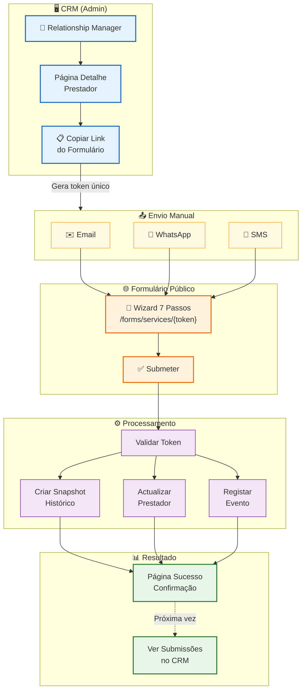

---

## Geração do Link (Token)

```mermaid
flowchart LR
    subgraph trigger ["🖱️ Trigger"]
        click["Admin clica<br/>'Copiar Link'"]
    end

    subgraph generate ["⚙️ generateFormsToken()"]
        create["Criar string:<br/>providerId:timestamp"]
        encode["Codificar em<br/>Base64 URL-safe"]
        store["Guardar token<br/>em providers.forms_token"]
    end

    subgraph output ["📋 Output"]
        url["URL completo:<br/>/forms/services/{token}"]
        clipboard["Copiar para<br/>Clipboard"]
    end

    click --> create
    create --> encode
    encode --> store
    store --> url
    url --> clipboard

    classDef triggerStyle fill:#e3f2fd,stroke:#1565c0,stroke-width:1px
    classDef generateStyle fill:#f3e5f5,stroke:#7b1fa2,stroke-width:1px
    classDef outputStyle fill:#e8f5e9,stroke:#2e7d32,stroke-width:1px

    class click triggerStyle
    class create,encode,store generateStyle
    class url,clipboard outputStyle
```

### Formato do Token

```
providerId:timestamp → Base64 URL-safe
Exemplo: "abc-123-uuid:1705929600000" → "YWJjLTEyMy11dWlkOjE3MDU5Mjk2MDAwMDA"
```

---

## Wizard de 7 Passos

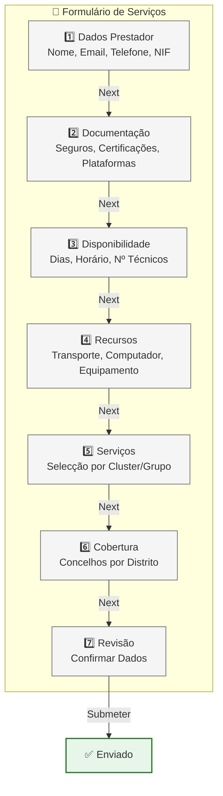

---

## Detalhe: Cada Passo do Formulário

### Passo 1 - Dados do Prestador

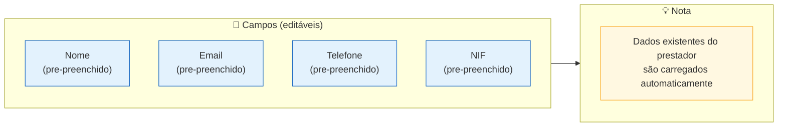

### Passo 2 - Documentação

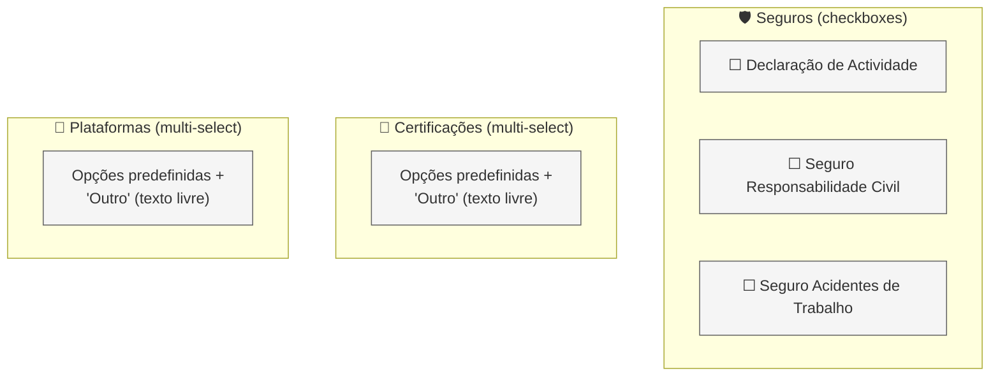

### Passo 3 - Disponibilidade

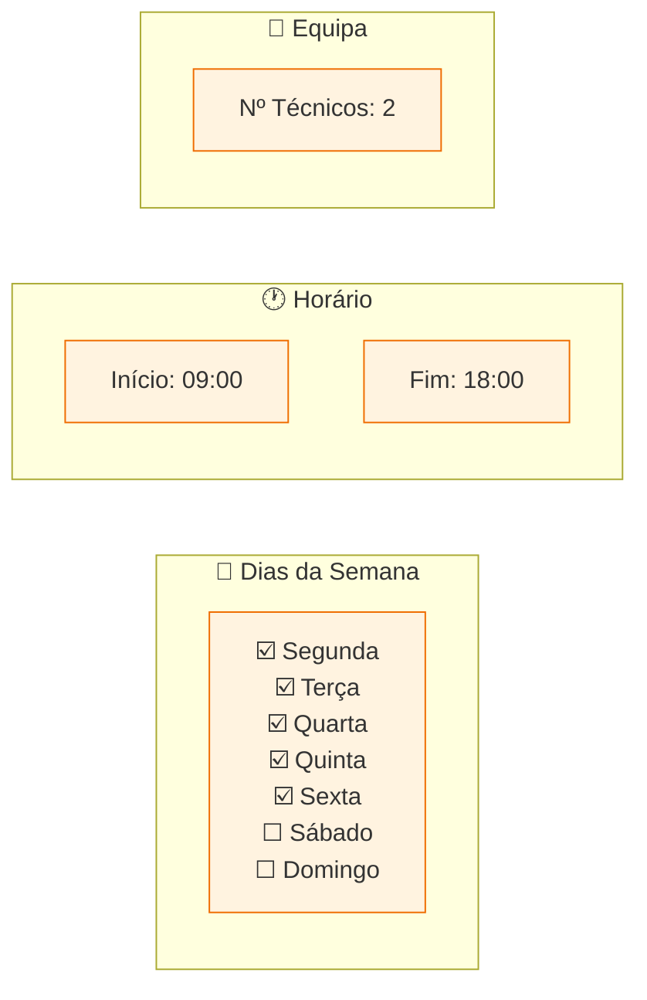

### Passo 4 - Recursos

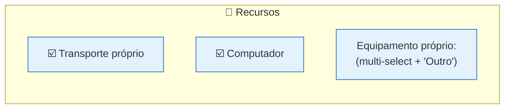

### Passo 5 - Serviços (Selecção Hierárquica)

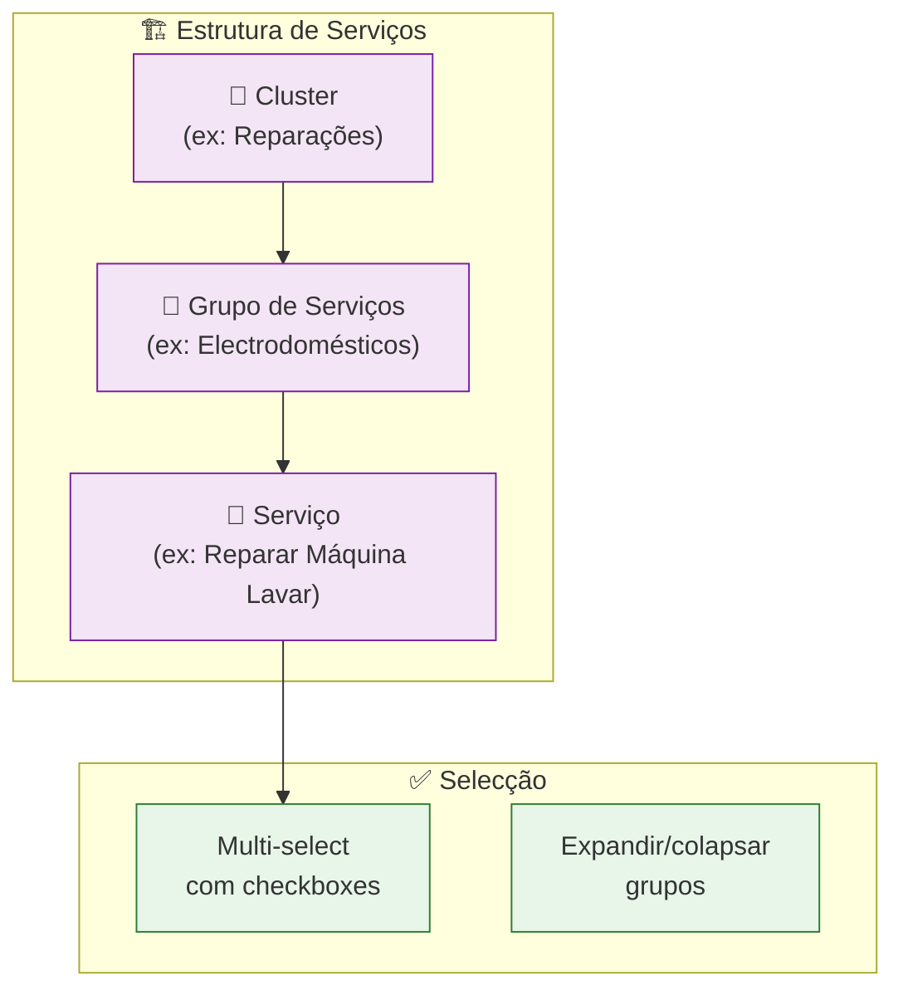

### Passo 6 - Cobertura Geográfica

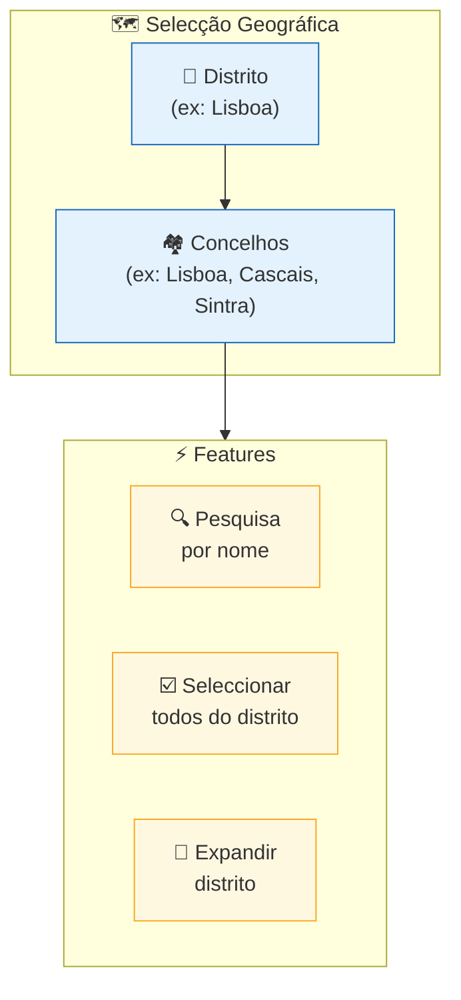

### Passo 7 - Revisão

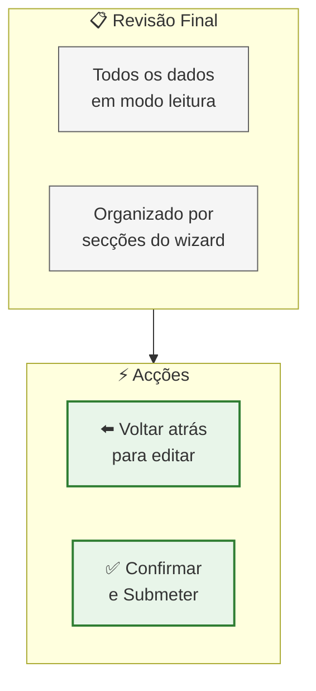

---

## Processamento da Submissão

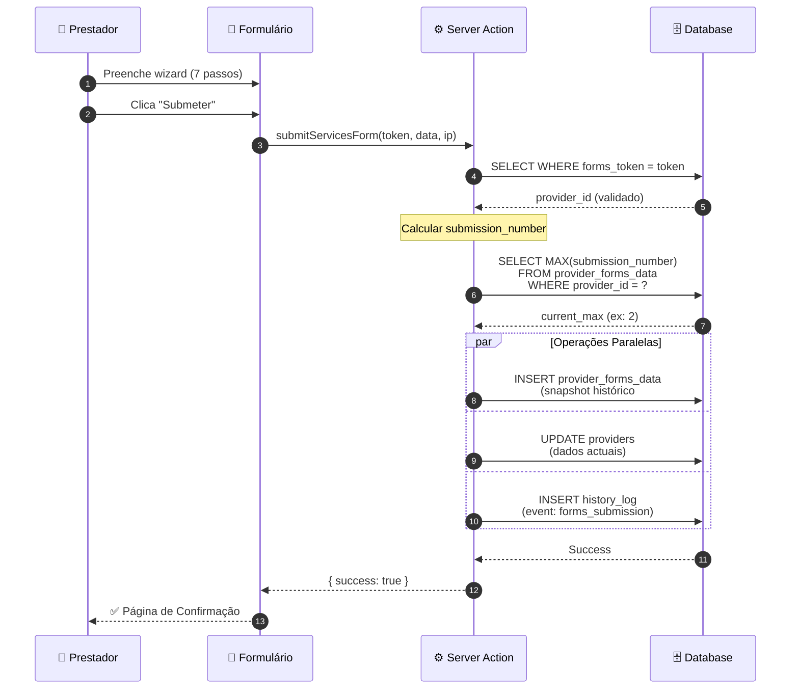

---

## Armazenamento Dual

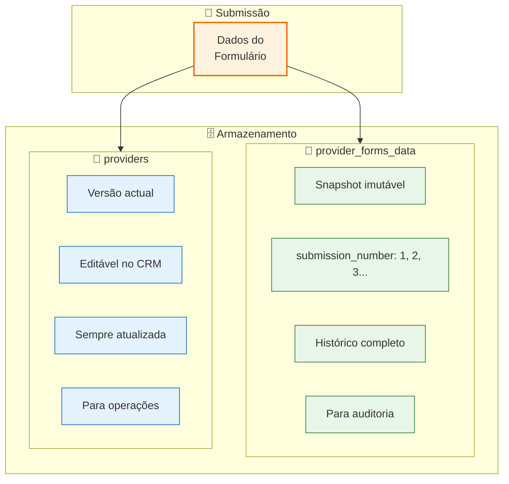

### Porquê Armazenamento Dual?

| Tabela | Propósito | Mutável? |
|--------|-----------|----------|
| `provider_forms_data` | Registo histórico de cada submissão | ❌ Não (snapshot) |
| `providers` | Dados actuais do prestador | ✅ Sim (editável) |

**Benefícios:**
- 📜 **Auditoria** - Saber exactamente o que foi submetido e quando
- 🔄 **Múltiplas submissões** - Prestador pode actualizar dados várias vezes
- ✏️ **Flexibilidade** - Admin pode corrigir dados actuais sem perder histórico

---

## Visualização no CRM

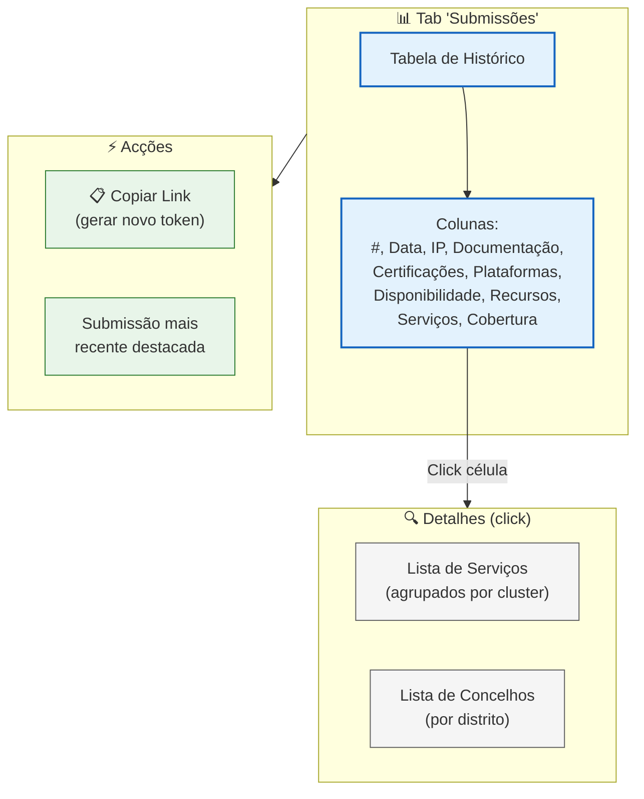

---

## Ciclo de Re-submissão

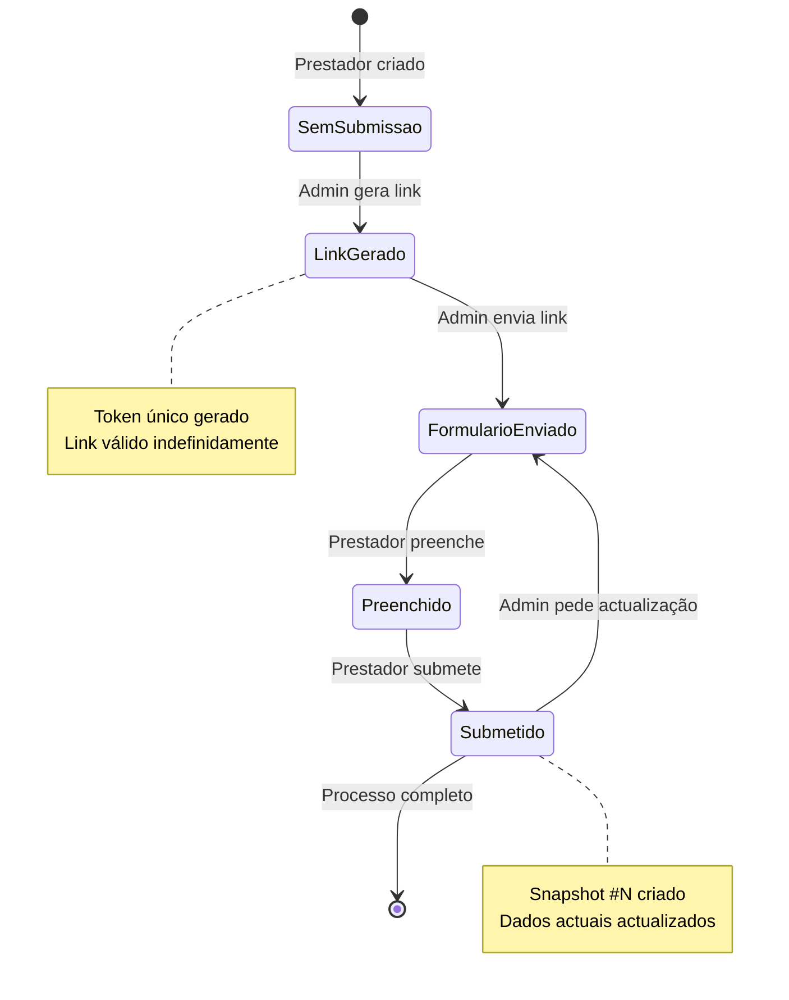

---

## Dados Guardados

### Campos do Formulário

| Secção | Campos |
|--------|--------|
| **Dados** | nome, email, telefone, NIF |
| **Documentação** | 3 seguros, certificações[], plataformas[] |
| **Disponibilidade** | dias_semana[], hora_início, hora_fim, num_técnicos |
| **Recursos** | transporte_próprio, computador, equipamento[] |
| **Serviços** | selected_services[] (UUIDs) |
| **Cobertura** | coverage_municipalities[] (nomes) |

### Metadados da Submissão

| Campo | Descrição |
|-------|-----------|
| `submission_number` | Número sequencial (1, 2, 3...) |
| `submitted_at` | Data/hora da submissão |
| `submitted_ip` | Endereço IP do prestador |

---

## Código Relacionado

| Ficheiro | Função |
|----------|--------|
| `app/forms/services/[token]/page.tsx` | Página pública do formulário |
| `app/forms/services/[token]/services-form-client.tsx` | Wizard de 7 passos |
| `lib/forms/services-actions.ts` | `generateFormsToken()`, `submitServicesForm()` |
| `components/forms/services-selector.tsx` | Selector de serviços hierárquico |
| `components/forms/coverage-selector.tsx` | Selector de cobertura geográfica |
| `components/providers/tabs/submissoes-tab.tsx` | Tab de visualização no CRM |

---

## Documentos Relacionados

- [02-FLUXOS-NEGOCIO.md](../../02-FLUXOS-NEGOCIO.md) - Fluxos de negócio principais
- [provider-lifecycle.md](./provider-lifecycle.md) - Ciclo de vida do prestador
- [03-BASE-DADOS.md](../../03-BASE-DADOS.md) - Schema das tabelas

---

*Última actualização: Janeiro 2026*
