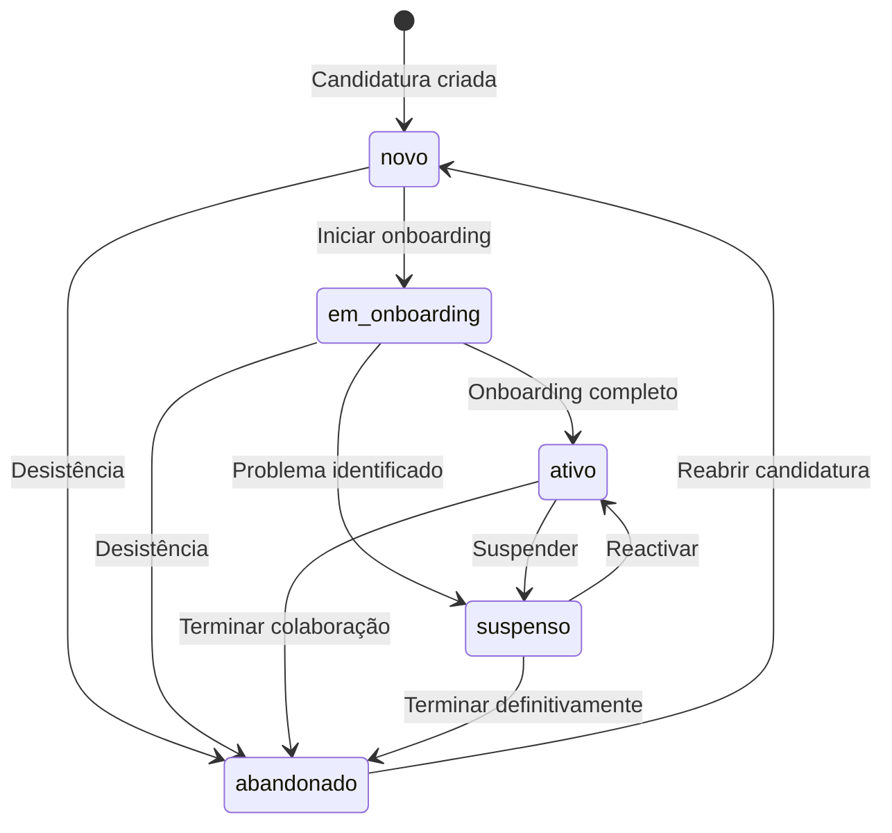
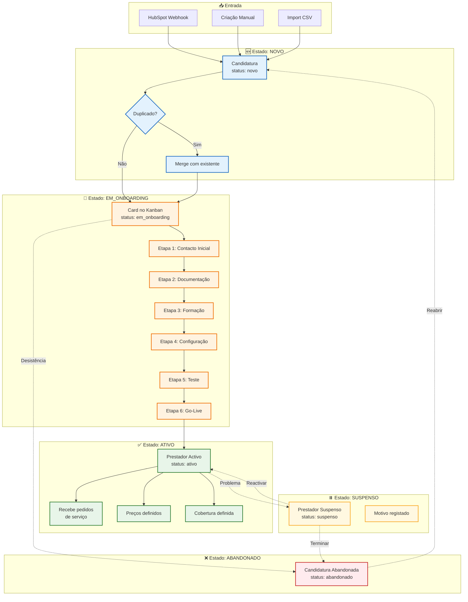
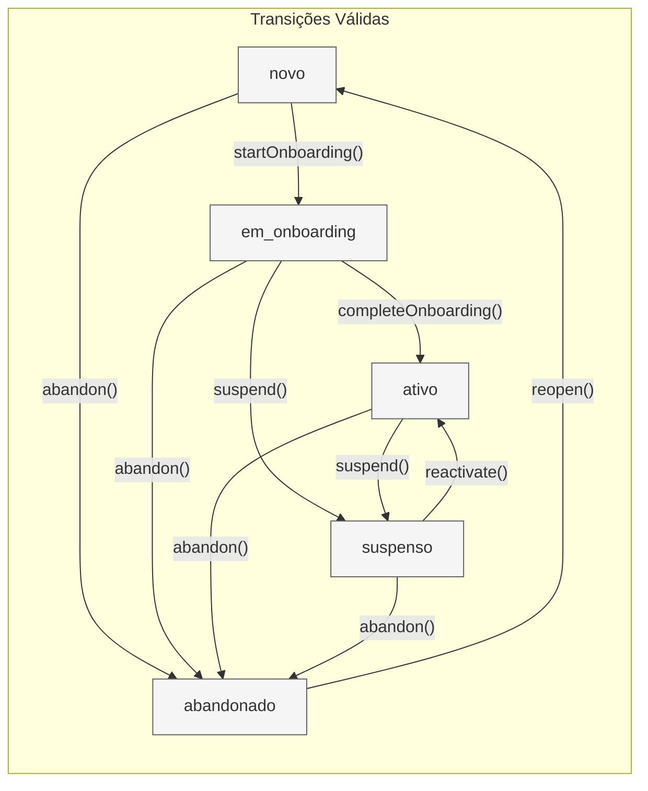

# Ciclo de Vida do Prestador

Este diagrama mostra os estados possíveis de um prestador e as transições entre eles.

---

## State Machine

---

## Flowchart Detalhado

---

## Tabela de Estados

| Estado | Descrição | Cor | Acções Possíveis |
|--------|-----------|-----|------------------|
| **novo** | Candidatura recebida, aguarda triagem | 🔵 Azul | Iniciar onboarding, Abandonar |
| **em_onboarding** | Em processo de integração (6 etapas) | 🟠 Laranja | Avançar etapa, Suspender, Abandonar |
| **ativo** | Pronto para receber trabalhos | 🟢 Verde | Suspender, Terminar |
| **suspenso** | Temporariamente inactivo | 🟡 Amarelo | Reactivar, Terminar |
| **abandonado** | Processo terminado/desistência | 🔴 Vermelho | Reabrir |

---

## Transições Permitidas

---

## Regras de Negócio

### Novo → Em Onboarding
- Verificação de duplicados (email, NIF, nome fuzzy)
- Se duplicado: opção de merge ou criar novo
- Card criado automaticamente no Kanban

### Em Onboarding → Ativo
- Todas as 6 etapas devem estar completas
- Tarefas obrigatórias de cada etapa concluídas
- Preços base definidos
- Pelo menos 1 concelho de cobertura

### Ativo → Suspenso
- Motivo obrigatório
- Registo em `history_log`
- Pedidos em curso mantêm-se (não são cancelados)

### Suspenso → Ativo
- Verificação de documentação válida
- Registo de reactivação em `history_log`

### Qualquer → Abandonado
- Motivo obrigatório
- Soft delete (dados mantidos para histórico)
- Pode ser reaberto se necessário

---

## Código Relacionado

| Ficheiro | Função |
|----------|--------|
| `lib/candidaturas/actions.ts` | `createCandidatura()`, `mergeCandidaturas()` |
| `lib/onboarding/actions.ts` | `startOnboarding()`, `moveCard()`, `updateTask()` |
| `lib/prestadores/actions.ts` | `updateProviderStatus()` |
| `lib/providers/actions.ts` | `getProvider()`, `updateProvider()` |

---

## Documentos Relacionados

- [02-FLUXOS-NEGOCIO.md](../../02-FLUXOS-NEGOCIO.md) - Fluxos detalhados
- [onboarding-pipeline.md](./onboarding-pipeline.md) - Pipeline de onboarding
- [03-BASE-DADOS.md](../../03-BASE-DADOS.md) - Schema da tabela providers

---

*Última actualização: Janeiro 2026*
