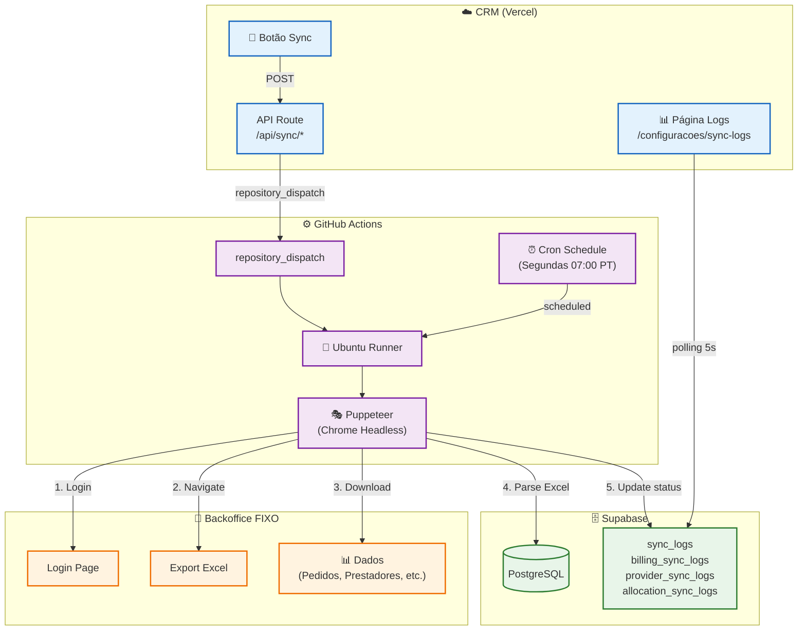
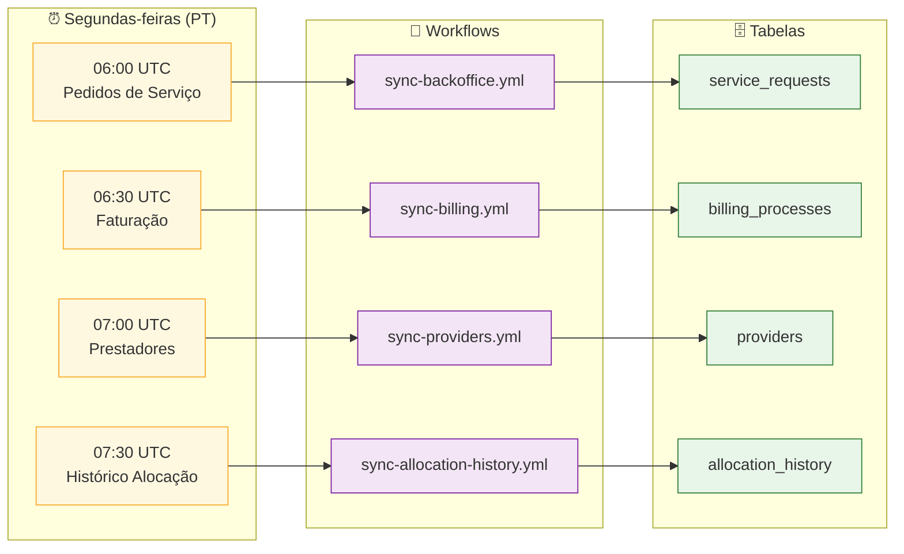
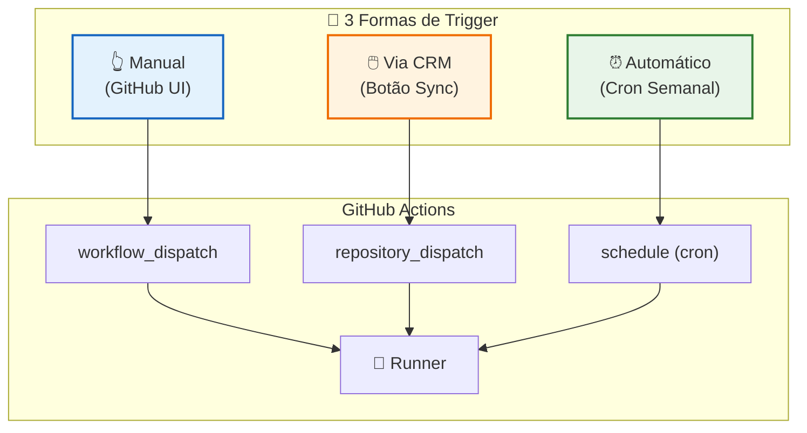
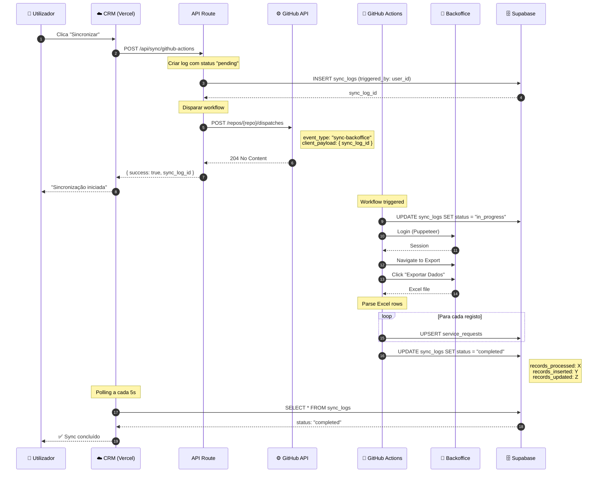
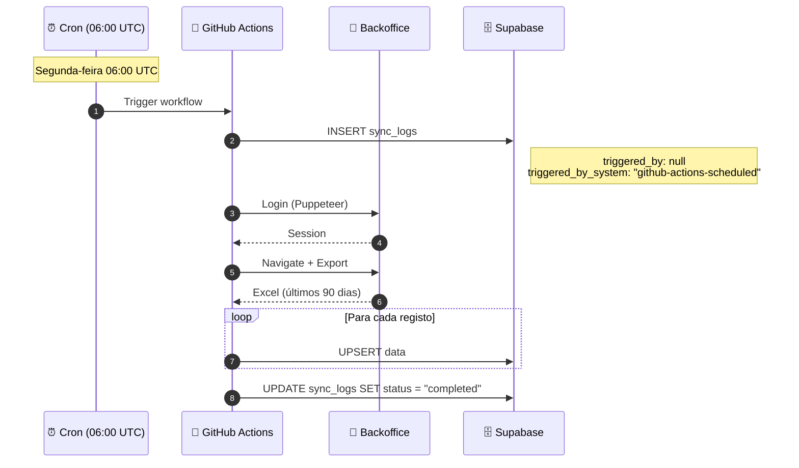
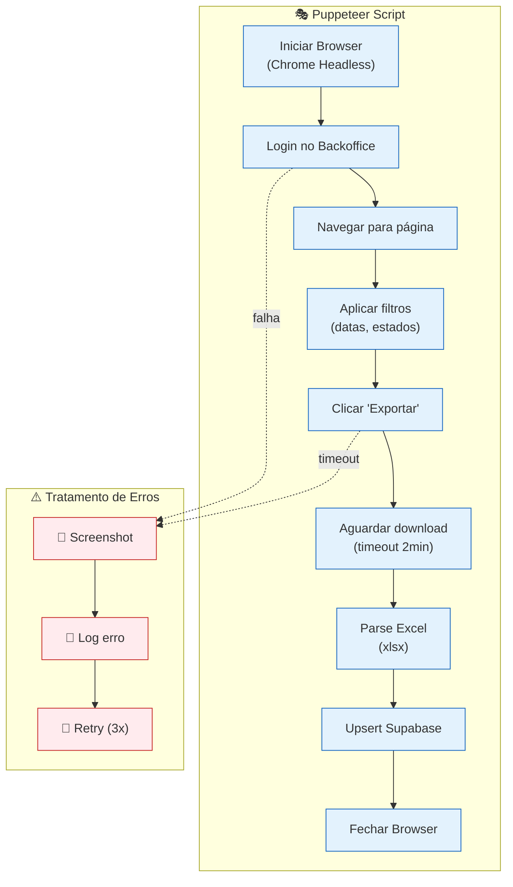
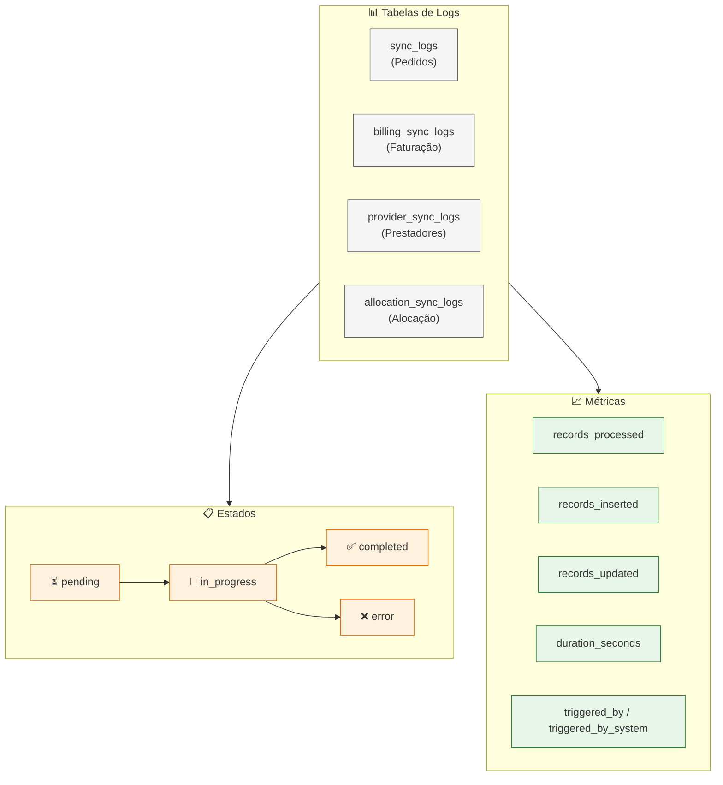
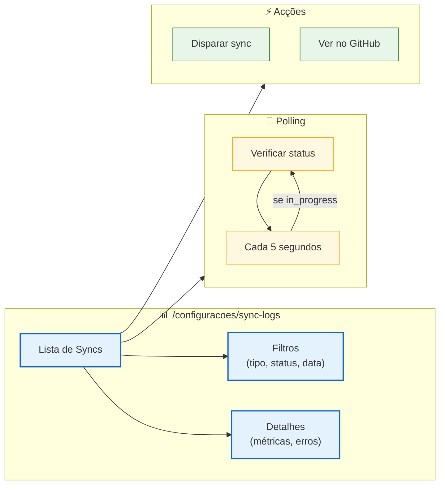
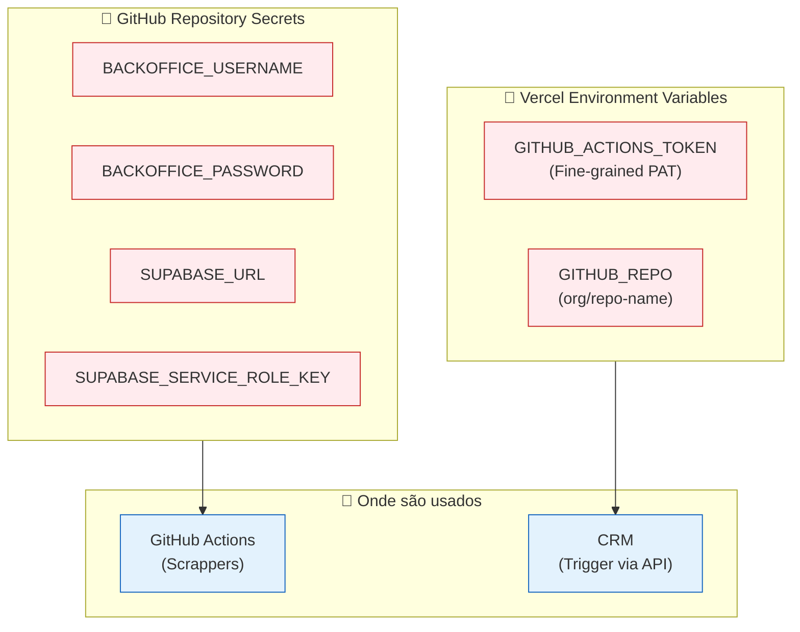

# Sincronização com Backoffice FIXO

Este diagrama detalha o sistema de sincronização de dados entre o CRM e o backoffice FIXO via GitHub Actions.

> **Documentação completa:** [04-INTEGRACOES.md](../../04-INTEGRACOES.md#backoffice-fixo-scrappers)

---

## Arquitectura Geral

---

## 4 Scrappers Disponíveis

---

## Formas de Execução

---

## Fluxo Detalhado: Sync Manual via CRM

---

## Fluxo Detalhado: Sync Automático (Scheduled)

---

## Puppeteer Scraping Flow

---

## Sistema de Logs

---

## Monitorização no CRM

---

## Configuração de Secrets

> 📖 **O que são Secrets?** Para uma explicação detalhada sobre o que são secrets, porque são importantes e boas práticas de segurança, consulta [07-SEGURANCA.md](../../07-SEGURANCA.md#gestão-de-secrets-e-credenciais).

---

## Resumo: Tabela de Scrappers

| Scrapper | Workflow | Horário UTC | Período | Tabela Dados | Tabela Logs |
|----------|----------|------------------|---------|--------------|-------------|
| **Pedidos** | `sync-backoffice.yml` | Seg 06:00 | 90 dias | `service_requests` | `sync_logs` |
| **Faturação** | `sync-billing.yml` | Seg 06:30 | Todos | `billing_processes` | `billing_sync_logs` |
| **Prestadores** | `sync-providers.yml` | Seg 07:00 | Todos | `providers` | `provider_sync_logs` |
| **Alocação** | `sync-allocation-history.yml` | Seg 07:30 | Mês | `allocation_history` | `allocation_sync_logs` |

---

## Código Relacionado

| Ficheiro | Descrição |
|----------|-----------|
| `.github/workflows/sync-*.yml` | Workflow definitions |
| `scripts/sync-*-github.ts` | Standalone Puppeteer scripts |
| `src/app/api/sync/*/route.ts` | API routes para trigger |
| `src/lib/sync/actions.ts` | Server actions |
| `src/app/(dashboard)/configuracoes/sync-logs/page.tsx` | Página de logs |

---

## Documentos Relacionados

- [04-INTEGRACOES.md](../../04-INTEGRACOES.md#backoffice-fixo-scrappers) - **Configuração completa e troubleshooting**
- [containers.md](../architecture/containers.md) - Arquitectura de containers
- [02-FLUXOS-NEGOCIO.md](../../02-FLUXOS-NEGOCIO.md#sincronização-de-dados) - Visão de negócio

---

*Última actualização: Janeiro 2026*
