# Prevenção de Ataques

Este documento ilustra como os diferentes tipos de ataques são bloqueados pelo sistema de segurança do CRM Prestadores.

> **Documentação completa:** [07-SEGURANCA.md](../../07-SEGURANCA.md)

---

## Visão Geral das Camadas de Defesa

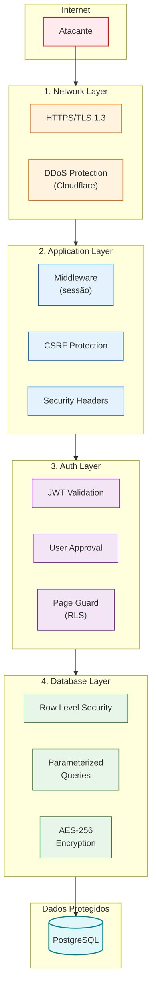

---

## 1. SQL Injection

### O Ataque

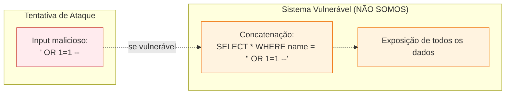

### A Protecção

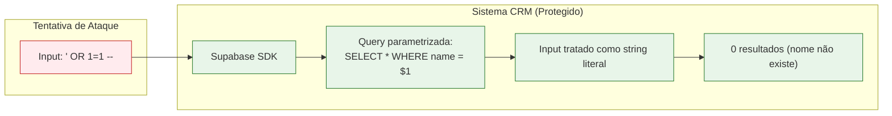

```typescript
// O SDK NUNCA concatena strings
const userInput = "' OR 1=1 --"

// O que o Supabase gera internamente:
// SELECT * FROM providers WHERE name = $1
// $1 = "' OR 1=1 --" (como STRING, não como SQL)
const { data } = await supabase
  .from('providers')
  .eq('name', userInput)  // Parametrizado automaticamente
```

---

## 2. Cross-Site Scripting (XSS)

### O Ataque

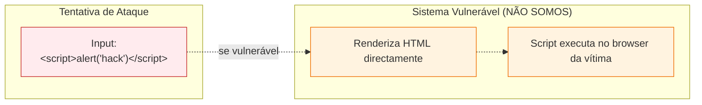

### A Protecção

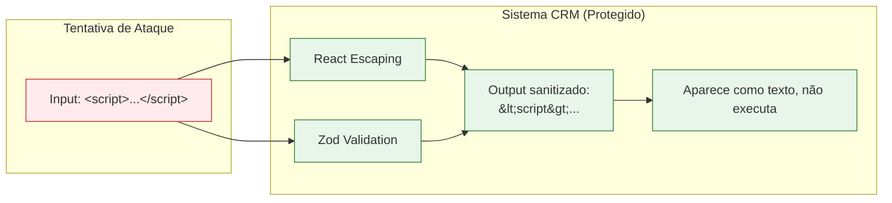

**Protecções activas:**

| Protecção | Como Funciona |
|-----------|---------------|
| **React Escaping** | Sanitiza automaticamente `{}` em JSX |
| **Sem dangerouslySetInnerHTML** | Não renderizamos HTML não sanitizado |
| **Zod Validation** | Inputs validados antes de guardar |
| **JWT Expiration** | Tokens expiram em ~1 hora |

---

## 3. Cross-Site Request Forgery (CSRF)

### O Ataque

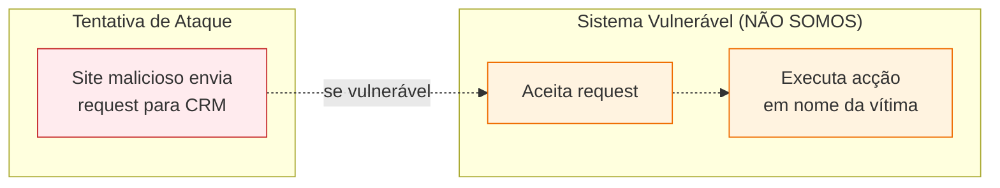

### A Protecção

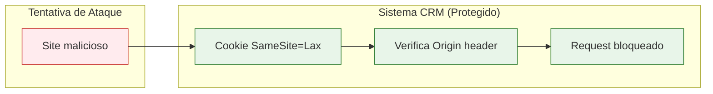

**Protecções activas:**

- **SameSite=Lax cookies**: Cookies não são enviados em requests cross-site
- **Next.js CSRF built-in**: Server Actions verificam origem
- **JWT em cookies**: Não vulnerável a CSRF via headers

---

## 4. Acesso Não Autorizado via API

### O Ataque

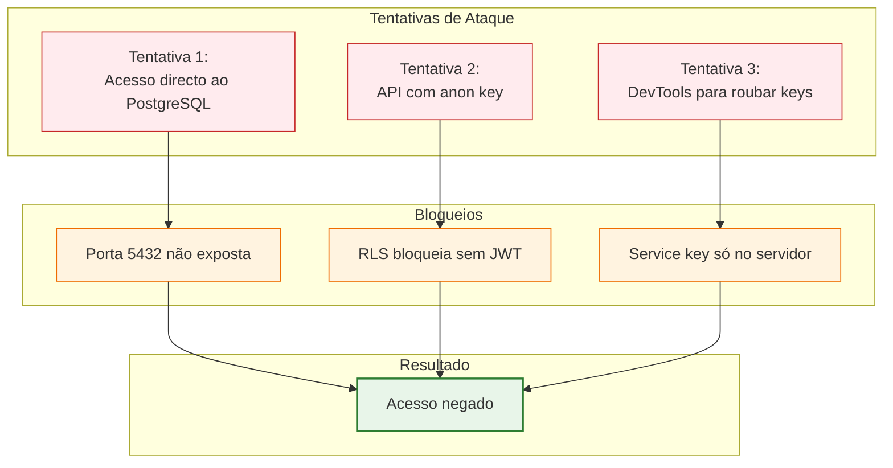

### Cenário Detalhado

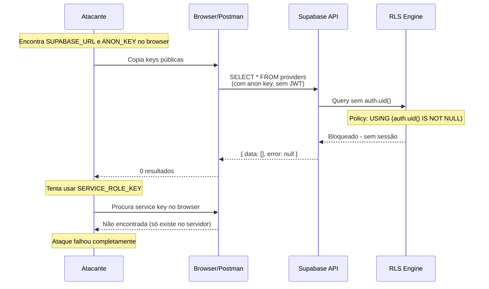

---

## 5. Brute Force em Login

### O Ataque e Protecção

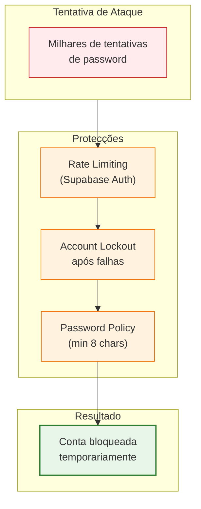

**Protecções Supabase Auth:**

| Protecção | Configuração |
|-----------|--------------|
| Rate limiting | 5 tentativas por minuto |
| Lockout | 15 min após 5 falhas |
| Password policy | Min 8 caracteres |

---

## 6. DDoS (Distributed Denial of Service)

### A Protecção

```mermaid
flowchart LR
    subgraph attack ["Ataque DDoS"]
        bots["Milhões de requests"]
    end

    subgraph cloudflare ["Cloudflare (via Vercel)"]
        waf["Web Application Firewall"]
        rate["Rate Limiting"]
        geo["Geo-blocking (opcional)"]
    end

    subgraph vercel ["Vercel Edge"]
        edge["Edge Network Global"]
        cache["Caching Agressivo"]
    end

    subgraph app ["Aplicação"]
        healthy["CRM funcionando normalmente"]
    end

    attack --> cloudflare
    cloudflare --> vercel
    vercel --> healthy

    classDef attackStyle fill:#ffebee,stroke:#c62828,stroke-width:1px
    classDef cfStyle fill:#fff3e0,stroke:#ef6c00,stroke-width:1px
    classDef vercelStyle fill:#e3f2fd,stroke:#1565c0,stroke-width:1px
    classDef appStyle fill:#e8f5e9,stroke:#2e7d32,stroke-width:2px

    class bots attackStyle
    class waf,rate,geo cfStyle
    class edge,cache vercelStyle
    class healthy appStyle
```

---

## 7. Man-in-the-Middle (MITM)

### A Protecção

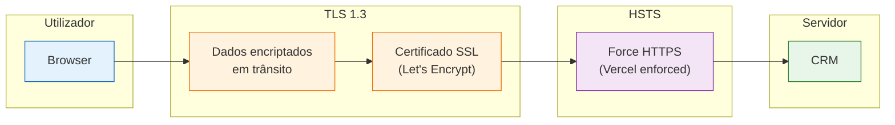

**Protecções:**

- **TLS 1.3**: Encriptação state-of-the-art
- **HSTS**: Browser força HTTPS
- **Vercel**: Certificados auto-renovados

---

## Resumo: Matriz de Ataques vs Protecções

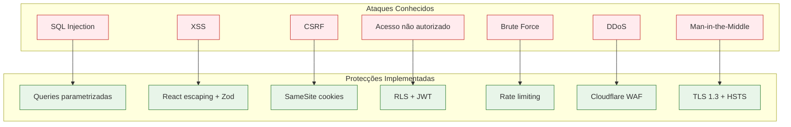

| Ataque | Protecção | Camada |
|--------|-----------|--------|
| **SQL Injection** | Queries parametrizadas (Supabase SDK) | Database |
| **XSS** | React escaping + Zod validation | Application |
| **CSRF** | SameSite=Lax cookies + Next.js built-in | Application |
| **Acesso não autorizado** | RLS + JWT + Middleware | Auth + Database |
| **Brute Force** | Rate limiting + Account lockout | Auth |
| **DDoS** | Cloudflare WAF via Vercel | Network |
| **MITM** | TLS 1.3 + HSTS | Network |

---

## Documentos Relacionados

- [07-SEGURANCA.md](../../07-SEGURANCA.md) - Documentação completa de segurança
- [rls-policies.md](./rls-policies.md) - Detalhes das políticas RLS
- [auth-flow.md](./auth-flow.md) - Fluxo de autenticação

---

*Última actualização: Janeiro 2026*
