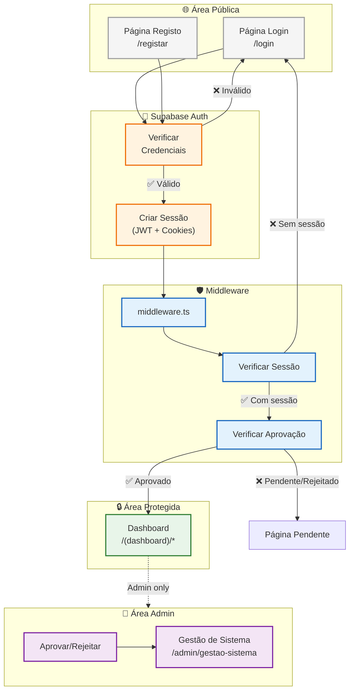
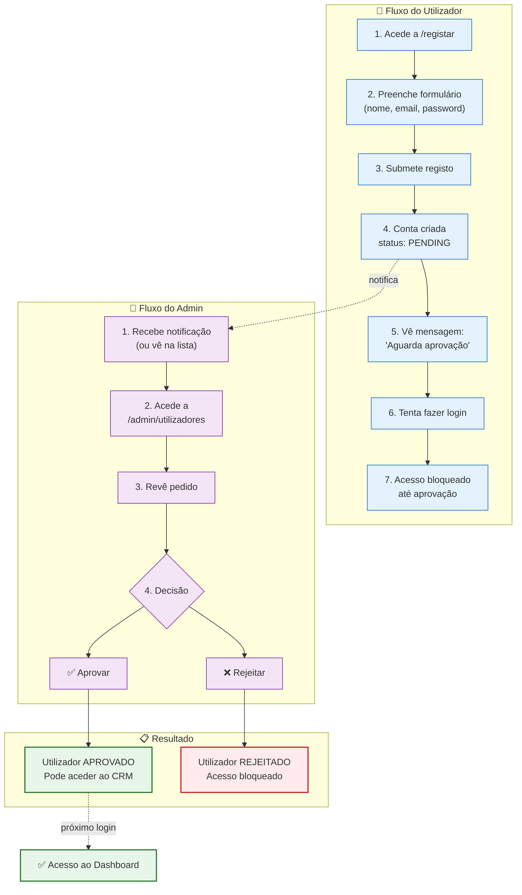
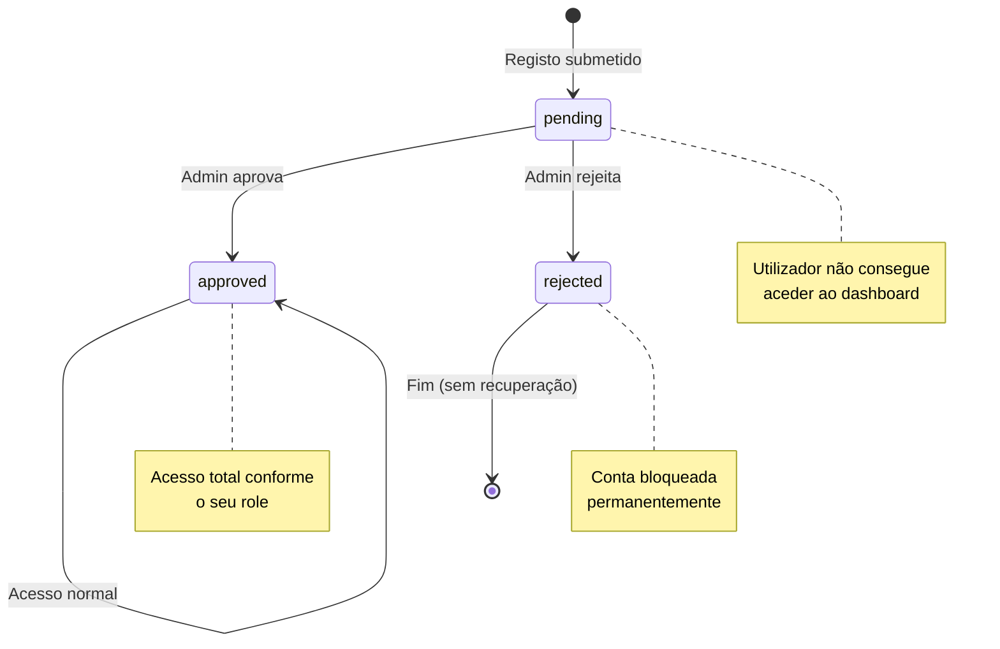
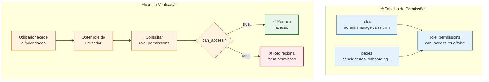
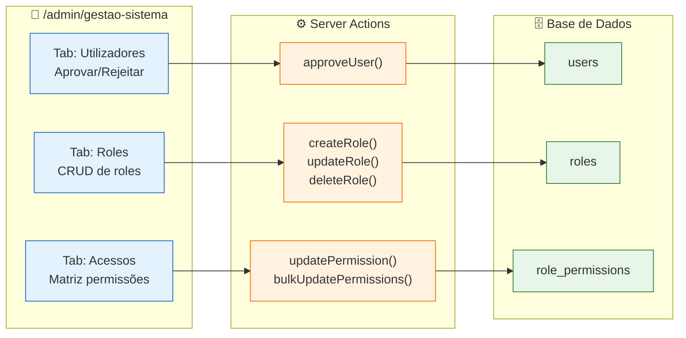
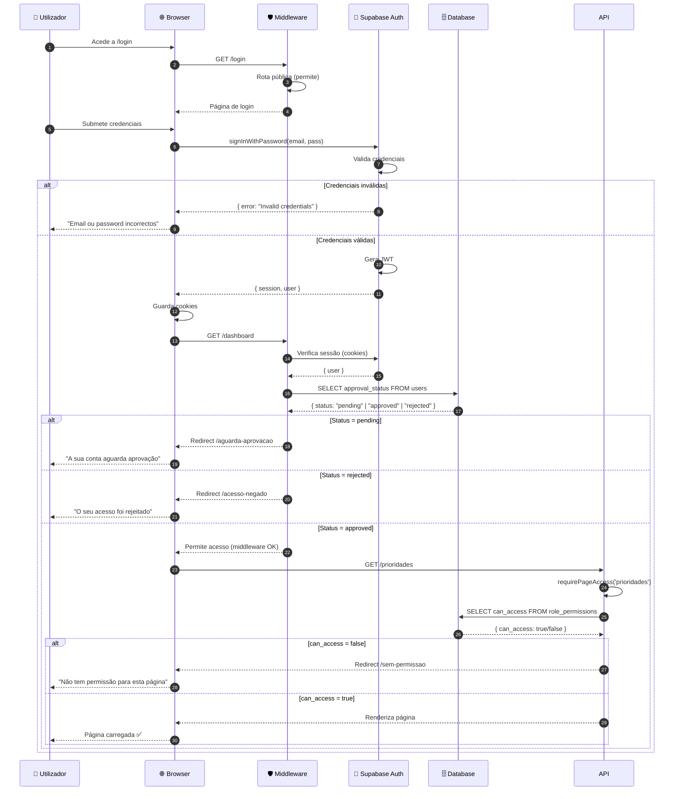
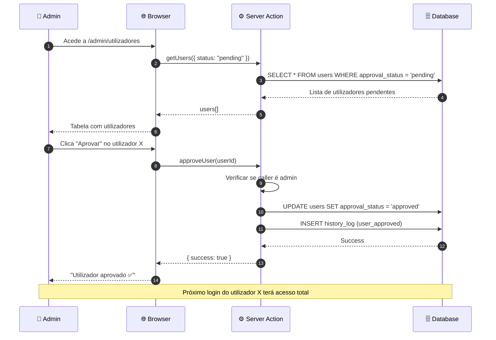
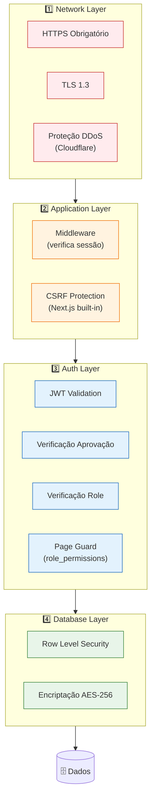

# Fluxo de Autenticação

Este diagrama detalha o sistema de autenticação e autorização do CRM, incluindo o processo de aprovação de utilizadores por administradores.

> **Documentação completa:** [07-SEGURANCA.md](../../07-SEGURANCA.md)

---

## Visão Geral

---

## Fluxo de Registo e Aprovação

---

## Estados do Utilizador

---

## Sistema de Permissões Dinâmico

O sistema usa permissões dinâmicas geridas em base de dados através de três tabelas: `roles`, `pages` e `role_permissions`.

---

## Roles e Permissões por Página

```mermaid
flowchart TB
    subgraph roles ["👥 Roles do Sistema"]
        admin["👑 Admin"]
        manager["📊 Manager"]
        rm["👔 Relationship Manager"]
        user["👤 User"]
    end

    subgraph pages_onb ["📋 Onboarding"]
        p_cand["Candidaturas"]
        p_onb["Onboarding"]
        p_kpis["KPIs"]
        p_agenda["Agenda"]
    end

    subgraph pages_rede ["🌐 Rede"]
        p_prest["Prestadores"]
        p_rede["Mapa Rede"]
        p_ped["Pedidos"]
    end

    subgraph pages_admin ["🔒 Admin"]
        p_prio["Prioridades"]
        p_users["Gestão de Sistema"]
    end

    admin --> p_cand & p_onb & p_kpis & p_agenda
    admin --> p_prest & p_rede & p_ped
    admin --> p_prio & p_users

    manager --> p_cand & p_onb & p_kpis & p_agenda
    manager --> p_prest & p_rede & p_ped
    manager --> p_prio

    rm --> p_cand & p_onb & p_kpis & p_agenda
    rm --> p_prest & p_rede & p_ped

    user --> p_cand & p_onb & p_kpis & p_agenda
    user --> p_prest & p_rede & p_ped

    classDef adminStyle fill:#f3e5f5,stroke:#7b1fa2,stroke-width:2px
    classDef managerStyle fill:#e8f5e9,stroke:#2e7d32,stroke-width:2px
    classDef rmStyle fill:#fff3e0,stroke:#ef6c00,stroke-width:2px
    classDef userStyle fill:#e3f2fd,stroke:#1565c0,stroke-width:2px
    classDef pageStyle fill:#f5f5f5,stroke:#9e9e9e,stroke-width:1px
    classDef adminPageStyle fill:#ffebee,stroke:#c62828,stroke-width:1px

    class admin adminStyle
    class manager managerStyle
    class rm rmStyle
    class user userStyle
    class p_cand,p_onb,p_kpis,p_agenda,p_prest,p_rede,p_ped pageStyle
    class p_prio,p_users adminPageStyle
```

---

## Gestão de Permissões (UI Admin)

---

## Sequence: Login Completo

---

## Sequence: Aprovação pelo Admin

---

## Camadas de Segurança

---

## Tabela: Estados de Aprovação

| Estado | Pode fazer login? | Acede ao dashboard? | Quem pode mudar? |
|--------|-------------------|---------------------|------------------|
| `pending` | ✅ Sim | ❌ Não (redireccionado) | Admin |
| `approved` | ✅ Sim | ✅ Sim | Admin |
| `rejected` | ✅ Sim | ❌ Não (bloqueado) | - |

---

## Código Relacionado

| Ficheiro | Função |
|----------|--------|
| `lib/supabase/middleware.ts` | Verificação de sessão (JWT) |
| `lib/permissions/guard.ts` | Verificação de permissões por página |
| `lib/permissions/actions.ts` | CRUD de roles e permissões |
| `app/(auth)/login/page.tsx` | Página de login |
| `app/(auth)/registar/page.tsx` | Página de registo |
| `app/admin/gestao-sistema/page.tsx` | Gestão de utilizadores, roles e permissões |

---

## Documentos Relacionados

- [07-SEGURANCA.md](../../07-SEGURANCA.md) - **Segurança completa do sistema**
- [02-FLUXOS-NEGOCIO.md](../../02-FLUXOS-NEGOCIO.md#fluxo-de-utilizadores-e-autenticação) - Fluxo de utilizadores
- [components.md](../architecture/components.md) - Arquitectura de componentes

---

*Última actualização: Janeiro 2026*
