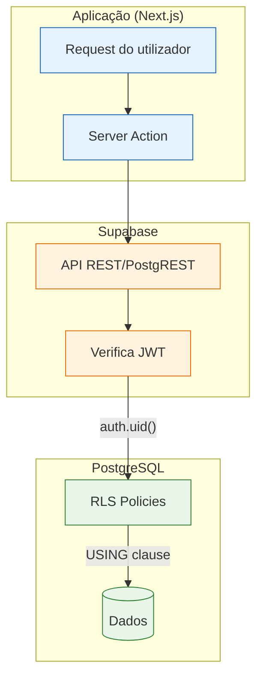
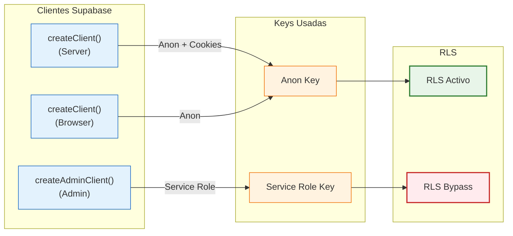
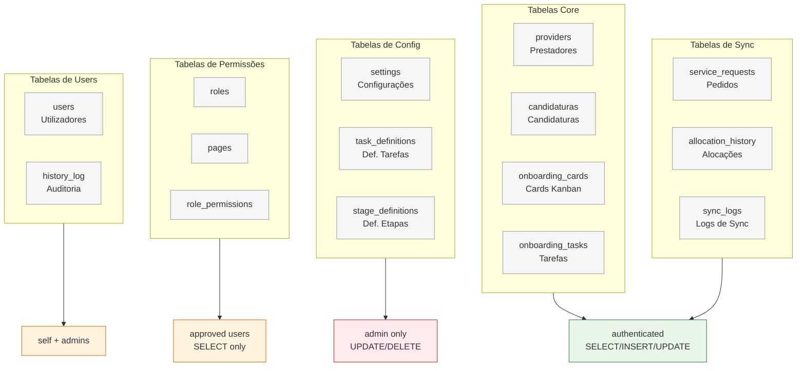
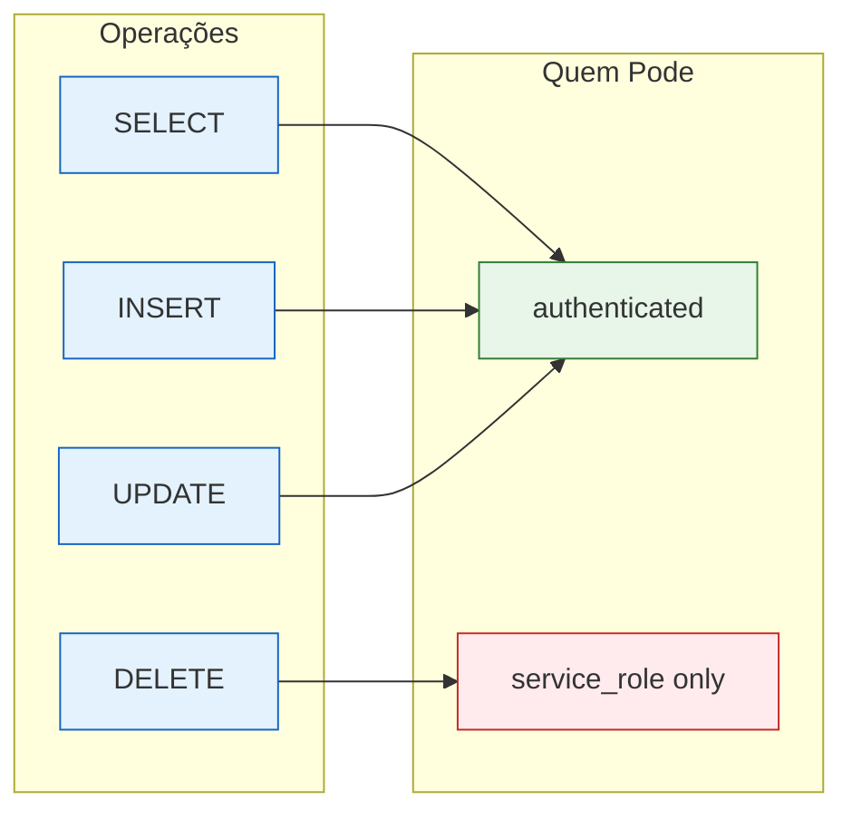
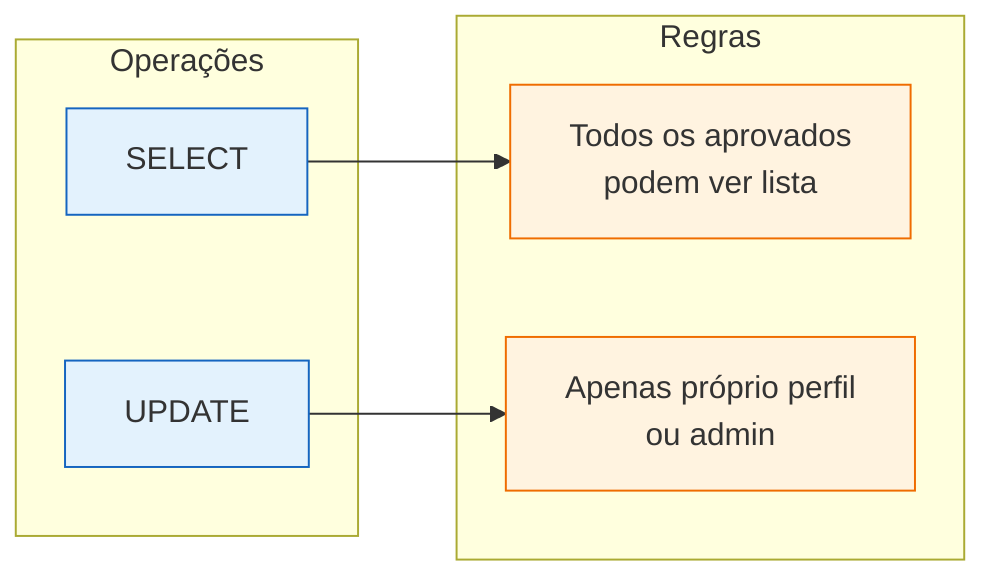
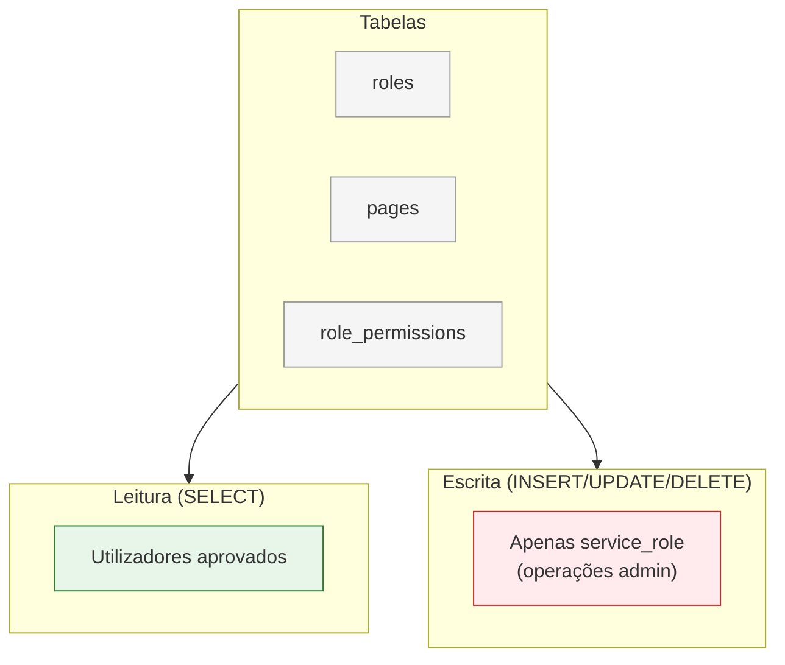
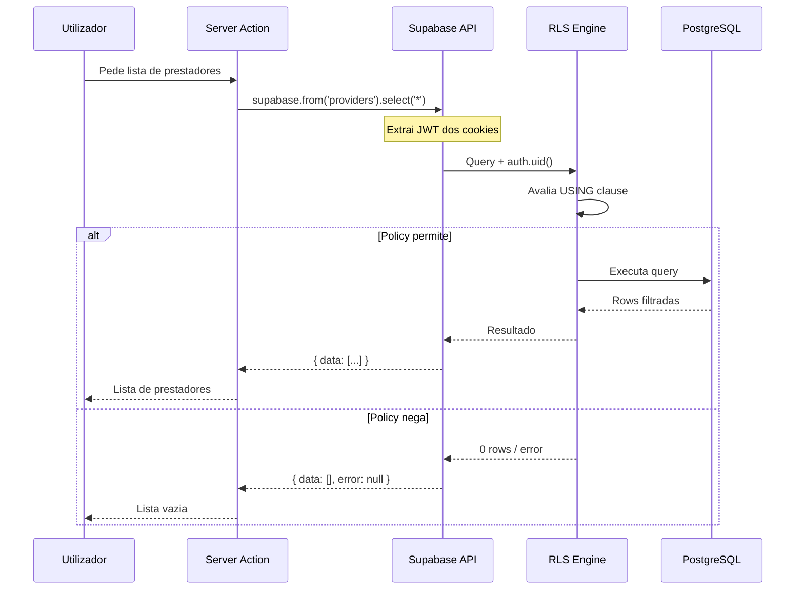

# Row Level Security (RLS) Policies

Este documento detalha como o Row Level Security do PostgreSQL protege os dados no CRM Prestadores.

> **Documentação completa:** [07-SEGURANCA.md](../../07-SEGURANCA.md#row-level-security-rls)

---

## O Que é RLS?

Row Level Security (RLS) é um mecanismo de segurança **a nível de base de dados** que controla quem pode ver e modificar cada linha de uma tabela. As políticas são avaliadas pelo PostgreSQL, não pela aplicação.



---

## Benefícios do RLS

| Benefício | Descrição |
|-----------|-----------|
| **Defense in Depth** | Mesmo que a aplicação tenha um bug, a BD bloqueia acessos indevidos |
| **Impossível de Bypass** | Políticas são avaliadas pelo PostgreSQL, não pelo código |
| **Auditável** | Políticas são SQL declarativo, fáceis de revisar |
| **Granular** | Diferentes regras para SELECT, INSERT, UPDATE, DELETE |

---

## Clientes Supabase e RLS



| Cliente | Key | RLS | Quando Usar |
|---------|-----|-----|-------------|
| `createClient()` (server) | Anon + Cookies | **Activo** | Operações normais de utilizadores |
| `createClient()` (browser) | Anon | **Activo** | Real-time, operações no cliente |
| `createAdminClient()` | Service Role | **Bypass** | Operações admin, sync, migrations |

---

## Arquitectura de Políticas por Tabela



---

## Políticas Detalhadas

### 1. Tabela `providers` (Prestadores)



```sql
-- Leitura: qualquer utilizador autenticado
CREATE POLICY "providers_select" ON providers
  FOR SELECT TO authenticated
  USING (true);

-- Inserção: qualquer utilizador autenticado
CREATE POLICY "providers_insert" ON providers
  FOR INSERT TO authenticated
  WITH CHECK (true);

-- Actualização: qualquer utilizador autenticado
CREATE POLICY "providers_update" ON providers
  FOR UPDATE TO authenticated
  USING (true);

-- Eliminação: apenas via service_role (admin)
-- Não existe policy para DELETE com authenticated
```

### 2. Tabela `users` (Utilizadores)



```sql
-- Leitura: utilizadores aprovados podem ver outros
CREATE POLICY "users_select" ON users
  FOR SELECT TO authenticated
  USING (
    EXISTS (
      SELECT 1 FROM users u
      WHERE u.id = auth.uid()
      AND u.approval_status = 'approved'
    )
  );

-- Actualização: apenas o próprio perfil
CREATE POLICY "users_update_own" ON users
  FOR UPDATE TO authenticated
  USING (id = auth.uid())
  WITH CHECK (id = auth.uid());
```

### 3. Tabelas de Permissões (`roles`, `pages`, `role_permissions`)



```sql
-- Roles: leitura para utilizadores aprovados
CREATE POLICY "roles_select" ON roles
  FOR SELECT TO authenticated
  USING (
    EXISTS (
      SELECT 1 FROM users
      WHERE id = auth.uid()
      AND approval_status = 'approved'
    )
  );

-- Pages: leitura para utilizadores aprovados
CREATE POLICY "pages_select" ON pages
  FOR SELECT TO authenticated
  USING (
    EXISTS (
      SELECT 1 FROM users
      WHERE id = auth.uid()
      AND approval_status = 'approved'
    )
  );

-- Role Permissions: leitura para utilizadores aprovados
CREATE POLICY "role_permissions_select" ON role_permissions
  FOR SELECT TO authenticated
  USING (
    EXISTS (
      SELECT 1 FROM users
      WHERE id = auth.uid()
      AND approval_status = 'approved'
    )
  );

-- Escrita: apenas via createAdminClient() (service_role)
```

### 4. Tabelas de Sync (`service_requests`, `sync_logs`)

```sql
-- Service Requests: leitura para autenticados
CREATE POLICY "service_requests_select" ON service_requests
  FOR SELECT TO authenticated
  USING (true);

-- Escrita via service_role (GitHub Actions sync)
CREATE POLICY "service_requests_all" ON service_requests
  FOR ALL TO service_role
  USING (true) WITH CHECK (true);

-- Sync Logs: leitura para autenticados
CREATE POLICY "sync_logs_select" ON sync_logs
  FOR SELECT TO authenticated
  USING (true);

-- Inserção de logs por autenticados
CREATE POLICY "sync_logs_insert" ON sync_logs
  FOR INSERT TO authenticated
  WITH CHECK (true);
```

### 5. Tabela `history_log` (Auditoria)

```sql
-- Apenas inserção (append-only audit log)
CREATE POLICY "history_log_insert" ON history_log
  FOR INSERT TO authenticated
  WITH CHECK (true);

-- Leitura para autenticados
CREATE POLICY "history_log_select" ON history_log
  FOR SELECT TO authenticated
  USING (true);

-- Sem UPDATE/DELETE - logs são imutáveis
```

---

## Fluxo de Verificação RLS



---

## Matriz Resumo de Políticas

| Tabela | SELECT | INSERT | UPDATE | DELETE |
|--------|--------|--------|--------|--------|
| `providers` | authenticated | authenticated | authenticated | service_role |
| `candidaturas` | authenticated | authenticated | authenticated | service_role |
| `onboarding_cards` | authenticated | authenticated | authenticated | service_role |
| `onboarding_tasks` | authenticated | authenticated | authenticated | service_role |
| `users` | approved users | auth.users | self only | - |
| `roles` | approved users | service_role | service_role | service_role |
| `pages` | approved users | service_role | service_role | service_role |
| `role_permissions` | approved users | service_role | service_role | service_role |
| `service_requests` | authenticated | service_role | service_role | service_role |
| `sync_logs` | authenticated | authenticated | service_role | - |
| `history_log` | authenticated | authenticated | - | - |
| `settings` | authenticated | service_role | service_role | - |

---

## Funções Auxiliares RLS

O sistema usa funções PostgreSQL para lógica de permissões reutilizável:

```sql
-- Verifica se utilizador pode aceder a uma página
CREATE OR REPLACE FUNCTION can_user_access_page(user_id UUID, page_key TEXT)
RETURNS BOOLEAN AS $$
BEGIN
  RETURN EXISTS (
    SELECT 1 FROM role_permissions rp
    JOIN users u ON u.role_id = rp.role_id
    JOIN pages p ON p.id = rp.page_id
    WHERE u.id = user_id
    AND p.key = page_key
    AND rp.can_access = true
    AND u.approval_status = 'approved'
  );
END;
$$ LANGUAGE plpgsql SECURITY DEFINER;

-- Obtém páginas acessíveis pelo utilizador
CREATE OR REPLACE FUNCTION get_user_accessible_pages(user_id UUID)
RETURNS TABLE(page_key TEXT, page_name TEXT, page_path TEXT) AS $$
BEGIN
  RETURN QUERY
  SELECT p.key, p.name, p.path
  FROM pages p
  JOIN role_permissions rp ON rp.page_id = p.id
  JOIN users u ON u.role_id = rp.role_id
  WHERE u.id = user_id
  AND rp.can_access = true
  AND p.is_active = true
  ORDER BY p.display_order;
END;
$$ LANGUAGE plpgsql SECURITY DEFINER;
```

---

## Debugging de RLS

Para verificar se RLS está activo numa tabela:

```sql
SELECT tablename, rowsecurity
FROM pg_tables
WHERE schemaname = 'public';
```

Para listar políticas de uma tabela:

```sql
SELECT policyname, cmd, qual, with_check
FROM pg_policies
WHERE tablename = 'providers';
```

---

## Documentos Relacionados

- [07-SEGURANCA.md](../../07-SEGURANCA.md) - Segurança geral do sistema
- [03-BASE-DADOS.md](../../03-BASE-DADOS.md) - Schema da base de dados
- [auth-flow.md](./auth-flow.md) - Fluxo de autenticação

---

*Última actualização: Janeiro 2026*
